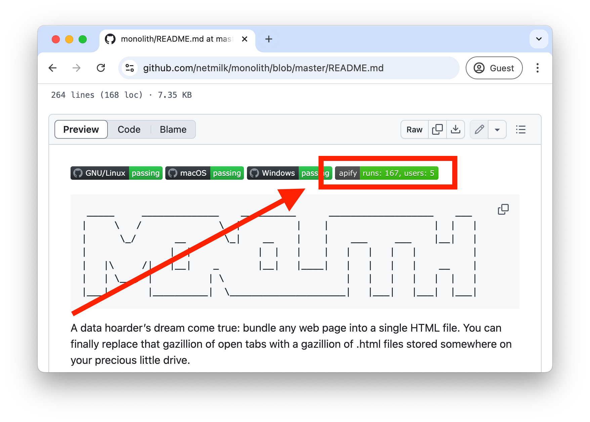

Apify Actor Status Badge can be embedded in 3rd party documentation to show current health status and engagement of the Actor in the Apify Platform.

---
import Tabs from '@theme/Tabs';
import TabItem from '@theme/TabItem';

## Actor status badge example

This is the badge generated for the [Apify's Website Content Crawler](https://apify.com/apify/website-content-crawler) Actor.

[](https://apify.com/apify/website-content-crawler)


### How to embed the Actor Status Badge

The Badge is a dynamic SVG image loaded from the Apify platform. The Badge is served from the URL Template:

```text
https://apify.com/actor-badge?actor=:username/:actor-name
```

In order to embed the badge in the HTML documentation, just use it as an image wrapped in a link as shown in the example below. Don't froget to use the `username` and `actor-name` of your Actor.

#### Example
<!-- vale off -->
<Tabs>
  <TabItem value="html" label="HTML Example" default>
    ```html
    <a href="https://apify.com/apify/website-content-crawler">
      
    </a>
    ```
  </TabItem>
  <TabItem value="markdown" label="Markdown Example">  
    ```markdown
    [](https://apify.com/apify/website-content-crawler)
    ```
  </TabItem>
</Tabs>

### Supported Actor states

The badge indicates the state of the Actor in the Apify Platform as the result of the [automated testing](../development/automated_tests.md).

#### Actor OK


#### Actor under maintenance


#### Actor deprecated


#### Actor not found


### Example of the Badge in Github README



