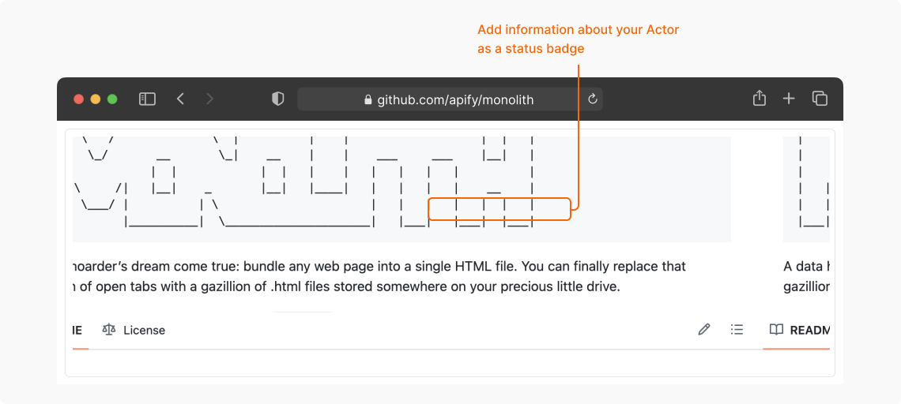

import Tabs from '@theme/Tabs';
import TabItem from '@theme/TabItem';

You can embed the Actor status badge in your README or documentation to show users the current status and usage information of your Actor on the Apify platform.



## Supported statuses

The badge displays the status of your Actor in the Apify platform based on the result of the [automated testing](../development/automated_tests.md) process. The following statuses are supported:

- Actor OK
    
- Actor under maintenance
    
- Actor deprecated
    
- Actor not found
    

## Embed the status badge

The status badge is a dynamic SVG image loaded from the Apify platform and served from the following URL template:

```text
https://apify.com/actor-badge?actor=<USERNAME>/<ACTOR>
```

Where:

- `<USERNAME>` is your Apify username.
- `<ACTOR>` is the name of your Actor.

To embed the badge in your HTML documentation, use the badge URL as an image wrapped in a link:

<Tabs>
  <TabItem value="html" label="HTML" default>
    ```html
    <a href="https://apify.com/apify/website-content-crawler">
      
    </a>
    ```
  </TabItem>
  <TabItem value="markdown" label="Markdown">
    ```markdown
    [](https://apify.com/apify/website-content-crawler)
    ```
  </TabItem>
</Tabs>
