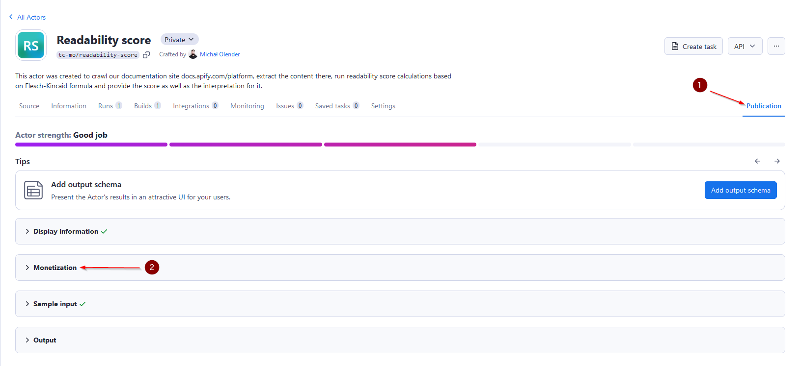
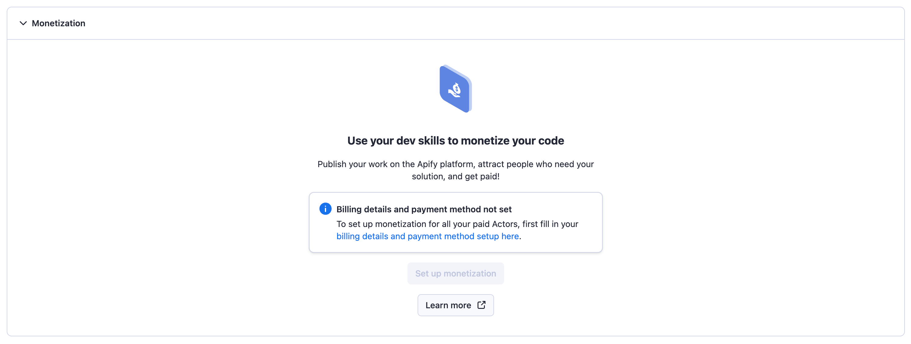
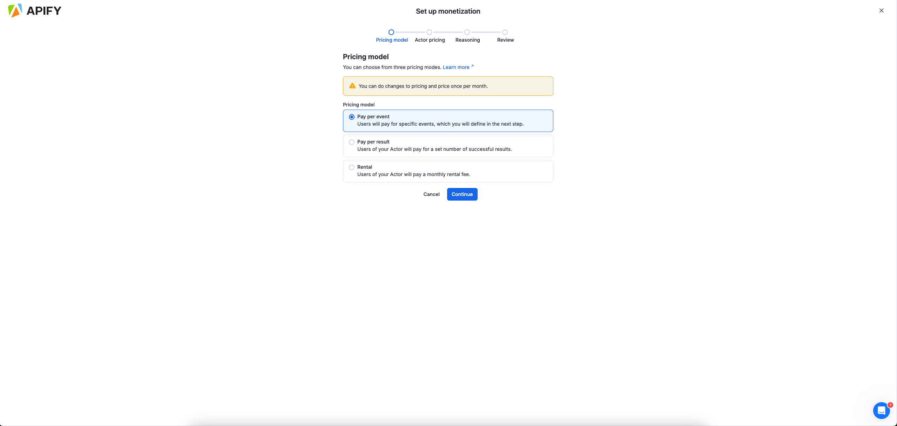
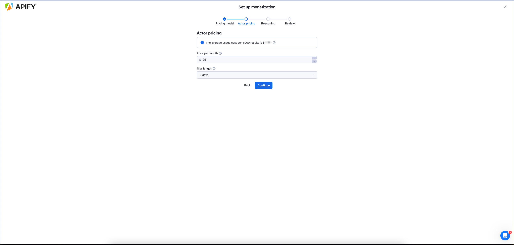
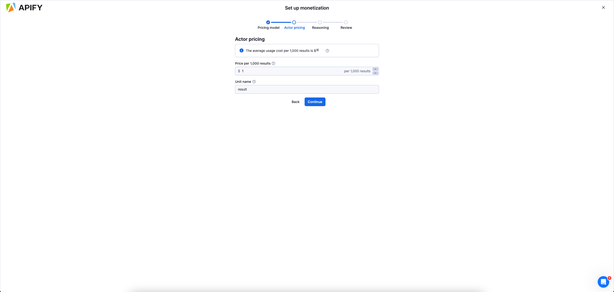
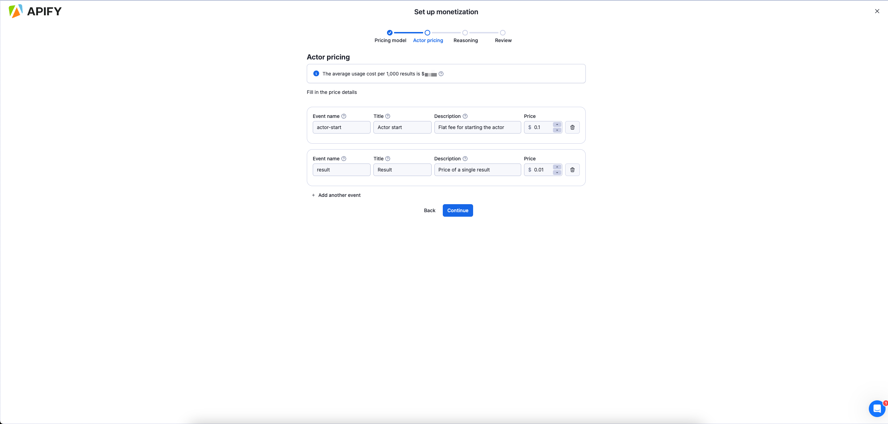

**Learn how you can monetize your web scraping and automation projects by publishing Actors to users in Apify Store.**

---

import Tabs from '@theme/Tabs';
import TabItem from '@theme/TabItem';

Apify Store allows you to monetize your web scraping, automation and AI Agent projects by publishing them as paid Actors. This guide explains the available pricing models and how to get started.

## Pricing models

Actors in Apify Store can be published under one of the following pricing models:

1. **Free**: Users can run the Actor without any additional charges beyond the platform usage costs generated by the Actor.
2. **Rental**: Users pay for the platform usage costs. However, after a trial period, they need to pay a flat monthly fee to the developer to continue using the Actor.
3. **Pay per result (PPR)**: Users don't pay for the platform usage costs. Instead, they pay the developer based on the number of results produced by the Actor.
4. **Pay per event (PPE)**: Users don't pay for the platform usage cost the Actor generates. Instead, they pay based on specific events that are programmatically triggered from the Actor's source code. These events are defined by the developer and can include actions such as generating a single result or starting an Actor.

For a detailed comparison of pricing models from the perspective of your users, refer to [Actors in Store](/platform/actors/running/actors-in-store) page.

### Rental pricing model

With the rental model, you can specify a free trial period and a monthly rental price. After the trial, users with an [Apify paid plan](https://apify.com/pricing) can continue using your Actor by paying the monthly fee. You can receive 80% of the total rental fees collected each month.

    
Example - rental pricing model

You make your Actor rental with 7-day free trial and then $30/month. During the first calendar month, three users start to use your Actor:

1. First user, on the Apify paid plan, starts the free trial on the 15th
1. Second user, on the Apify paid plan, starts the free trial on the 25th
1. Third user, on the Apify free plan, starts the free trial on the 20th

The first user pays their first rent 7 days after the free trial, i.e., on the 22nd of the month. The second user only starts paying the rent next month. The third user is on the Apify free plan, so after the free trial ends on the 27th of the month, they are not charged and cannot use the Actor further until they get a paid plan. Your profit is computed only from the first user. They were charged $30, so 80% of this goes to you, i.e., _0.8 * 30 = $24_.

### Pay-per-result (PPR) pricing model

In this model, you set a price per 1,000 results. Users are charged based on the number of results your Actor produces and stores in the run's default dataset. Your profit is calculated as 80% of the revenue minus platform usage costs. The formula is:

`(0.8 * revenue) - costs = profit`

Only revenue and cost for Apify customers on paid plans are taken into consideration when computing your profit. Users on free plans are not reflected there.

The details on how your cost is computed can be found in [Computing your costs for PPE and PPR Actors](#computing-your-costs-for-ppe-and-ppr-actors).

Example - pay-per-result pricing model

You make your Actor pay-per-result and set the price to be $1/1,000 results. During the first month, two users on Apify paid plans use your Actor to get 50,000 and 20,000 results, costing them $50 and $20, respectively. Let's say the underlying platform usage for the first user is $5 and for the second $2. A third user, this time on an Apify free plan, uses the Actor to get 5,000 results, with underlying platform usage of $0.5.

Your profit is computed only from the first two users, since they are on Apify paid plans. The revenue for the first user is $50 and for the second $20, i.e., total revenue is $70. The total underlying cost is _$5 + $2 = $7_. Since your profit is 80% of the revenue minus the cost, it would be _0.8 * 70 - 7 = $49_.

#### Best practices for PPR Actors

To ensure profitable operation:

- Set memory limits in your [`actor.json`](https://docs.apify.com/platform/actors/development/actor-definition/actor-json) file to control platform usage costs
- Implement the `ACTOR_MAX_PAID_DATASET_ITEMS` check to prevent excess result generation. You can copy [this simple solution](https://github.com/metalwarrior665/max-paid-items-example/blob/master/src/push-data.ts).
- Test your Actor with various result volumes to determine optimal pricing
- Push at least one "error item" to the dataset for invalid input or if search query didn't generate any result. This will prevent users running your Actor for free.

### Pay-per-event (PPE) pricing model

The pay-per-event pricing model offers a flexible monetization option for Actors on Apify Store. Unlike pay per result, PPE allows you to charge users based on specific events triggered programmatically by your Actor's code.

#### PPE vs. PPR

Unlike PPR, which charges based on the number of results produced, PPE lets you define pricing for individual events. You can charge for specific events directly from your Actor by calling the PPE charging API. Common events include Actor start, dataset item creation, and external API calls.

#### How is profit computed

Your profit is calculated as follows:

`profit = (0.8 * revenue) - platform costs`

where:

- _Revenue_: The amount charged for events via the PPE [API](/api/v2/post-charge-run) or through [JS](/sdk/js/reference/class/Actor#charge)/[Python](/sdk/python/reference/class/Actor#charge) SDK. You receive 80% of this revenue.
- _Platform costs_: The underlying platform usage costs for running the Actor, calculated in the same way as for PPR. For more details, visit the [Computing your costs for PPE and PPR Actors](#computing-your-costs-for-ppe-and-ppr-actors) section.

Only paid user activity is included in profit calculations.

#### How to set pricing for PPE

1. _Understand your costs_: Analyze resource usage (e.g CPU, memory, proxies, external APIs) and identify cost drivers
1. _Define clear events_: break your Actor's functionality into measurable, chargeable events.
1. _Common use cases_:
   1. _For scraping_: combine Actor start and dataset items pricing to reflect setup and per-result cost.
   1. _Beyond scraping_: Account for integrations with external systems or external API calls.
1. _External API costs_: Account for additional processing costs.
1. _Test your pricing_: Run your Actor and analyze cost-effectiveness using a special dataset.
1. _Communicate value_: Ensure pricing reflects the value provided and is competitive.

#### Best practices for PPE Actors

- Set memory limits in your [`actor.json`](/platform/actors/development/actor-definition/actor-json) file to control platform usage costs
- Charge either for "Actor start" or for invalid input or empty search to prevent users from running your Actor for free.
  - Don't charge the "Actor start" event again after Actor migration (check `ChargingManager` state).
- Finish the Actor run once charging reaches user-configured `Maximum cost per run`. Apify SDKs ([JS](/sdk/js/reference/class/Actor#charge) and [Python](/sdk/python/reference/class/Actor#charge)) return `ChargeResult` that helps determine when to finish.
- If you are not using the SDKs, use idempotency keys in API calls to prevent double charges.
- Try to limit the number of events. Fewer events make it easier for users to understand your pricing.
- Try to make your event have tangible artifacts that users can see and understand (this might not be possible when using external APIs) i.e:
  - Get a record
  - Save it to a dataset
  - etc.

:::note `ChargingManager` usage

Use our SDKs ([JS](/sdk/js/reference/class/ChargingManager) and, [Python](/sdk/python/reference/class/ChargingManager) or use [`apify actor charge`](/cli/docs/next/reference#apify-actor-charge-eventname) when using our Apify CLI) to simplify PPE implementation into your Actor. This tool can handle pricing, usage tracking, idempotency keys, API errors, and, event charging via an API.

You can also choose not to use it, but then you must handle API integration and possible edge cases manually. You can use `ChargingManager` code as a reference.

:::

### How to attract larger customers of PPE and PPR Actors

Each user running your PPE or PPR Actor belongs to a discount tier:

- _FREE_
- _BRONZE_
- _SILVER_
- _GOLD_

You can define different prices for different tiers.
While optional, we recommend offering progressively lower prices for higher discount tiers. This approach can significantly improve attractiveness of your Actor to large enterprise customers who may spend thousands or tens of thousands of dollars on it.

Your platform costs are also lower for these higher tier, which helps maintain healthy profit margins. This is further detailed in the [Computing your costs for PPE and PPR Actors](#computing-your-costs-for-ppe-and-ppr-actors) section.

By default, we advise against setting excessively high prices for _FREE_ tier users, as this can limit the ability to evaluate your Actor thoroughly. However, in certain situations, such as protecting your Actor from fraudulent activity or excessive use of your internal APIs, a higher price for _FREE_ tier users might be justified.

During an Actor run, you can identify the user's discount tier through Actor run environment variables or by querying user data via the Apify API. This capability allows you to offer premium features or differentiated service levels to users in higher discount tiers.

In addition to the standard tiers, Apify provides further tiers specifically for enterprise customers, including _PLATINUM_ and _DIAMOND_ tiers. If you are interested in offering enterprise-level services and attracting major clients, please contact us.

### Computing your costs for PPE and PPR Actors

For both PPE and PPR Actors, profit is computed using the formula `(0.8 * revenue) - costs`. In this section, we'll explain how the `costs` component is calculated.

When paying users run your Actor, it generates platform usage in the form of compute units, data traffic, API operations etc. This usage determines the `costs` in the profit formula above.

:::note _FREE_ tier usage

Platform usage by _FREE_ tier users is covered by Apify and does not contribute to your costs.

:::

To calculate your costs in dollars for a specific run by paying user, multiply the unit cost of each service by the quantity consumed. For example, if a _BRONZE_ tier user run uses 10 compute units (CUs) at $0.4/CU, your cost would be $4.

As highlighted in the [How to attract larger customers of PPE and PPR Actors](#how-to-attract-larger-customers-of-ppe-and-ppr-actors) section, if your Actor uses tiered pricing, the user's discount tier determines the unit costs applied to their runs. Your costs are lower for higher tiers, enabling you to offer more competitive pricing to these customers, while sustaining healthy profit margins.

The following table summarizes the platform unit costs used for your cost computation  across different discount tiers.

| Service                         | Price is per | _FREE_  | _BRONZE_ | _SILVER_ | _GOLD_  |
|:-------------------------------|:--------------|--------:|---------:|---------:|--------:|
| Compute unit                   | CU            | $0.4    | $0.4     | $0.3     | $0.25   |
| Residential proxies            | GB            | $8      | $8       | $7.5     | $7      |
| SERPs proxy                    | 1,000 SERPs   | $2.5    | $2.5     | $2       | $1.7    |
| Data transfer - external       | GB            | $0.2    | $0.2     | $0.19    | $0.18   |
| Data transfer - internal       | GB            | $0.05   | $0.05    | $0.045   | $0.04   |
| Dataset - reads               | 1,000 reads   | $0.0004 | $0.0004  | $0.00036 | $0.00032|
| Dataset - writes              | 1,000 writes  | $0.005  | $0.005   | $0.0045  | $0.004  |
| Key-value store - reads       | 1,000 reads   | $0.005  | $0.005   | $0.0045  | $0.004  |
| Key-value store - writes      | 1,000 writes  | $0.05   | $0.05    | $0.045   | $0.04   |
| Key-value store - lists       | 1,000 lists   | $0.05   | $0.05    | $0.045   | $0.04   |
| Request queue - reads         | 1,000 reads   | $0.004  | $0.004   | $0.0036  | $0.0032 |
| Request queue - writes        | 1,000 writes  | $0.02   | $0.02    | $0.018   | $0.016  |

If you decide not to offer tiered discounts on your Actor, the unit prices for _FREE_ tier apply. To offer enterprise level services and unlock even cheaper unit prices for enterprise customers, please reach out to us.

## Setting up monetization

Navigate to your [Actor page](https://console.apify.com/actors?tab=my) in Apify Console, choose the Actor that you want to monetize, and select the Publication tab.

Open the Monetization section and complete your billing and payment details.

Choose the pricing model for your Actor.

Follow the monetization wizard to configure your pricing model.
<Tabs>
<TabItem value="Rental" label="Rental">

</TabItem>
<TabItem value="Pay-per-result" label="Pay-per-result">

</TabItem>
<TabItem value="Pay-per-event" label="Pay-per-event">

</TabItem>
</Tabs>

## Changing monetization

You can change the monetization setting of your Actor by using the same wizard as for the setup in the **Monetization** section of your Actor's **Publication** tab. Any changes made to an already published Actor will take _14 days_ to come into effect, so that the users of your Actor have time to prepare.

:::important Frequency of monetization adjustments

Be aware that you can change the monetization setting of each Actor only once per month. For further information and guidelines, please refer to our [Terms & Conditions](https://apify.com/store-terms-and-conditions)

:::

## Payouts and analytics

Payout invoices are generated automatically on the 14th of each month. Review your invoice in the **Settings > Payout** section within one week. If not approved by the 20th, the system will auto-approve on the 21st.

Track your Actor's performance through:

- The payout section for financial records
- [Actor Analytics](https://console.apify.com/actors/development/analytics) (**Actors > Development > Analytics**) for usage statistics

## Promoting your Actor

Create serach-engine-optimized descriptions and README files to improve search engine visibility. Share your Actor on multiple channels:

- Post on Reddit, Quora, and social media platforms
- Create tutorial videos demonstrating key features
- Publish articles about your Actor on relevant websites
- Consider creating a product showcase on platforms like Product Hunt

Remember to tag Apify in your social media posts for additional exposure. Effective promotion can significantly impact your Actor's success, differentiating between those with many paid users and those with few to none.

Learn more about promoting your Actor in the [Apify's marketing playbook](/academy/actor-marketing-playbook).

