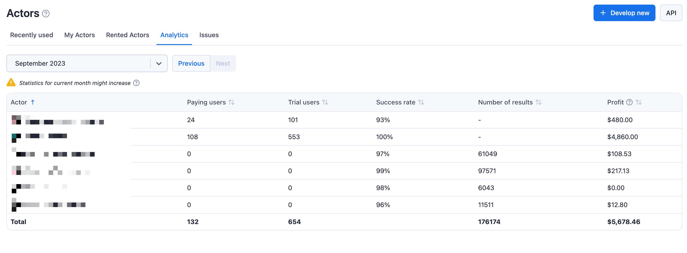

**Learn how you can monetize your web scraping and automation projects by publishing Actors to users in Apify Store.**

---

Apify Store allows you to monetize your web scraping and automation projects by publishing them as Paid Actors. This guide explains the available pricing models and how to get started.

## Pricing models

Actors in Apify Store can be published under one of the following pricing models:

1. **Free**: Users can run the Actor without any additional charges beyond the platform usage costs generated by the Actor.
2. **Rental**: Users pay for the platform usage costs. However, after a trial period, they need to pay a flat monthly fee to the developer to continue using the Actor.
3. **Pay per result**: Users don't pay for the platform usage costs. Instead, they pay the developer based on the number of results produced by the Actor.
4. **Pay per event**: Users don't pay for the platform usage cost the Actor generates. Instead, they pay based on specific events that are programmatically triggered from the Actor's source code. These events are defined by the developer and can include actions such as generating a single result or starting an Actor.

### Rental pricing model

With the rental model, you can specify a free trial period and a monthly rental price. After the trial, users with an [Apify paid plan](https://apify.com/pricing) can continue using your Actor by paying the monthly fee. You can receive 80% of the total rental fees collected each month.

    
Example - rental pricing model

You make your Actor rental with 7-day free trial and then $30/month. During the first calendar month, three users start to use your Actor:

1. First user, on the Apify paid plan, starts the free trial on 15th
1. Second user, on the Apify paid plan, starts the free trial on 25th
1. Third user, on the Apify free plan, start the free trial on 20th

The first user pays their first rent 7 days after the free trial, i.e., on the 22nd of the month. The second user only starts paying the rent next month. The third user is on the Apify free plan, so after the free trial ends on the 27th of the month, they are not charged and cannot use the Actor further until they get a paid plan. Your profit is computed only from the first user. They were charged $30, so 80% of this goes to you, i.e., _0.8 * 30 = $24_.

### Pay-per-result pricing model

In this model, you set a price per 1,000 results. Users are charged based on the number of results your Actor produces. Your profit is calculated as 80% of the revenue minus platform usage costs. The formula is:

`(0.8 * revenue) - costs = profit`

#### Pay-per-result unit pricing for cost computation

| Service                         | Unit price                 |
|:--------------------------------|:---------------------------|
| Compute unit                    | **$0.4** / CU              |
| Residential proxies             | **$13** / GB               |
| SERPs proxy                     | **$3** / 1,000 SERPs       |
| Data transfer - external        | **$0.20** / GB             |
| Data transfer - internal        | **$0.05** / GB             |
| Dataset - reads                 | **$0.0004** / 1,000 reads  |
| Dataset - writes                | **$0.005** / 1,000 writes  |
| Key-value store - reads         | **$0.005** / 1,000 reads   |
| Key-value store - writes        | **$0.05** / 1,000 writes   |
| Key-value store - lists         | **$0.05** / 1,000 lists    |
| Request queue - reads           | **$0.004** / 1,000 reads   |
| Request queue - writes          | **$0.02** / 1,000 writes   |

Only revenue and cost for Apify customers on paid plans are taken into consideration when computing your profit. Users on free plans are not reflected there.

Read more about Actors on Apify Store and different pricing models from the perspective of your users in the [Store documentation](https://docs.apify.com/platform/actors/running/actors-in-store).

Example - pay-per-result pricing model

You make your Actor pay-per-result and set the price to be $1/1,000 results. During the first month, two users on Apify paid plans use your Actor to get 50,000 and 20,000 results, costing them $50 and $20, respectively. Let's say the underlying platform usage for the first user is $5 and for the second $2. Third user, this time on Apify free plan, uses the Actor to get 5,000 results, with underlying platform usage of $0.5.

Your profit is computed only from the first two users, since they are on Apify paid plans. The revenue for the first user is $50 and for the second $20, i.e., total revenue is $70. The total underlying cost is _$5 + $2 = $7_. Since your profit is 80% of the revenue minus the cost, it would be _0.8 * 70 - 7 = $49_.

#### Best practices for Pay-per-results Actors

To ensure profitable operation:

- Set memory limits in your [`actor.json`](https://docs.apify.com/platform/actors/development/actor-definition/actor-json) file to control platform usage costs
- Implement the `ACTOR_MAX_PAID_DATASET_ITEMS` check to prevent excess result generation
- Test your Actor with various result volumes to determine optimal pricing

## Setting up monetization

Navigate to your [Actor page](https://console.apify.com/actors?tab=my) in Apify Console, choose Actor that you want to monetize, and select the Publication tab.

Open the Monetization section and complete your billing and payment details.

Follow the monetization wizard to configure. Follow the monetization wizard to configure your pricing model.

## Changing monetization

You can change the monetization setting of your Actor by using the same wizard as for the setup in the **Monetization** section of your Actor's **Publication** tab. Any changes made to an already published Actor will take _14 days_ to come in effect, so that the users of your Actor have time to prepare.

:::important Frequency of monetization adjustments

Be aware that you can change the monetization setting of each Actor only once per month. For further information and guidelines, please refer to our [Terms & Conditions](https://apify.com/store-terms-and-conditions)

:::

## Payouts and analytics

Payout invoices are generated automatically on the 14th of each month. Review your invoice in the **Settings > Payout** section within one week. If not approved by the 20th, the system will auto-approve on the 21st.

Track your Actor's performance through:

- The payout section for financial records
- Actor Analytics for usage statistics

    

- Individual Actor Insights for detailed performance metrics

    

## Promoting your Actor

Create serach-engine-optimized descriptions and README files to improve search engine visibility. Share your Actor on multiple channels:

- Post on Reddit, Quora, and social media platforms
- Create tutorial videos demonstrating key features
- Publish articles about your Actor on relevant websites
- Consider creating a product showcase on platforms like Product Hunt

Remember to tag Apify in your social media posts for additional exposure. Effective promotion can significantly impact your Actor's success, differentiating between those with many paid users and those with few to none.

Learn more about promoting your Actor in the [Apify's marketing playbook](/academy/actor-marketing-playbook).

