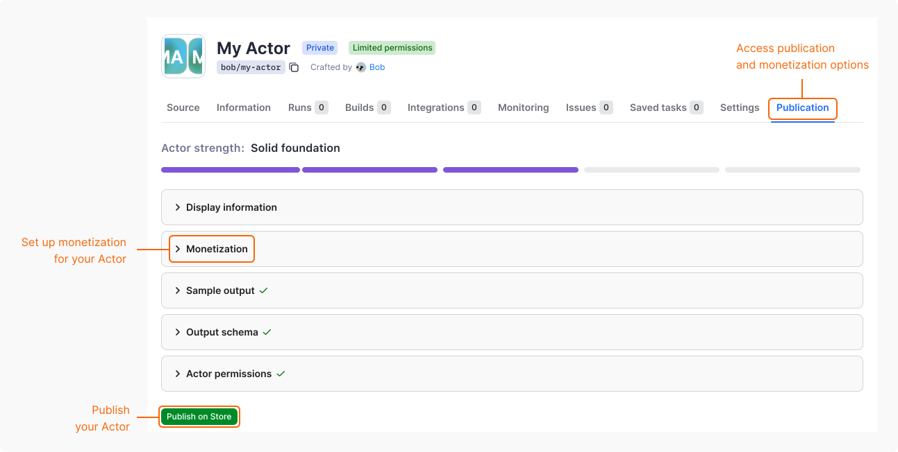

import Tabs from '@theme/Tabs';
import TabItem from '@theme/TabItem';
import RentalSunset from '../../../../_partials/_rental-sunsetting.mdx';

Apify Store allows you to monetize your web scraping, automation, and AI agent projects by publishing them as paid Actors.

## Pricing models

You can publish Actors on Apify Store under one of the following pricing models:

- [Pay per event (PPE)](/actors/publishing/monetize/pay-per-event): Users pay for specific events that are programmatically triggered from the Actor's source code. You can define these events and include actions such as generating a single result or starting an Actor. You can also choose whether to pass the platform usage costs on to users.
- Pay per usage: Users can run the Actor without any additional charges beyond the platform usage costs generated by the Actor.

For a detailed comparison of pricing models from the perspective of your users, see [Actors in Store](/actors/running/actors-in-store).

## Set up monetization

To set up monetization for your Actor, first complete your billing and payment details. Then, you can define the pricing for your Actor:

1. Log in to [Apify Console](https://console.apify.com).
1. In the left-side panel, go to **Development** > **My Actors**.
1. From the table, select the Actor you want to monetize.
1. Go to the **Publication** tab.
1. In **Monetization** section, select **Set up monetization**.

The monetization setup consists of three steps:

1. In the **Actor pricing** step, you can:
    - Modify or delete the [`apify-actor-start`](/actors/publishing/monetize/pay-per-event#synthetic-start-event) event.
    - Modify or delete the [`apify-default-dataset-item`](/actors/publishing/monetize/pay-per-event#synthetic-default-dataset-item-event) event.
    - Define [custom events](/actors/publishing/monetize/pay-per-event#actor-events) and their prices.
    - [Transfer the platform usage costs on to users](/actors/publishing/monetize/pay-per-event#platform-usage-costs).
    - Set the minimal cost that users can choose as max cost per run.
1. In the **Primary event** step, select the event that best represents the main value of your Actor. By default, the dataset event or the only existing event is used.
1. In the **Review** step, verify the final pricing for your Actor before confirming.

### Change monetization

You can change the monetization setting of your Actor by using the same wizard as for the setup in the **Monetization** section of your Actor's **Publication** tab.

Most changes take effect **immediately**. However, **major changes** require a 14-day notice period and are limited to once per month to protect users.

**Major changes** that require 14-day notice include:

- Changing the pricing model (e.g., from rental to pay-per-event)
- Increasing prices
- Adding new events

All other changes (such as decreasing prices, adjusting descriptions, or removing events) take effect immediately.

:::info Frequency of major monetization adjustments

You can make major monetization changes to each Actor only **once per month**. After making a major change, you must wait until it takes effect (14 days) plus an additional period before making another major change. For further information & guidelines, please refer to the [Terms & Conditions](/legal/store-publishing-terms-and-conditions)

:::

## Make your Actor eligible for agentic payments

Agentic payments let AI agents discover, run, and pay for your Actor without an Apify account, using protocols such as [x402](/integrations/x402) and [Skyfire](/integrations/skyfire). Eligible Actors are flagged with `allowsAgenticUsers=true` and surface in agentic discovery, for example when [searching the store via API](https://docs.apify.com/api/v2#/reference/store/store-actors-collection/get-list-of-actors-in-store) with `allowsAgenticUsers=true`.

To be eligible for agentic payments, your Actor must:

- Use the [pay per event](/actors/publishing/monetize/pay-per-event) pricing model. Rental and pay-per-usage Actors are not supported.
- Run with [limited permissions](/actors/development/permissions). Actors that request full permissions are excluded.
- Not use [Standby](/actors/running/standby) mode for now. Standby support is coming later.

Actors that meet these criteria become available to agentic users automatically - there is no separate opt-in.

## Monthly payouts and analytics

Payout invoices are automatically generated on the 11th of each month, summarizing the profits from all your Actors for the previous month.
In accordance with the [Terms & Conditions](/legal/store-publishing-terms-and-conditions), only funds from legitimate users who have already paid are included in the payout invoice.

:::note How negative profits are handled

If your PPE Actor's price doesn't cover its monthly platform usage costs, it will have a negative profit. When this occurs, we automatically set that Actor's profit to $0 for the month. This ensures a single Actor's loss never reduces your total payout.

:::

You have 3 days to review your payout invoice in the **Development >Insights > Payout** section. During this period, you can either approve the invoice or request a revision, which we will process promptly.
If no action is taken, the payout will be automatically approved on the 14th, with funds disbursed shortly after. Payouts require meeting minimum thresholds of either:

- $20 for PayPal
- $100 for other payout methods

If the monthly profit does not meet these thresholds, as per the [Terms & Conditions](/legal/store-publishing-terms-and-conditions), the funds will roll over to the next month until the threshold is reached.

## Handle free users

When monetizing your Actor, you might want to limit features or usage for users on the Apify free plan. If you choose to do this, you _must_ handle it transparently:

- Communicate upfront: Clearly state any limitations in your Actor's `README` and input schema. Users should know about restrictions _before_ they run the Actor.
- Graceful exits: If a free user hits a limit, don't crash the Actor or return a system error. Instead, exit gracefully with a clear [status message](/actors/development/programming-interface/status-messages#communicating-limitations) explaining the limit (e.g., "Free tier limit reached").
- Avoid confusion: Never make a policy restriction look like a bug or platform error.

## Actor analytics

Monitor your Actors' performance through the [Actor Analytics](https://console.apify.com/actors/insights/analytics) dashboard under **Development > Insights > Analytics**.

The analytics dashboard allows you to select specific Actors and view key metrics aggregated across all user runs:

- Revenue, costs and profit trends over time
- User growth metrics (both paid and free users)
- Cost per 1,000 results to optimize pricing
- Run success rate statistics
- User acquisition funnel analytics
- Shared debug runs from users

All metrics can be exported as JSON for custom analysis and reporting.

## Promote your Actor

Create search-engine-optimized descriptions and README files to improve search engine visibility. Share your Actor on multiple channels:

- Post on Reddit, Quora, and social media platforms
- Create tutorial videos demonstrating key features
- Publish articles about your Actor on relevant websites
- Consider creating a product showcase on platforms like Product Hunt

Remember to tag Apify in your social media posts for additional exposure. Effective promotion can significantly impact your Actor's success, differentiating between those with many paid users and those with few to none.

Learn more about promoting your Actor with  [Apify's marketing checklist](/academy/actor-marketing-playbook/promote-your-actor/checklist).
