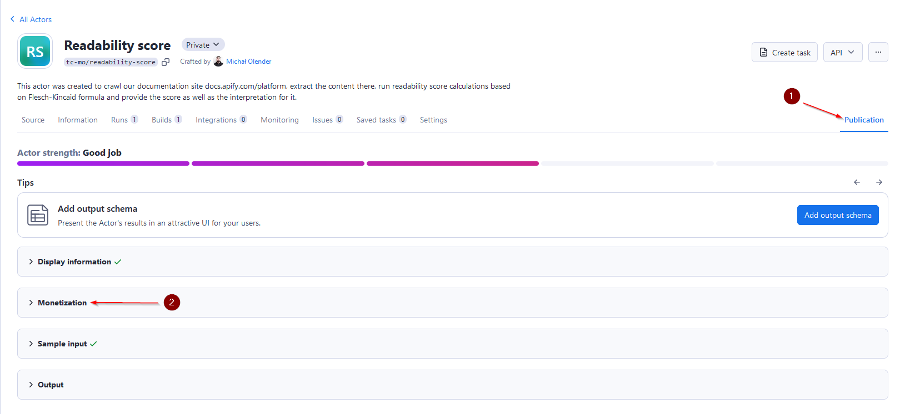
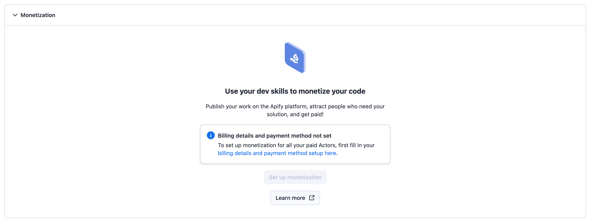
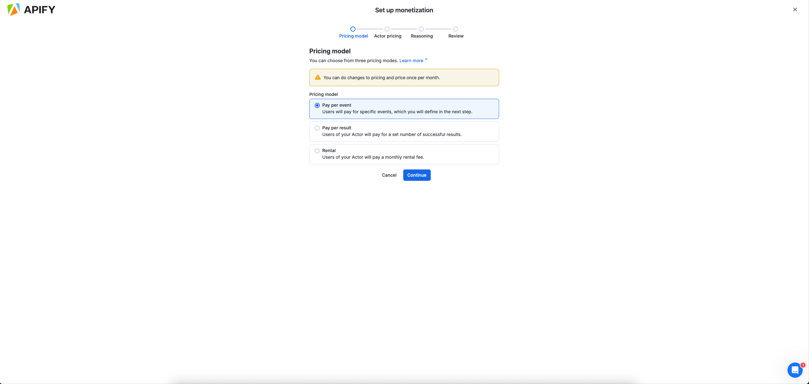
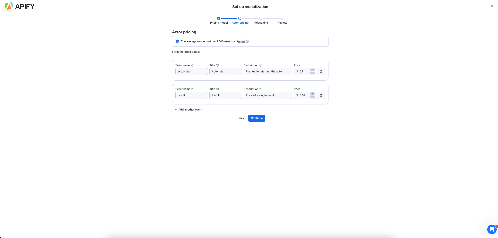
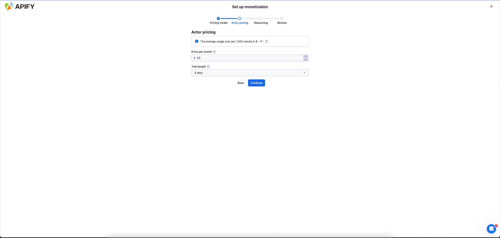

import Tabs from '@theme/Tabs';
import TabItem from '@theme/TabItem';
import RentalSunset from '../../../../_partials/_rental-sunsetting.mdx';

<RentalSunset/>

Apify Store allows you to monetize your web scraping, automation, and AI agent projects by publishing them as paid Actors. This guide explains the available pricing models and how to get started.

## Pricing models

Actors in Apify Store can be published under one of the following pricing models:

- _Pay per usage_: Users can run the Actor without any additional charges beyond the platform usage costs generated by the Actor.
- _Pay per event (PPE)_: Users pay for specific events that are programmatically triggered from the Actor's source code. These events are defined by the developer and can include actions such as generating a single result or starting an Actor. The developer also chooses whether to pass the platform usage costs to users.
- _Rental_: Users pay for the platform usage costs. However, after a trial period, they need to pay a flat monthly fee to the developer to continue using the Actor.

For a detailed comparison of pricing models from the perspective of your users, refer to [Actors in Store](/platform/actors/running/actors-in-store) page.

<RentalSunset/>

## Key benefits

The following table compares the two main pricing models available for monetizing your Actors:

| Feature/Category         | Pay-per-event (PPE)                                              | Rental                         |
|--------------------------|------------------------------------------------------------------|--------------------------------|
| Revenue scalability      | Unlimited, scales with usage                                     | Capped at monthly fee          |
| AI/MCP compatibility     | ✅ Fully compatible                                              | ❌ Not compatible              |
| User cost predictability | Predictable                                                      | Unpredictable (rental + usage) |
| Store discounts          | ✅ Store discounts available                                     | ❌ Single price only           |
| Marketing boost          | Priority store placement                                         | Standard visibility            |
| Commission opportunities | Standard 20%                                                     | Standard 20%                   |
| Custom event billing     | ✅ Charge for any event                                          | Not available                  |
| Per-result billing       | Optional (via event; automatic via `apify-default-dataset-item`) | Not available                  |

## Set up monetization

Navigate to your [Actor page](https://console.apify.com/actors?tab=my) in Apify Console, choose the Actor that you want to monetize, and select the Publication tab.

Open the Monetization section and complete your billing and payment details.

Choose the pricing model for your Actor.

Follow the monetization wizard to configure your pricing model.
<Tabs>
<TabItem value="Pay-per-event" label="Pay-per-event">

</TabItem>
<TabItem value="Rental" label="Rental">

</TabItem>
</Tabs>

### Change monetization

You can change the monetization setting of your Actor by using the same wizard as for the setup in the **Monetization** section of your Actor's **Publication** tab.

Changes are split into two categories: _significant_ and _non-significant_. Non-significant changes take effect immediately, while significant changes require a 14-day notice period to give your users time to adjust.

#### Significant changes

The following changes are considered significant and require a **14-day notice period**:

- Changing the pricing model (e.g. from rental to pay-per-event)
- Increasing prices
- Adding new paid events

When you submit a significant change, users of your Actor are notified and the change is scheduled to take effect after 14 days. During this waiting period, the current pricing remains active.

#### Non-significant changes

The following changes take effect **immediately**:

- Decreasing prices
- Removing events
- Updating event descriptions
- Adjusting other non-pricing settings

#### Restrictions on significant changes

:::caution You cannot cancel a planned change

Once you commit to a significant change, you cannot cancel or modify it yourself. If you need to revert a planned change, contact [Apify support](https://apify.com/contact).

:::

Significant changes are limited to **once per month** per Actor. After submitting a significant change, you must wait for the full cycle to complete before making another one:

1. You submit a significant change (e.g. a price increase).
1. The change takes effect after **14 days**.
1. After the change takes effect, there is an additional waiting period before you can submit another significant change.

This means approximately **one month** passes between the time you commit to your first significant change and when you can make the next one. Plan your pricing strategy carefully before committing.

For full details on the rules governing monetization changes, refer to the [Store publishing terms and conditions](/legal/store-publishing-terms-and-conditions).

## Monthly payouts and analytics

Payout invoices are automatically generated on the 11th of each month, summarizing the profits from all your Actors for the previous month.
In accordance with the [Terms & Conditions](/legal/store-publishing-terms-and-conditions), only funds from legitimate users who have already paid are included in the payout invoice.

:::note How negative profits are handled

If your PPE Actor's price doesn't cover its monthly platform usage costs, it will have a negative profit. When this occurs, we automatically set that Actor's profit to $0 for the month. This ensures a single Actor's loss never reduces your total payout.

:::

You have 3 days to review your payout invoice in the **Development >Insights > Payout** section. During this period, you can either approve the invoice or request a revision, which we will process promptly.
If no action is taken, the payout will be automatically approved on the 14th, with funds disbursed shortly after. Payouts require meeting minimum thresholds of either:

- $20 for PayPal
- $100 for other payout methods

If the monthly profit does not meet these thresholds, as per the [Terms & Conditions](/legal/store-publishing-terms-and-conditions), the funds will roll over to the next month until the threshold is reached.

## Handle free users

When monetizing your Actor, you might want to limit features or usage for users on the Apify free plan. If you choose to do this, you _must_ handle it transparently:

- Communicate upfront: Clearly state any limitations in your Actor's `README` and input schema. Users should know about restrictions _before_ they run the Actor.
- Graceful exits: If a free user hits a limit, don't crash the Actor or return a system error. Instead, exit gracefully with a clear [status message](/platform/actors/development/programming-interface/status-messages#communicating-limitations) explaining the limit (e.g., "Free tier limit reached").
- Avoid confusion: Never make a policy restriction look like a bug or platform error.

## Actor analytics

Monitor your Actors' performance through the [Actor Analytics](https://console.apify.com/actors/insights/analytics) dashboard under **Development > Insights > Analytics**.

The analytics dashboard allows you to select specific Actors and view key metrics aggregated across all user runs:

- Revenue, costs and profit trends over time
- User growth metrics (both paid and free users)
- Cost per 1,000 results to optimize pricing
- Run success rate statistics
- User acquisition funnel analytics
- Shared debug runs from users

All metrics can be exported as JSON for custom analysis and reporting.

## Promote your Actor

Create search-engine-optimized descriptions and README files to improve search engine visibility. Share your Actor on multiple channels:

- Post on Reddit, Quora, and social media platforms
- Create tutorial videos demonstrating key features
- Publish articles about your Actor on relevant websites
- Consider creating a product showcase on platforms like Product Hunt

Remember to tag Apify in your social media posts for additional exposure. Effective promotion can significantly impact your Actor's success, differentiating between those with many paid users and those with few to none.

Learn more about promoting your Actor with  [Apify's marketing checklist](/academy/actor-marketing-playbook/promote-your-actor/checklist).

