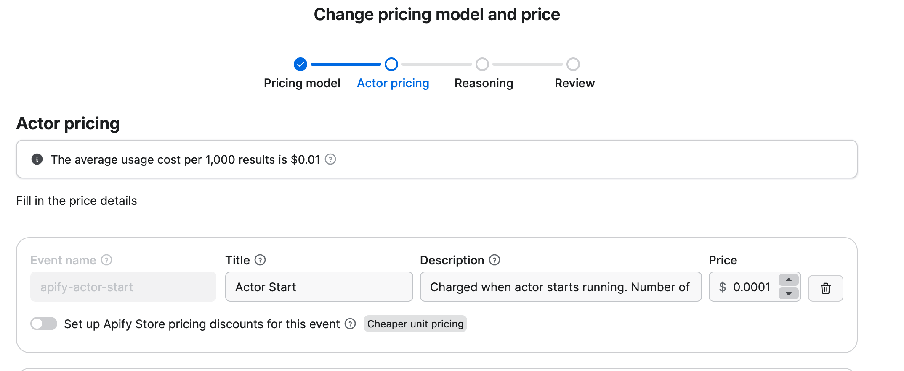

**Learn how to monetize your Actor with pay-per-event (PPE) pricing, charging users for specific actions like Actor starts, dataset items, or API calls, and understand how to set profitable, transparent event-based pricing.**

---

import Tabs from '@theme/Tabs';
import TabItem from '@theme/TabItem';

The PPE pricing model offers a flexible monetization option for Actors on Apify Store. Unlike pay per result, PPE allows you to charge users based on specific events triggered programmatically by your Actor's code.

PPE lets you define pricing for individual events. You can charge for specific events directly from your Actor using the [JS](/sdk/js/reference/class/Actor#charge)/[Python](/sdk/python/reference/class/Actor#charge) SDK, or by calling the [PPE charging API](/api/v2/post-charge-run) directly. Common events include Actor start, dataset item creation, and external API calls.

The details on how your cost is computed can be found in [Examples of a PPE pricing](#examples-of-a-ppe-pricing).

:::tip Additional benefits

Actors that implement PPE pricing receive additional benefits, including increased visibility in Apify Store and enhanced discoverability.

:::

## How is profit computed

Your profit is calculated from the mentioned formula:

`profit = (0.8 * revenue) - platform costs`

where:

- _Revenue_: The amount charged for events via the PPE charging API or through JS/Python SDK. You receive 80% of this revenue.
- _Platform costs_: The underlying platform usage costs for running the Actor, calculated in the same way as for PPR. For more details, visit the [Computing your costs for PPE and PPR Actors](#computing-your-costs-for-ppe-and-ppr-actors) section.

Only revenue and cost for Apify customers on paid plans are taken into consideration when computing your profit. Users on free plans are not reflected there.

:::note Negative profit isolation

An Actor's negative net profit does not affect the positive profit of another Actor. For aggregation purposes, any Actor with a negative net profit is considered to have a profit of $0.

- _Previously:_ `Total Profit = (-$90) + $100 = $10`
- _Now:_ `Total Profit = $0 + $100 = $100`

:::

## How to set pricing for PPE Actors

1. _Understand your costs_: Analyze resource usage (e.g CPU, memory, proxies, external APIs) and identify cost drivers
1. _Define clear events_: break your Actor's functionality into measurable, chargeable events.
1. _Common use cases_:
   1. _For scraping_: combine Actor start and dataset items pricing to reflect setup and per-result cost.
   1. _Beyond scraping_: Account for integrations with external systems or external API calls.
1. _External API costs_: Account for additional processing costs.
1. _Test your pricing_: Run your Actor and analyze cost-effectiveness using a special dataset.
1. _Communicate value_: Ensure pricing reflects the value provided and is competitive.

## Respect user spending limits

Finish the Actor run once charging reaches user-configured maximum cost per run. Apify SDKs (JS and Python) return `ChargeResult` that helps determine when to finish.

The `eventChargeLimitReached` property checks if the current event type can be charged more. If you have multiple event types, analyze the `chargeableWithinLimit` property to see if other events can still be charged before stopping the Actor.

:::info ACTOR_MAX_TOTAL_CHARGE_USD environment variable

For pay-per-event Actors, users set a spending limit through the Apify Console. This limit is available in your Actor code as the `ACTOR_MAX_TOTAL_CHARGE_USD` [environment variable](/platform/actors/development/programming-interface/environment-variables), which contains the user's maximum cost.

:::

<Tabs groupId="main">
<TabItem value="JavaScript" label="JavaScript">

```js
import { Actor } from 'apify';

const chargeForApiProductDetail = async () => {
  const chargeResult = await Actor.charge({ eventName: "product-detail" });

  return chargeResult;
};

await Actor.init();

// API call, or any other logic that you want to charge for
const chargeResult = await chargeForApiProductDetail();

if (chargeResult.eventChargeLimitReached) {
  await Actor.exit();
}

// Rest of the Actor logic

await Actor.exit();
```

</TabItem>
<TabItem value="Python" label="Python">

```py
from apify import Actor

async def charge_for_api_product_detail():
    charge_result = await Actor.charge(event_name='product-detail')

    return charge_result

async def main():
    await Actor.init()
    
    # API call, or any other logic that you want to charge for

    charge_result = await charge_for_api_product_detail()

    if charge_result.event_charge_limit_reached:
        await Actor.exit()

    # Rest of the Actor logic

    await Actor.exit()
```

</TabItem>
</Tabs>

:::note Crawlee integration and spending limits

When using [Crawlee](https://crawlee.dev/), use `crawler.autoscaledPool.abort()` instead of `Actor.exit()` to gracefully finish the crawler and allow the rest of your code to process normally.

:::

## Best practices for PPE Actors

Use our SDKs ([JS](/sdk/js/) and, [Python](/sdk/python/) or use [`apify actor charge`](/cli/docs/next/reference#apify-actor-charge-eventname) when using our Apify CLI) to simplify PPE implementation into your Actor. SDKs help you handle pricing, usage tracking, idempotency keys, API errors, and, event charging via an API. You can also choose not to use it, but then you must handle API integration and possible edge cases manually.

### Use synthetic start event `apify-actor-start`

:::info TL;DR:

We recommend using the synthetic Actor start event in PPE Actors. It benefits both you and your users.

:::

Starting an Actor takes time, and creates additional cost for the Actor creator, because the profit equals revenue minus platform costs.

One of the options to charge for the time spent on starting the Actor is to charge an “Actor start” event. Unfortunately, this makes your Actor comparably expensive with other tools on the market (outside of [Apify Store](/platform/console/store)) that do not incur this startup cost.

We want to make it easier for Actor creators to stay competitive, but also help them to be profitable. Therefore, we have the Apify Actor synthetic start event `apify-actor-start`. This event is enabled by default for all new PPE Actors, and when you use it Apify will cover the compute unit cost of the first 5 seconds of every Actor run.

The default price of the event is set intentionally low. This pricing means that the free 5 seconds of compute we provide costs us more than the revenue generated from the event. We've made this investment to **support our creator community** by reducing your startup costs while keeping your Actors competitively priced for users.

#### How the synthetic start event works

- The Apify Actor start event is **automatically enabled** for all new PPE Actors. For existing Actors, you can enable it in Apify Console.
- Apify **automatically charges** the event.
  - You must _not_ manually charge for the synthetic start event (`apify-actor-start`) in your Actor code. If you attempt to charge this event yourself, the operation will fail.
- The default price of the event is **$0.00005**, which equals **$0.05 per 1,000 starts**. We recommend keeping the default price to keep your Actors competitive.
- The number of events charged **depends on the memory** of the Actor run. Up to and including 1 GB of RAM, the event is charged once. Then it's charged once for each extra GB of memory. For example:
  - 128 MB RAM: 1 event, $0.00005
  - 1 GB RAM: 1 event, $0.00005
  - 4 GB RAM: 4 events, $0.0002
- You can increase the price of the event if you wish, but you **won't get more free compute**.
- You can delete the event if you wish, but if you do, you will **lose the free 5 seconds** of compute.

#### Synthetic start event for new Actors

For new Actors, this event is added automatically as you can see on the following screen:



#### Synthetic start event for existing Actors

If you have existing Actors, you can add this event manually in Apify Console in the Publication tab.

#### Synthetic start event for Actors with start event

Your Actor might already have a start event defined, such as `actor-start` or another variant of the event name. In this case, you can choose whether to use the synthetic start event or keep the existing start event.

If you want to use the synthetic start event, remove the existing start event from your Actor and add the synthetic start event in Apify Console in the Publication tab.

### Set memory limits

Set memory limits using `minMemoryMbytes` and `maxMemoryMbytes` in your [`actor.json`](https://docs.apify.com/platform/actors/development/actor-definition/actor-json) file to control platform usage costs.

```json
{
    "actorSpecification": 1, 
    "name": "name-of-my-scraper",
    "version": "0.0",
    "minMemoryMbytes": 512,
    "maxMemoryMbytes": 1024,
}
```

:::note Memory requirements for browser-based scraping

When using browser automation tools like Puppeteer or Playwright for web scraping, increase the memory limits to accommodate the browser's memory usage.

:::

### Charge for invalid input

Charge for things like URLs that appear valid but lead to errors (like 404s) since you had to open the page to discover the error. Return error items with proper error codes and messages instead of failing the entire Actor run.

The snippet below shows how you can charge for invalid inputs using `Actor.pushData` when a dataset item is created and the `scraped-result` event is charged.

<Tabs groupId="main">
<TabItem value="JavaScript" label="JavaScript">

```js
import { Actor } from 'apify';

const processUrl = async (url) => {
  const response = await fetch(url);
    
  if (response.status === 404) {
    // Charge for the work done and return error item in one call
    await Actor.pushData({
      url: url,
      error: "404",
      errorMessage: "Page not found"
    }, 'scraped-result');
    
    return;
  }

  // Rest of the process_url function
};

await Actor.init();

const input = await Actor.getInput();
const { urls } = input;
  
for (const url of urls) {
  await processUrl(url);
}

// Rest of the Actor logic

await Actor.exit();
```

</TabItem>
<TabItem value="Python" label="Python">

```py
from apify import Actor
import requests

async def process_url(url):
    response = requests.get(url)
    
    if response.status_code == 404:
      # Charge for the work done and return error item in one call
      await Actor.push_data({
          'url': url,
          'error': '404',
          'errorMessage': 'Page not found'
      }, 'scraped-result')
        
      return

    # Rest of the process_url function

async def main():
    await Actor.init()
    
    input_data = await Actor.get_input()
    urls = input_data.get('urls', [])
    
    for url in urls:
        await process_url(url)
    
    # Rest of the Actor logic
    
    await Actor.exit()
```

</TabItem>
</Tabs>

### Keep pricing simple with fewer events

Try to limit the number of events. Fewer events make it easier for users to understand your pricing and predict their costs.

### Make events produce visible results

For Actors that produce data, events should map to something concrete in the user's dataset or storage.

However, we acknowledge that some events don't produce tangible results (such as running AI workflows or processing external API calls). This flexibility gives you the freedom to charge for special operations, complex workflows, and unique value propositions.

Examples:

- _`post` event_: Each charge adds one social media post to the dataset
- _`profile` event_: Each charge adds one user profile to the dataset  
- _`processed-image` event_: Each charge adds one processed image to the dataset
- _`ai-analysis` event_: Each charge processes one document through an AI workflow (no tangible output, but valuable processing)

:::note Additional context

You can display a status message or push a record to the dataset to inform users about non-data actions performed by your Actor. This helps users understand what actions were charged for, even if those actions do not produce tangible output.

:::

### Use idempotency keys to prevent double charges

If you're not using the Apify SDKs (JS/Python), you need to handle idempotency (ensuring the same operation produces the same result when called multiple times) manually to prevent charging the same event multiple times.

## Example of a PPE pricing

You create a social media monitoring Actor with the following pricing:

- `post`: $0.002 per post - count every social media post you extract.
- `profile`: $0.001 per profile - count every user profile you extract.
- `sentiment-analysis`: $0.005 per post - count every post analyzed for sentiment, engagement metrics, and content classification using external LLM APIs.

:::info Fixed pricing vs. usage-based pricing

You have two main strategies for charging AI-related operations:

1. **Fixed event pricing** (like `sentiment-analysis` above): Charge a fixed amount per operation, regardless of actual LLM costs
2. **Usage-based pricing**: Use events like `llm-token` that charge based on actual LLM usage costs

Fixed pricing is simpler for users to predict, while usage-based pricing more accurately reflects your actual costs.

:::

### Pricing breakdown by user

<table>
  <thead>
    <tr>
      <th>User</th>
      <th style={{whiteSpace: 'nowrap'}}>Plan</th>
      <th style={{width: '45%'}}>Events</th>
      <th style={{width: '35%'}}>Charges</th>
      <th style={{whiteSpace: 'nowrap'}}>Total</th>
      <th style={{whiteSpace: 'nowrap'}}>Platform cost</th>
    </tr>
  </thead>
  <tbody>
    <tr>
      <td>1</td>
      <td style={{whiteSpace: 'nowrap'}}>Paid plan</td>
      <td>
        <div style={{marginBottom: '4px'}}>5,000 × <code>post</code></div>
        <div style={{marginBottom: '4px'}}>50 × <code>profile</code></div>
        <div>2,000 × <code>sentiment-analysis</code></div>
      </td>
      <td>
        <div style={{marginBottom: '4px'}}>5,000 × $0.002</div>
        <div style={{marginBottom: '4px'}}>50 × $0.001</div>
        <div>2,000 × $0.005</div>
      </td>
      <td><strong>$20.05</strong></td>
      <td>$2.50</td>
    </tr>
    <tr>
      <td>2</td>
      <td style={{whiteSpace: 'nowrap'}}>Paid plan</td>
      <td>
        <div style={{marginBottom: '4px'}}>3,000 × <code>post</code></div>
        <div style={{marginBottom: '4px'}}>20 × <code>profile</code></div>
        <div>1,000 × <code>sentiment-analysis</code></div>
      </td>
      <td>
        <div style={{marginBottom: '4px'}}>3,000 × $0.002</div>
        <div style={{marginBottom: '4px'}}>20 × $0.001</div>
        <div>1,000 × $0.005</div>
      </td>
      <td><strong>$11.02</strong></td>
      <td>$1.50</td>
    </tr>
    <tr>
      <td>3</td>
      <td style={{whiteSpace: 'nowrap'}}>Free plan</td>
      <td>
        <div style={{marginBottom: '4px'}}>1,000 × <code>post</code></div>
        <div style={{marginBottom: '4px'}}>5 × <code>profile</code></div>
        <div>200 × <code>sentiment-analysis</code></div>
      </td>
      <td>
        <div style={{marginBottom: '4px'}}>1,000 × $0.002</div>
        <div style={{marginBottom: '4px'}}>5 × $0.001</div>
        <div>200 × $0.005</div>
      </td>
      <td><strong>$3.01</strong></td>
      <td>$0.40</td>
    </tr>
  </tbody>
</table>

Your profit and costs are computed **only from the first two users** since they are on Apify paid plans.

The platform usage costs are just examples, but you can see the actual costs in the [Computing your costs for PPE and PPR Actors](/platform/actors/publishing/monetize/pricing-and-costs#computing-your-costs-for-ppe-and-ppr-actors) section.

### Revenue breakdown

- **Revenue (paid users only)**: $20.05 + $11.02 = **$31.07**
- **Platform cost (paid users only)**: $2.50 + $1.50 = **$4.00**
- **Profit**: 0.8 × $31.07 − $4.00 = **$20.86**

{/* ### Example: usage-indexed PPE pricing

- `llm-token-cent`: $0.02 per $0.01 LLM spend - emit one event for each cent billed by your LLM provider.

:::info Simplified example

For the simplicity of the example, we show only the LLM-token-cent event. In reality, you can charge for any event you want.

::: */}

{/* #### Pricing breakdown by user

<table>
  <thead>
    <tr>
      <th>User</th>
      <th style={{whiteSpace: 'nowrap'}}>Plan</th>
      <th style={{width: '45%'}}>Events</th>
      <th style={{width: '35%'}}>Charges</th>
      <th style={{whiteSpace: 'nowrap'}}>Total</th>
      <th style={{whiteSpace: 'nowrap'}}>Cost</th>
    </tr>
  </thead>
  <tbody>
    <tr>
      <td>1</td>
      <td style={{whiteSpace: 'nowrap'}}>Paid plan</td>
      <td>
        <div style={{marginBottom: '4px'}}>$25.40 LLM usage:</div>
        <div>2,540 × <code>llm-token-cent</code></div>
      </td>
      <td>
        <div>2,540 × $0.02 = $50.80</div>
      </td>
      <td><strong>$50.80</strong></td>
      <td>$2.60</td>
    </tr>
    <tr>
      <td>2</td>
      <td style={{whiteSpace: 'nowrap'}}>Paid plan</td>
      <td>
        <div style={{marginBottom: '4px'}}>$12.10 LLM usage:</div>
        <div>1,210 × <code>llm-token-cent</code></div>
      </td>
      <td>
        <div>1,210 × $0.02 = $24.20</div>
      </td>
      <td><strong>$24.20</strong></td>
      <td>$1.20</td>
    </tr>
    <tr>
      <td>3</td>
      <td style={{whiteSpace: 'nowrap'}}>Free plan</td>
      <td>
        <div style={{marginBottom: '4px'}}>$3.90 LLM usage:</div>
        <div>390 × <code>llm-token-cent</code></div>
      </td>
      <td>
        <div>390 × $0.02 = $7.80</div>
      </td>
      <td><strong>$7.80</strong></td>
      <td>$0.35</td>
    </tr>
  </tbody>
</table>

The platform usage costs are just examples, but you can see the actual costs in the [Computing your costs for PPE and PPR Actors](/platform/actors/publishing/monetize/pricing-and-costs#computing-your-costs-for-ppe-and-ppr-actors) section.

#### Revenue breakdown

- **Revenue (paid users only)**: $50.80 + $24.20 = **$75.00**
- **Underlying cost (paid users only)**: $2.60 + $1.20 = **$3.80**
- **Profit**: 0.8 × $75.00 − $3.80 = **$56.20**

This example illustrates the key trade-off of PPE pricing: while it's harder for users to predict exact costs upfront, it provides developers with a safer and more scalable revenue model that grows with actual usage. */}

## Event names

If you need to know your event names, you can retrieve the list of available pricing event names using the [Get Actor](https://apify.com/docs/api/v2/act-get) API endpoint.

## Next steps

- Check out the [Pricing and costs](./pricing_and_costs.mdx) section to learn how to compute your costs.
