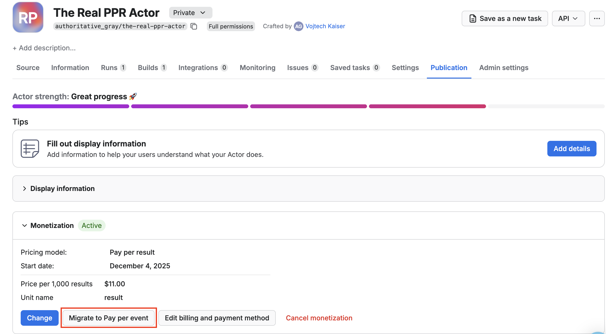

**Learn how to monetize your Actor with pay-per-result (PPR) pricing, charging users based on the number of results produced and stored in the dataset, and understand how to set profitable, transparent result-based pricing.**

---

import Tabs from '@theme/Tabs';
import TabItem from '@theme/TabItem';

:::warning Pay per result is deprecated

This pricing model is deprecated and will be removed in 2026. You can migrate to [pay per event with one click](#one-click-migration-to-ppe), and the migration is backward compatible.

:::

In this model, you set a price per 1,000 results. Users are charged based on the number of results your Actor produces and stores in the run's default dataset. Your profit is calculated as 80% of the revenue minus platform usage costs.

The details on how your cost is computed can be found in [Example of a PPR pricing model](#example-of-ppr-pricing).

## One click migration to PPE

Select your PPR Actor, go to the **Publication** tab, open the **Monetization** section, and click the **Migrate to pay per event** button.



### Why should I migrate

The pay per event pricing model offers superior flexibility in charging not only for the results but also for any event.
This helps you to pass on the costs of external APIs or additional processing directly to your users, price different functionalities of your Actor differently, avoid revenue loss from small but usage-heavy runs, and more.


Given that the pay per event model is fully compatible with pay per result, and to bring more simplicity to users of your Actors, we are fully deprecating PPR in favor of PPE.
The migration is completely automatic and fully backward compatible.

### What happens during migration

The migration switches your pricing model from pay per result to pay per event. Your price per 1,000 results is automatically converted to an equivalent `apify-default-dataset-item` [event](./pay-per-event#use-synthetic-default-dataset-item-event-apify-default-dataset-item) price.
This change does not count towards the pricing change limits that you are allowed to do once every 30 days.

**Code changes:** No changes to your Actor code are required if it already respects the `ACTOR_MAX_PAID_DATASET_ITEMS` environment variable (the price limit set by users).

**After migration:** With [pay per event](./pay-per-event), you can define additional custom events beyond dataset items.

**Respecting user spending limits:** You can continue using the `ACTOR_MAX_PAID_DATASET_ITEMS` environment variable to respect user-specified price limits.

## How is profit computed

Your profit is calculated from the mentioned formula:

`profit = (0.8 * revenue) - platform costs`

where:

- _Revenue_: The amount charged for results via the PPR pricing API or through JS/Python SDK. You receive 80% of this revenue.
- _Platform costs_: The underlying platform usage costs for running the Actor, calculated in the same way as for PPE. For more details, visit the [Example of a PPR pricing model](#example-of-a-ppr-pricing-model) section.

Only revenue and cost for Apify customers on paid plans are taken into consideration when computing your profit. Users on free plans are not reflected there.

## PPR vs PPE

PPR charges based on the number of results produced. PPE lets you define pricing for individual events, and help you to make your pricing more flexible. You can charge for specific events directly from your Actor by calling the PPE charging API.

:::info Learn more about PPE

If you want to learn more about PPE, refer to the [pay per event](/platform/actors/publishing/monetize/pay-per-event) section.

:::

## Best practices for PPR Actors

To ensure profitability, check the following best practices.

### Set memory limits

Set memory limits using `minMemoryMbytes` and `maxMemoryMbytes` in your [`actor.json`](https://docs.apify.com/platform/actors/development/actor-definition/actor-json) file to control platform usage costs.

```json
{
    "actorSpecification": 1, 
    "name": "name-of-my-scraper",
    "version": "0.0",
    "minMemoryMbytes": 512,
    "maxMemoryMbytes": 1024,
}
```

:::note Memory requirements for browser-based scraping

When using browser automation tools like [Puppeteer](https://pptr.dev/) or [Playwright](https://playwright.dev/) for web scraping, increase the memory limits to accommodate the browser's memory usage.

:::

### Implement the `ACTOR_MAX_PAID_DATASET_ITEMS` check

This check prevents your Actor from generating more results than the user has paid for, protecting both you and your users from unexpected costs.

The `ACTOR_MAX_PAID_DATASET_ITEMS` environment variable contains the user-set limit on returned results for PPR Actors. Do not exceed this limit. You can see the example implementation in the following code snippets.

<Tabs groupId="main">
<TabItem value="JavaScript" label="JavaScript">

```js
import { Actor } from 'apify';

// Use top-level variables with a closure so you don't have to initialize anything
const MAX_ITEMS: number | undefined = Number(process.env.ACTOR_MAX_PAID_DATASET_ITEMS) || undefined;

let isInitialized = false;
let isGettingItemCount = false;
let pushedItemCount = 0;

export const pushDataMaxAware = async (data: Parameters<Actor['pushData']>[0]): Promise<{ shouldStop: boolean }> => {
    // If this isn't PPR, just push like normally
    if (!MAX_ITEMS) {
        await Actor.pushData(data);
        return { shouldStop: false };
    }

    // Initialize on the first call so it as standalone function
    if (!isInitialized && !isGettingItemCount) {
        isGettingItemCount = true;
        const dataset = await Actor.openDataset();
        const { itemCount } = (await dataset.getInfo())!;
        pushedItemCount = itemCount;
        isGettingItemCount = false;
        isInitialized = true;
    }

    // Others handlers will wait until initialized which should be few milliseconds
    while (!isInitialized) {
        await new Promise((resolve) => setTimeout(resolve, 50));
    }

    const dataAsArray = Array.isArray(data) ? data : [data];
    const dataToPush = dataAsArray.slice(0, MAX_ITEMS - pushedItemCount);

    if (dataToPush.length) {
        // Update the state before 'await' to avoid race conditions
        pushedItemCount += dataToPush.length;
        await Actor.pushData(dataToPush);
    }

    return { shouldStop: pushedItemCount >= MAX_ITEMS };
};
```

</TabItem>
<TabItem value="Python" label="Python">

```py
import os
import asyncio
from apify import Actor
from typing import Union, List, Dict, Any

class PayPerResultManager:
    def __init__(self):
        self.max_items = int(os.getenv('ACTOR_MAX_PAID_DATASET_ITEMS', 0)) or None
        self.is_initialized = False
        self.is_getting_item_count = False
        self.pushed_item_count = 0

    async def push_data_max_aware(self, data: Union[Dict[Any, Any], List[Dict[Any, Any]]]) -> Dict[str, bool]:
        # If this isn't PPR, just push like normally
        if not self.max_items:
            await Actor.push_data(data)
            return {'shouldStop': False}

        # Initialize on the first call
        if not self.is_initialized and not self.is_getting_item_count:
            self.is_getting_item_count = True
            dataset = await Actor.open_dataset()
            dataset_info = await dataset.get_info()
            self.pushed_item_count = dataset_info['itemCount']
            self.is_getting_item_count = False
            self.is_initialized = True

        # Wait until initialized
        while not self.is_initialized:
            await asyncio.sleep(0.05)  # 50ms

        data_as_array = data if isinstance(data, list) else [data]
        data_to_push = data_as_array[:self.max_items - self.pushed_item_count]

        if data_to_push:
            # Update the state before 'await' to avoid race conditions
            self.pushed_item_count += len(data_to_push)
            await Actor.push_data(data_to_push)

        return {'shouldStop': self.pushed_item_count >= self.max_items}

# Create a singleton instance
ppr_manager = PayPerResultManager()

# Convenience function that uses the singleton
async def push_data_max_aware(data: Union[Dict[Any, Any], List[Dict[Any, Any]]]) -> Dict[str, bool]:
    return await ppr_manager.push_data_max_aware(data)
```

</TabItem>
</Tabs>

### Test your Actor

Test your Actor with various result volumes to determine optimal pricing. Start with minimal datasets (1-100 results) to understand your base costs and ensure the Actor works correctly with small inputs. Then test with typical usage volumes (1,000-10,000 results) to simulate real-world scenarios and identify any performance bottlenecks.

Throughout all testing, monitor platform usage costs for each test run to calculate the true cost per result. This cost analysis is crucial for setting profitable pricing that covers your expenses while remaining competitive in the market.

:::tip Use Actor analytics for cost estimation

Check the **cost per 1000 results** chart in your Actor's analytics in Apify Console. This chart is computed from all runs of both paying and free users, giving you a comprehensive view of platform usage costs across different usage patterns. Use this data to better estimate the adequate price for your Actor.

:::

### Push at least one "error item" to the dataset

In PPR Actors, users are only charged when your Actor produces results in the dataset. If your Actor encounters invalid input or finds no results, it should still push at least one item to the dataset to ensure the user is charged for the attempt.

Why this matters:

- _Prevents free usage_: Without pushing any items, users could run your Actor repeatedly with invalid inputs without being charged
- _Ensures fair billing_: Users should pay for the processing attempt, even if no valid results are found
- _Maintains profitability_: Every run should generate some revenue to cover your platform costs

Example scenarios:

- _User provides invalid search terms_: Push an error item explaining the issue
- _Target website returns no results_: Push an item indicating "No results found"
- _Input validation fails_: Push an item with validation error details

This ensures that every run generates at least one result, guaranteeing that users are charged appropriately for using your Actor.

## Example of PPR pricing

You make your Actor PPR and set the price to be _$1/1,000 results_. During the first month, three users use your Actor.

### Pricing breakdown by user

<table>
  <thead>
    <tr>
      <th>User</th>
      <th style={{whiteSpace: 'nowrap'}}>Plan</th>
      <th style={{width: '35%'}}>Results</th>
      <th style={{width: '45%'}}>Charges</th>
      <th style={{whiteSpace: 'nowrap'}}>Total</th>
      <th style={{whiteSpace: 'nowrap'}}>Platform cost</th>
    </tr>
  </thead>
  <tbody>
    <tr>
      <td>1</td>
      <td style={{whiteSpace: 'nowrap'}}>Paid plan</td>
      <td>
        <div>50,000 results</div>
      </td>
      <td>
        <div>50,000 ÷ 1,000 × $1.00</div>
      </td>
      <td><strong>$50.00</strong></td>
      <td>$5.00</td>
    </tr>
    <tr>
      <td>2</td>
      <td style={{whiteSpace: 'nowrap'}}>Paid plan</td>
      <td>
        <div>20,000 results</div>
      </td>
      <td>
        <div>20,000 ÷ 1,000 × $1.00</div>
      </td>
      <td><strong>$20.00</strong></td>
      <td>$2.00</td>
    </tr>
    <tr>
      <td>3</td>
      <td style={{whiteSpace: 'nowrap'}}>Free plan</td>
      <td>
        <div>5,000 results</div>
      </td>
      <td>
        <div>5,000 ÷ 1,000 × $1.00</div>
      </td>
      <td><strong>$5.00</strong></td>
      <td>$0.50</td>
    </tr>
  </tbody>
</table>

Your profit and costs are computed _only from the first two users_ since they are on Apify paid plans.

The platform usage costs are just examples, but you can see the actual costs in the [Computing your costs for PPE and PPR Actors](/platform/actors/publishing/monetize/pricing-and-costs#computing-your-costs-for-ppe-and-ppr-actors) section.

### Revenue breakdown

- _Revenue (paid users only): $50.00 + $20.00 = $70.00_
- _Platform cost (paid users only): $5.00 + $2.00 = $7.00_
- _Profit: 0.8 × $70.00 − $7.00 = $49.00_

## Next steps

- Check out the [Pricing and costs](./pricing_and_costs.mdx) section to learn how to compute your costs.
