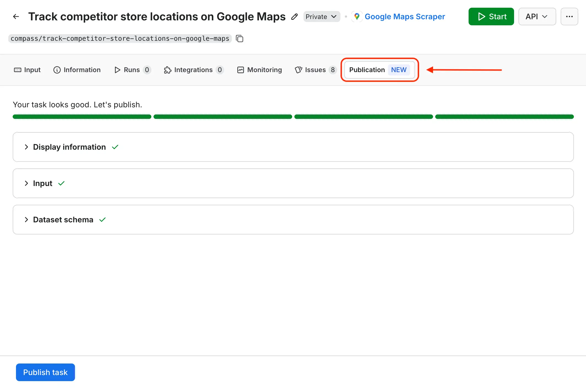
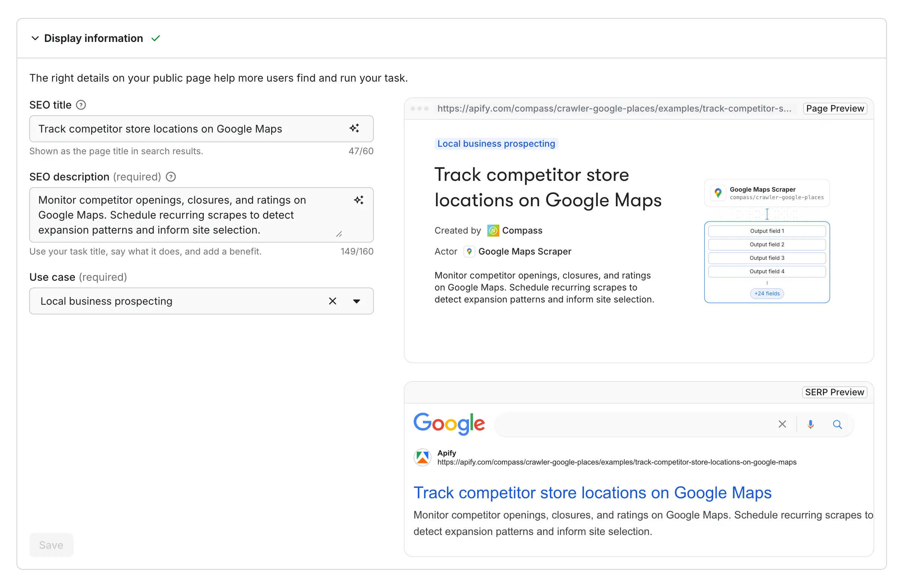
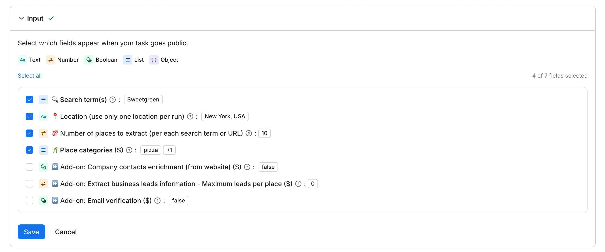
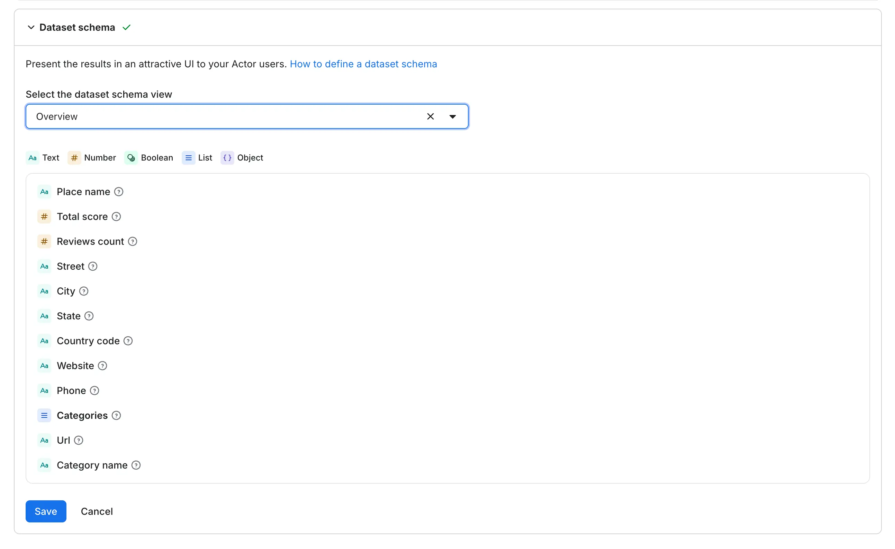
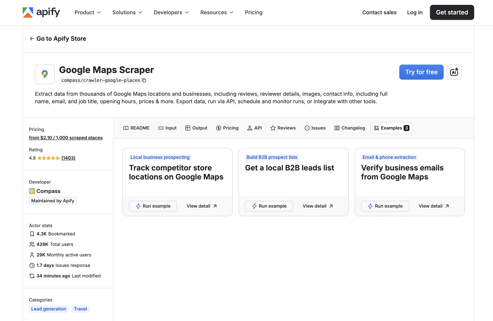
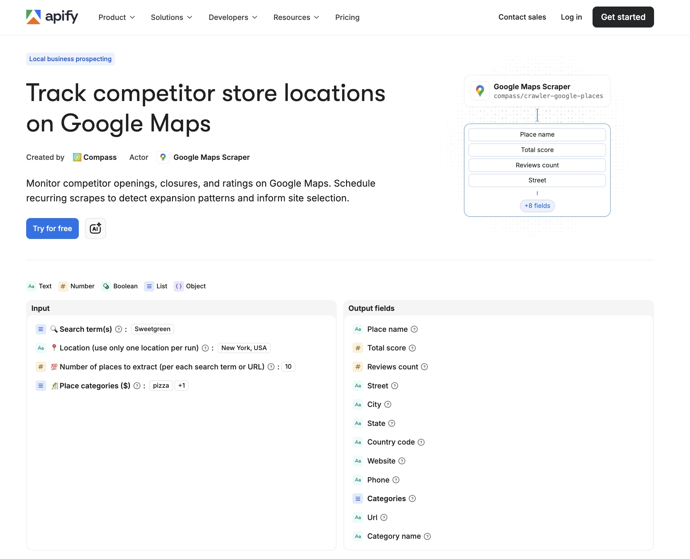

Actor tasks are useful for saving pre-configured inputs for your Actors. Making your tasks public can improve discoverability and explain use cases of your Actor with real-world examples.

Each public task is exposed through a landing page that shows users what the Actor does, what is the input, and what output to expect. Public tasks also appear in your Actor’s **Examples** tab. This helps people searching for or asking AI agents for a specific phrase or use case discover your Actor. Publishing tasks can lead to more page views, more runs, and, for monetized Actors, more revenue.

This guide walks you through the publication process on the **Publication** tab and the steps to make a task public.

Before you publish a task, your Actor itself must already be public. See [Publish your Actor](./publish.mdx) for the prerequisites that apply at the Actor level.

:::note Prerequisites

- A published Actor that you own or maintain.
- A [saved task](../running/tasks.md) with a complete input configuration.
- An [input schema](/platform/actors/development/actor-definition/input-schema) and [dataset schema](/platform/actors/development/actor-definition/dataset-schema) defined on the parent Actor.

:::

## What tasks to publish

Not every saved task deserves a public landing page. Focus on tasks that represent a real use case someone would search for and that show your Actor solving a specific problem.

### Demonstrate a specific job-to-be-done

The best tasks target a concrete goal that a user can relate to immediately. Instead of publishing a generic "default configuration" task, publish one that answers a question someone might type into a search engine or LLM client.

For example, if you maintain a Google Maps scraper Actor:

| Weak task | Strong task |
| --- | --- |
| Google Maps - default config | Find dentists in San Francisco with reviews |
| Test run 2 | Extract restaurant emails for local marketing |
| All fields enabled | Compare gym ratings across New York boroughs |

Each strong task focuses on a specific industry, location, or workflow. A user searching for "dentist data San Francisco" is far more likely to land on a page with that exact framing.

### Target search traffic and AI discovery

Each landing page also includes a markdown (`.md`) version that LLMs can access directly, making your task discoverable through AI-powered search and AI assistants.

Think of each task as a keyword-targeted landing page. Consider:

- **Location-specific tasks** - "Scrape real estate listings in Austin" rather than "Scrape real estate listings".
- **Industry-specific tasks** - "Monitor competitor pricing for electronics" rather than "Monitor competitor pricing".
- **Workflow-specific tasks** - "Export LinkedIn company data to Google Sheets" rather than "Export LinkedIn data".

The more specific the task, the less competition it has in search results and the more relevant it is to the person who finds it.

:::info Show the range of your Actor

If your Actor supports multiple use cases, publish a task for each one. A web scraping Actor might have tasks for lead generation, price monitoring, and content aggregation. Each task demonstrates a different capability and attracts a different audience.

:::

## Make your task public

Once your task runs reliably and produces the output you want users to see, publish it from Apify Console.

1. From your task's page in Apify Console, open the **Publication** tab.
1. Complete the three sections: **Display information**, **Input**, and **Dataset schema**.
1. Click **Publish task**.



### Display information

This section controls how your task appears on the public task landing page and in search results.

There are 3 fields to fill:

- **SEO task title** — shown as the heading on the landing page and as the page title in search results.
- **SEO description** — appears under the title on the landing page and as the meta description in search results.
- **Use case** — pick the option that best matches your task's job-to-be-done. The list is curated by Apify and offers sub-categories of the use cases supported by the parent Actor.


You can live preview how the fields propagate on the right (they update as you type):

- **Page Preview** — how the landing page will look to visitors.
- **SERP Preview** — how the page will appear in Google search results.




:::tip Title format

Frame the title as the user's job-to-be-done, not as a description of the Actor's mechanics. A good title combines an action, a target, and a qualifier.

:::

### Input

The Input section controls which fields from your task's input configuration appear on the public landing page. By default, every field defined in your task input is selected. Deselect any field that is not relevant to the task's use case.

This control affects display only. The task itself always runs with the full input configuration, regardless of which fields are selected here.




Use this section to:

- Show only the fields that demonstrate how the task is configured for its specific use case.
- Hide configuration fields that are not relevant to the task and would confuse first-time users.

:::info Secret fields are protected automatically

All input fields with `"isSecret": true` in the Actor's [input schema](/platform/actors/development/actor-definition/input-schema) are automatically masked. Their values are never displayed on the landing page or included in the copy other users receive. Verify that sensitive fields are properly marked as secret in the input schema before publishing.

:::

### Dataset schema

The Dataset schema section selects which view of the parent Actor's dataset is rendered on the landing page. Each view organizes the output fields differently. Pick the one that best matches the task's use case.



For more on configuring views, see [Dataset schema](/platform/actors/development/actor-definition/dataset-schema).

## Task landing page

Each published task gets its own standalone landing page on the [Apify website](https://apify.com). This page is publicly accessible, indexed by search engines, and readable by AI agents. Published tasks also appear in the **Examples** tab of the parent Actor's detail page, linking visitors directly to the landing page.



### URL structure

The landing page URL is built from your username, Actor name, and task name. For example:

```text
https://apify.com/john/google-maps-scraper/examples/find-dentists-san-francisco
```

Keep the task name short, descriptive, and focused on the use case keyword.

### Landing page content



The landing page displays the information you configured in the [Display information](#display-information), [Input](#input), and [Dataset schema](#dataset-schema) sections:

- The **SEO task title** and **SEO description** at the top of the page.
- The selected **input fields** with their configured values, so visitors can see exactly how the task is set up.
- A preview of the **Dataset schema fields** based on the dataset view you selected.
- A call-to-action button that lets visitors try the task immediately.
- There are additional sections on the landing page explaining generically **how Apify works** and **how to integrate** it.

### What happens when a visitor tries the task

When a visitor clicks the call-to-action button, Apify creates a new task under their account with the same input configuration. The visitor gets their own independent copy - they can modify it, run it, and manage it without affecting your original task. You don't need to worry about other users consuming your resources or altering your configuration.

## Next steps

- Set up [monetization](./monetize/index.mdx) for the parent Actor.
- Track quality with the [Actor quality score](./quality_score.mdx).
