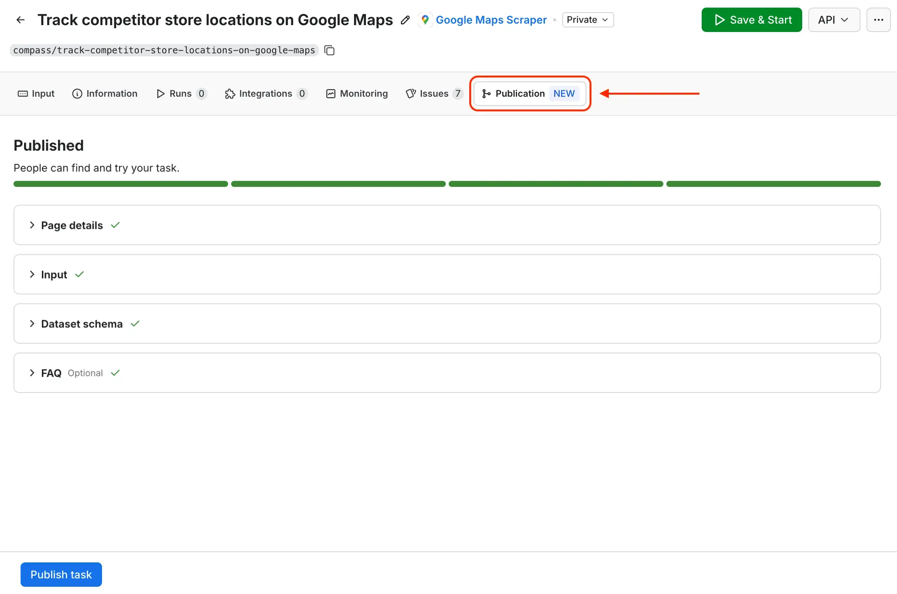
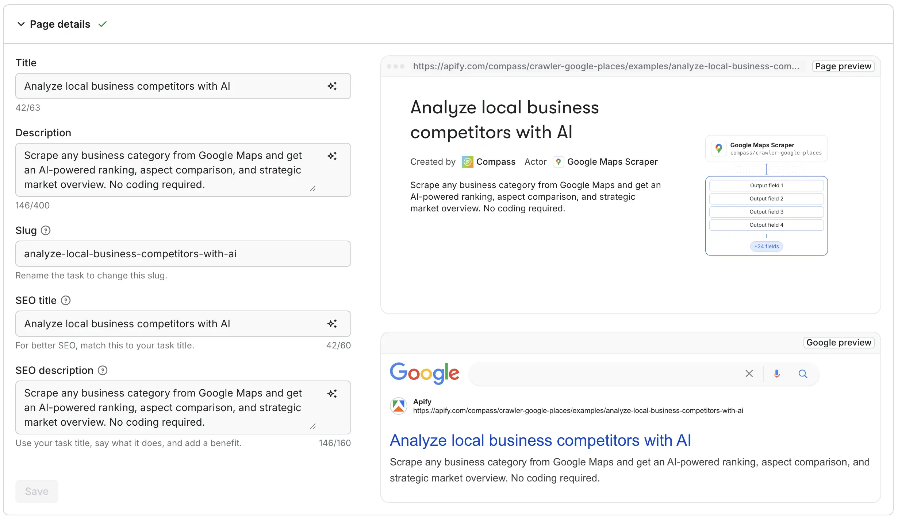
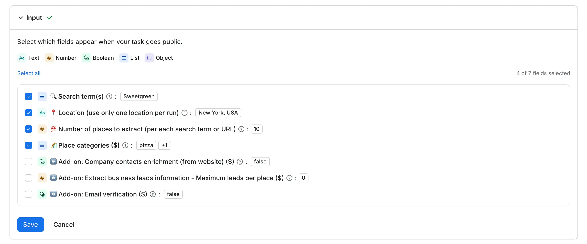
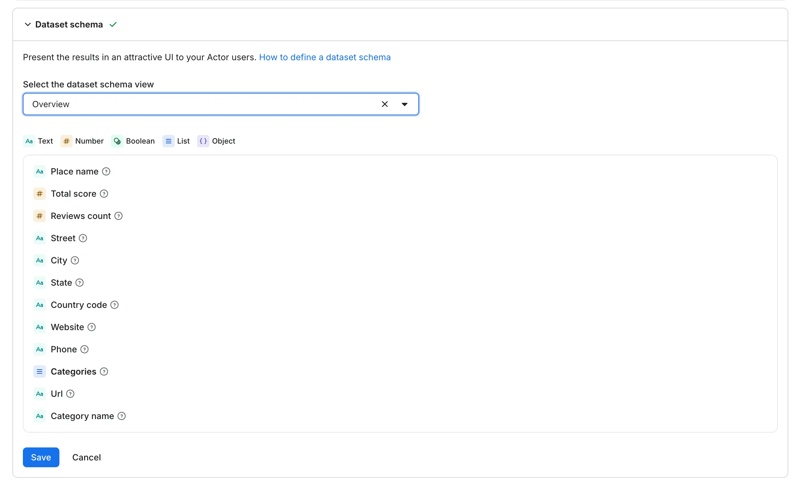
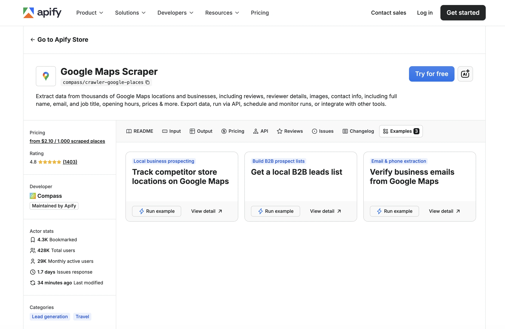
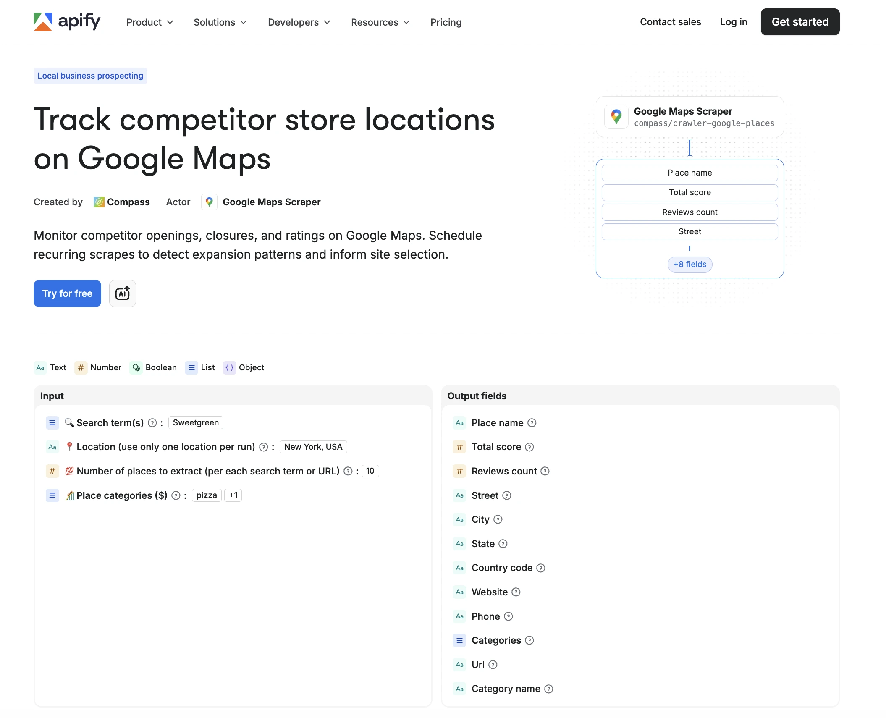

[Actor tasks](/actors/running/tasks) are shareable, pre-configured inputs for your Actors. [Publishing a task](#publish-your-tasks) creates a public landing page that shows what it does, what inputs to provide, and what output to expect. Published tasks also appear in your Actor's **Example tasks** tab, which helps users discover your Actor through search engines and AI agents. For monetized Actors, more discoverability means more paid runs.

You can create up to 50 tasks per Actor.

## Prerequisites

Before you publish a task, make sure you have:

- A [published Actor](./publish/index.mdx) that you own or maintain.
- A [saved task](/actors/running/tasks) with a complete input configuration.
- An [input schema](/actors/development/actor-definition/input-schema) and at least one [dataset schema view](/storage/dataset-schema) defined on the Actor.

If your Actor is missing an input schema or dataset schema, the **Publishing** tab shows what needs to be set up before you can publish.

## What tasks to publish

Focus on tasks that represent a real use case someone would search for and that show your Actor solving a specific problem. Not every saved task needs a public landing page.

### Focus on a real use case

The best tasks aim to solve a problem a user actually has. Instead of publishing a generic "default configuration" task, publish one that answers a question someone might type into a search engine or AI agent.

For example, if you maintain Google Maps, Amazon, and Yahoo Finance scraper Actors:

| Generic task | Specific task |
| --- | --- |
| Google Maps business task | Analyze San Francisco business competitors with AI |
| Yahoo Finance test | Monitor stock prices on Yahoo Finance |
| Amazon scraper | Track Amazon product prices for market research |

Each task focuses on a specific industry, location, or workflow. A user searching for "San Francisco business competitors" is more likely to land on a page with that exact framing.

### Target search traffic and AI discovery

Each landing page shows up in Google search results. It also has a markdown (`.md`) version that AI agents can read directly.

Think of each task as a keyword-targeted landing page:

- Location-specific tasks: "Scrape real estate listings in Austin" rather than "Scrape real estate listings"
- Industry-specific tasks: "Monitor competitor pricing for electronics" rather than "Monitor competitor pricing"
- Workflow-specific tasks: "Export LinkedIn company data to Google Sheets" rather than "Export LinkedIn data"

The more specific the task, the less competition it has in search results and the more relevant it is to the person who finds it.

:::info Show the range of your Actor

If your Actor supports multiple use cases, publish a task for each one. A web scraping Actor might have tasks for lead generation, price monitoring, and content aggregation. Each task demonstrates a different capability and attracts a different audience.

:::

## Publish your tasks

Once your task runs reliably and produces the output you want users to see, publish it from Apify Console. The **Publishing** tab guides you through each requirement.

1. From your task's page in Apify Console, open the **Publishing** tab.
1. Complete the three sections: [Page details](#page-details), [Input](#input), and [Dataset schema](#dataset-schema).
1. Select **Publish task**.



### Page details

This section controls how your task appears on the landing page and in search results.

- **Slug:** the URL path for your task's landing page (lowercase, hyphens, no spaces).
- **SEO title:** appears as the heading on the landing page and as the page title in search results.
- **SEO description:** appears under the title on the landing page and as the meta description in search results.
- **Use case:** categorizes your task for Store browsing and search filtering. Required.

Use the AI icon next to each field to generate the SEO title and description from your task configuration.

The preview on the right updates as you type:

- **Page preview:** how the landing page will look to users.
- **Google preview:** how the page will appear in search results.



:::tip Title format

Frame the title as the user's goal, not as a description of the Actor's mechanics. A good title combines an action, a target, and a qualifier.

Good examples:

- Track competitors' store locations
- Get a local B2B leads list
- Verify business emails from Google Maps

Avoid titles like "Google Maps scraper - task 3" or "Test task" that describe the Actor instead of the user's goal.

:::

### Input

The **Input** section controls which fields from your task's input configuration appear on the landing page. Every input field is selected by default. Deselect any field that isn't relevant to this task's use case.

This control affects display only. The task itself always runs with the full input configuration, regardless of which fields are selected here.



:::info Secret fields are protected automatically

All input fields with `"isSecret": true` in the Actor's [input schema](/actors/development/actor-definition/input-schema) are automatically masked and never shown on the landing page. Before publishing, confirm sensitive fields are marked as secret.

:::

### Dataset schema

The **Dataset schema** section selects which view of the Actor's dataset is rendered on the landing page. Each view organizes the output fields differently. Pick the one that best matches the task's use case.



For more on configuring views, see [Dataset schema](/storage/dataset-schema).

### Publish confirmation

When you select **Publish task**, a confirmation dialog reminds you that your runs and data stay private. Once published, anyone on Apify can duplicate and run your task with their own input.

A success dialog lets you share your task on social media. Use the **View landing page** button in the **Publishing** tab to preview it.

## Unpublish a task

To remove a task's landing page, open the task's **Publishing** tab and select **Unpublish task**. Confirm to remove it.

Unpublishing removes the landing page, but your task and its configuration stay saved. Republish anytime.

<!-- TODO: capture task-unpublish-dialog.webp screenshot -->

To see which tasks are published, filter by **Publish status** in the Tasks list in the sidebar.

## Task landing page

Each published task gets its own standalone landing page on the [Apify website](https://apify.com), indexed by Google and readable by AI agents. Published tasks also appear in the **Example tasks** tab of the Actor's detail page, linking users directly to the landing page.



### URL structure

The landing page URL is built from your username, Actor name, and task name. For example:

```text
https://apify.com/john/google-maps-scraper/examples/analyze-local-business-competitors
```

Keep the task name short, descriptive, and focused on the use case keyword.

### Landing page content



The landing page displays the information you configured in the [Page details](#page-details), [Input](#input), and [Dataset schema](#dataset-schema) sections:

- The **SEO title** and **SEO description** at the top of the page.
- The selected **input fields** with their exact configured values.
- A preview of the **Dataset schema fields** based on the dataset view you selected.
- A call-to-action button that lets users try the task right away.

### After a user tries your task

When a user clicks the call-to-action button, Apify creates a new task under their account with the same input configuration. The user can change, run, and manage it without affecting your original task. Your runs, data, and configuration stay private.

## Next steps

- Set up [monetization](./monetize/index.mdx) for your Actor.
- Track quality with the [Actor quality score](./quality_score.mdx).
