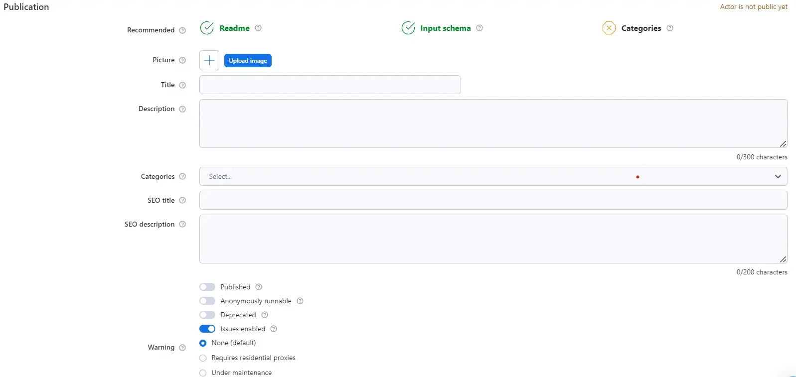
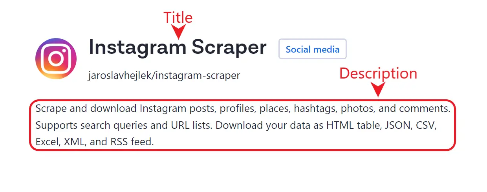
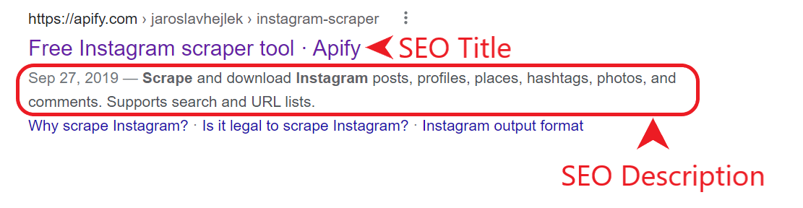
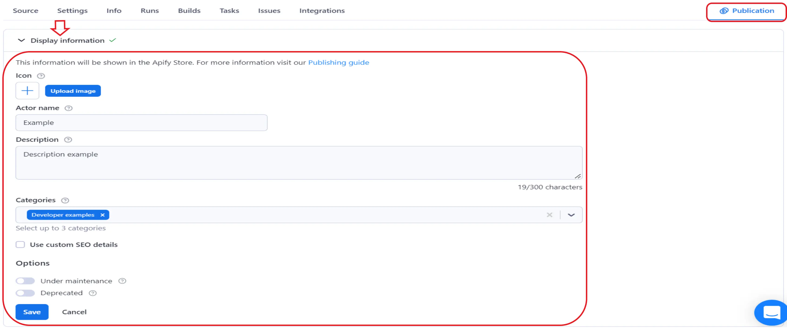
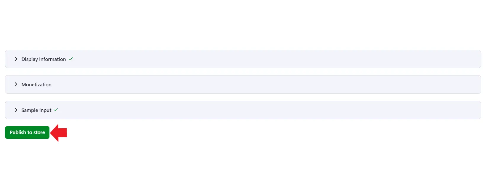
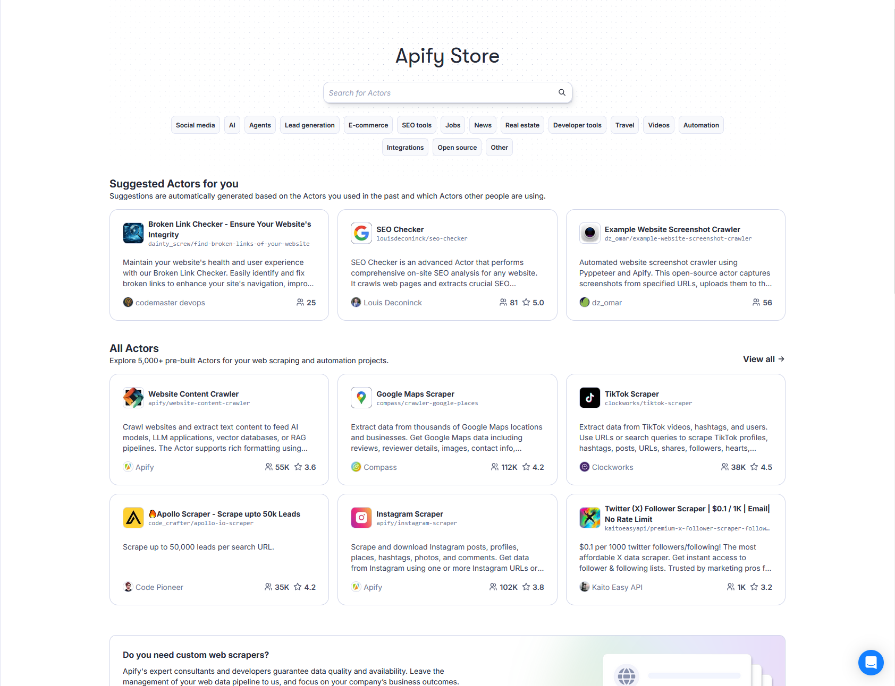
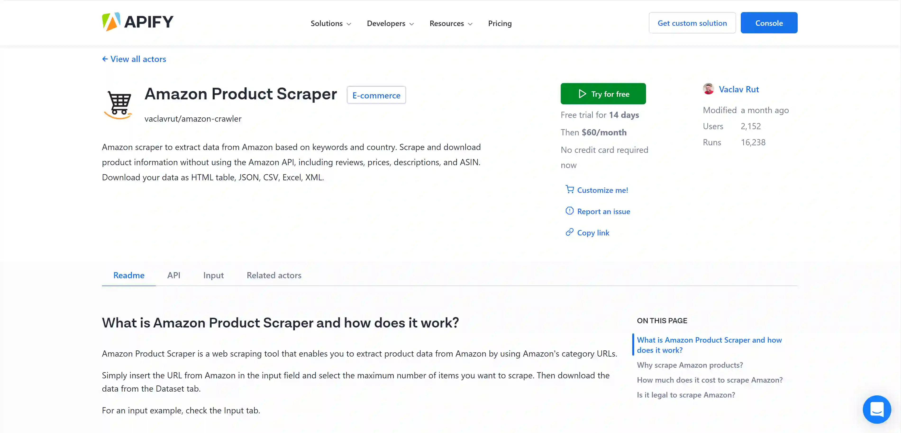

**Prepare your actor for the Apify Store with a description and README file and learn how to make your actor available to the public.**

---

Before you make your actor public, it is important to make sure your actor has good **Description** and **README** sections so that users can understand what your actor does, how to configure its inputs, and what kind of output it returns. In this lesson, we will briefly go over each of the fields you have to fill in before publishing your actor. For more detailed information about [SEO and promotion](/academy/get-most-of-actors/seo-and-promotion) and [how to write a comprehensive README](/academy/get-most-of-actors/actor-readme), check our guides at Apify Developer Academy.

You can find the Title and description configurations by going to **Apify Console** → **Actors** → **My Actors** → **your-actor** → **Settings → Publication**

## Description {#description}

The actor’s description is a short paragraph describing the actor’s purpose. It will be displayed on the actor’s page right below its title.

While writing your actor’s description you also have the option to write an SEO title and description. The SEO title and description are used in place of the actor name and description on search engine results pages. Good SEO titles and descriptions utilize popular keywords, summarize the actor functionality, and are between 40-50 and 140-156 characters long, respectively.

## README {#readme}

The next step is to include a **README** detailing the actor’s features, reasons to scrape the targeted website, and an explanation about how to use the actor.

Keep in mind that the actor’s README is generated from your README.md file, and you can apply the same [SEO principles](/academy/get-most-of-actors/seo-and-promotion) described in the previous lesson to your README.

To save some time when writing an actor’s README, you can use the template below as a starting point:

[https://github.com/zpelechova/readme-template](https://github.com/zpelechova/readme-template)

Note that the complexity of the README should match the actor’s complexity. This means that the template above is not immutable and that you can adapt it to fit the particularities of your actor.

## Make your actor Public {#make-your-actor-public}

Once you have finished coding and testing your actor, it's time to publish it.

From your actor’s page in Apify Console, go to **Publication → Display information**, fill in all the relevant fields for your actor (e.g., "Icons","Actor name", "Description", "Categories") and save it.

Once all the fields are filled in, you will notice that the button **Publish to Store** will turn green. Just click on it and your actor should now be available to the public on Apify Store.

To check if everything went smoothly, you can go to [Apify Store](https://apify.com/store) and search for your actor’s name.

Then, click on your actor’s card and you will see your dedicated actor’s page. This is the page where users will most likely have their first contact with your actor, so make sure to carefully review it and check if everything is set up correctly.

