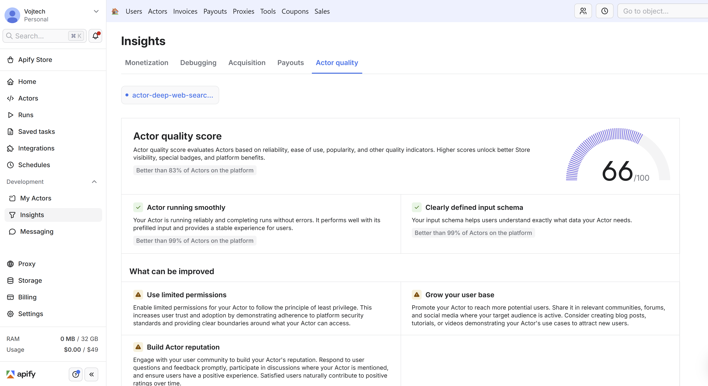

The Actor quality score is a metric that evaluates your Actor's performance across multiple dimensions, including reliability, ease of use, popularity, and other quality indicators. Scores range from 0 to 100 and influence your Actor's visibility and placement in the Apify Store.

---

## How to view your score

Navigate to **Console >Insights > Actor Quality**, and then select your Actor.

## Overview

The Actor quality score aggregates multiple performance and quality metrics into a single numerical rating. This score indicates your Actor's health and user satisfaction. A higher score improves your Actor's discoverability in the Apify Store.

The platform provides in-app recommendations to help you identify improvement opportunities and optimize your Actor's quality score.

:::note Score updates are not immediate

The Actor quality score recalculates several times per day. Changes you make to your Actor may not immediately reflect in your score or improvement recommendations. Improvement recommendations may continue to appear for a period of time after you have addressed the underlying issues.

:::

There are eight quality categories:

- Reliability
- Popularity
- Feedback and community
- Ease of use
- Pricing transparency
- Trustworthiness
- History of success
- Congruency of texts

## Quality score categories

### Reliability

Reliability measures your Actor's operational stability and consistency. A reliable Actor maintains high run success rates and passes automated quality assurance tests. Poor reliability significantly impacts your quality score. For more information on testing requirements, see [Automated Testing](https://docs.apify.com/platform/actors/publishing/test).

Implementing an [input schema](https://docs.apify.com/platform/actors/development/actor-definition/input-schema) helps prevent runtime failures by validating user input before execution begins, reducing errors caused by invalid or malformed inputs.

### Popularity

Popularity reflects user engagement and adoption of your Actor. This metric considers factors such as the number of users running your Actor, save counts, and return usage patterns. Building an Actor that addresses a clear use case and provides a seamless user experience is fundamental to achieving strong popularity metrics.

### Feedback and community

Users who have run your Actor multiple times are invited to provide reviews and ratings. User feedback significantly influences your quality score, making it essential to deliver a positive experience from the first run. Focus on creating clear onboarding flows and intuitive interfaces. Negative reviews impact your score, so prioritize addressing critical issues promptly and maintaining active communication with your user base to foster long-term success.

### Ease of use

Ease of use evaluates how quickly users can understand and successfully run your Actor. Provide clear, concise titles and descriptions that accurately convey your Actor's functionality. Input field descriptions should be self-explanatory and guide users toward correct usage. A [well-structured README](https://docs.apify.com/academy/actor-marketing-playbook/actor-basics/how-to-create-an-actor-readme) is equally important, particularly for Actors with complex use cases or configuration options. Strong ease of use facilitates user onboarding and improves retention rates.

### Pricing transparency

Pricing transparency evaluates how clearly users can understand and predict the costs of running your Actor. Transparent pricing models help users make informed decisions and budget accordingly. The [Pay per event (PPE)](https://docs.apify.com/platform/actors/publishing/monetize/pay-per-event) monetization model provides predictable, event-based pricing that makes costs explicit and easier to estimate.

Consider offering discounts for Bronze, Silver, and Gold subscription tiers. These incentives reward committed platform users and can increase your Actor's adoption among engaged customers.

### Trustworthiness

Trustworthiness evaluates whether your Actor follows the principle of least privilege by using limited permissions. This configuration provides clear boundaries around what the Actor can access, demonstrating adherence to platform security standards.

Actors with limited permissions build user confidence and trust, making users more likely to adopt them. Conversely, the absence of limited permissions will negatively impact your quality score.

Limited permissions support the vast majority of Actor use cases without restricting functionality. If your Actor requires access to resources beyond what limited permissions provide, contact the Apify support team to discuss your specific requirements.

### History of success

Developers with a proven track record of publishing successful Actors receive recognition in their quality scores. This factor acknowledges the value of experienced developers who consistently deliver high-quality Actors to the platform.

### Congruency

Congruency measures the consistency and coherence across your Actor's components. A well-designed Actor maintains alignment between its title, description, documentation, and schemas. Ensure that your [input schema](https://docs.apify.com/platform/actors/development/actor-definition/input-schema), [dataset schema](https://docs.apify.com/platform/actors/development/actor-definition/dataset-schema), [key-value store schema](https://docs.apify.com/platform/actors/development/actor-definition/key-value-store-schema), and README documentation all reflect consistent terminology and accurately describe the Actor's behavior. This coherence reduces user confusion and improves the overall experience.
