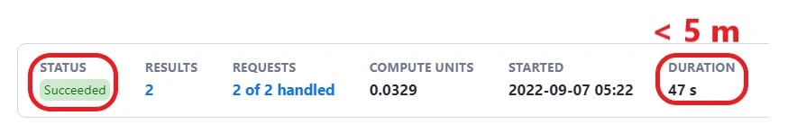

**Apify has a QA system that regularly runs automated tests to ensure that all Actors in the store are functional.**

---

The test runs the Actor with its default input (defined by the **prefill** option in the input schema file)
and expects it to finish with a **Succeeded** status within 5 minutes of the beginning of the run.

If the Actor fails to complete successful runs for three consecutive days, the developer will be notified,
and the Actor will be labeled **Under Maintenance** until it is fixed. After another 14 days of failing runs, you will receive another notification. Finally, if the runs continue to fail after yet another 14 days, the Actor will be **Deprecated**.

### What if my Actor cannot comply with the test logic?

Actors that require some sort of authentication will always fail the tests despite being fully functional.
If that's the case with your Actor, please contact support at **support@apify.com** and explain your specific use case that justifies why the Actor should be excluded from the automated tests.

### Advanced Actor testing

You can easily implement your own tests and customize them to fit your Actor's particularities
by using our public [Actor Testing](https://apify.com/pocesar/actor-testing) tool available in Apify Store.
For more information see [automated testing](../development/deployment/automated_tests.md) section.

