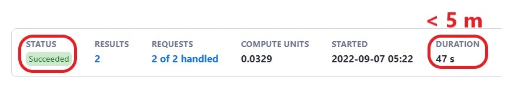

## Why we test

We want to make sure that all Actors in Apify Store are top-notch, or at least as top-notch as they can be. Since there are many of them, we have an automated testing procedure in place that tests all Actors daily.
This helps us to flag Actors that temporarily don't work as expected `under maintenance`, and to automatically `deprecate` Actors that have been broken for more than a month.

## How we test

The test runs the Actor with its default input (defined by the [**prefill**](https://docs.apify.com/actors/development/actor-definition/input-schema/specification/v1#prefill-vs-default-vs-required) option in the input schema file)
and expects it to finish with a **Succeeded** status and non-empty default dataset within 5 minutes of the beginning of the run.

If more than half of the daily test runs in the last three days fail, Apify notifies you and labels the Actor `under maintenance` until it's fixed. All test runs in those three days must use the same build, so a new build restarts the count. After another 14 days of failing runs, you get another notification. If the runs still fail 14 days after that, Apify marks the Actor as `deprecated`.

## Find out why the test failed

When Apify labels your Actor `under maintenance`, you get a notification in Apify Console and by email. What it says depends on whether the test could start the Actor.

### The test couldn't start the Actor

This usually means a problem with the input schema. The test builds its input from the schema's `prefill` values. Every required field needs a `prefill` or `default` value, and every value must pass the schema's validation. For example, a `prefill` of `3` fails for a field with `"maximum": 2`.

To see the input the test uses:

1. In Apify Console, open your Actor.
1. Go to **Source** > **Input**.
1. Select **Restore example input**. The form loads the values from the input schema and shows an error next to any value that fails validation.

Fix the input schema, then rebuild the Actor.

### The test run failed

The notification links to one of the failed test runs. Check its log for the cause.

If the run timed out, make the test input smaller. `prefill` or `default` values that return a few results are enough, so the run finishes within the 5-minute limit.

## How can I make my Actor healthy again

The best course of action is to fix the Actor and rebuild it. The automatic testing system will pick this up within 24 hours
and mark it as healthy. In some cases, your Actor might break because of issues with the target website. In such a case, if your Actor
passes the majority of test runs in the next 7 days, it will be marked as healthy automatically.

## What if my Actor cannot comply with the test logic

Some Actors aren't tested automatically:

- Actors with [Actor Standby](../running/actor_standby.md) enabled
- Actors in the MCP servers category
- Actors with a required secret input, or a required API token or key without a `prefill` value

If your Actor can't pass the test for another reason, such as needing more than 5 minutes to finish, request to skip the tests:

1. In the under-maintenance notification, open the form link. It opens the **Request to skip Actor checks** dialog in your Actor's **Settings** tab.
1. Explain why your Actor should skip the tests.
1. Select **Send request**.

Apify approves requests only in exceptional cases. You can also [contact support](https://apify.com/contact).

## Advanced Actor testing

You can easily implement your own tests and customize them to fit your Actor's particularities
by using the public [Actor Testing](https://apify.com/pocesar/actor-testing) tool available in Apify Store.
For more information, see the [automated testing](../development/automated_tests.md) section.
