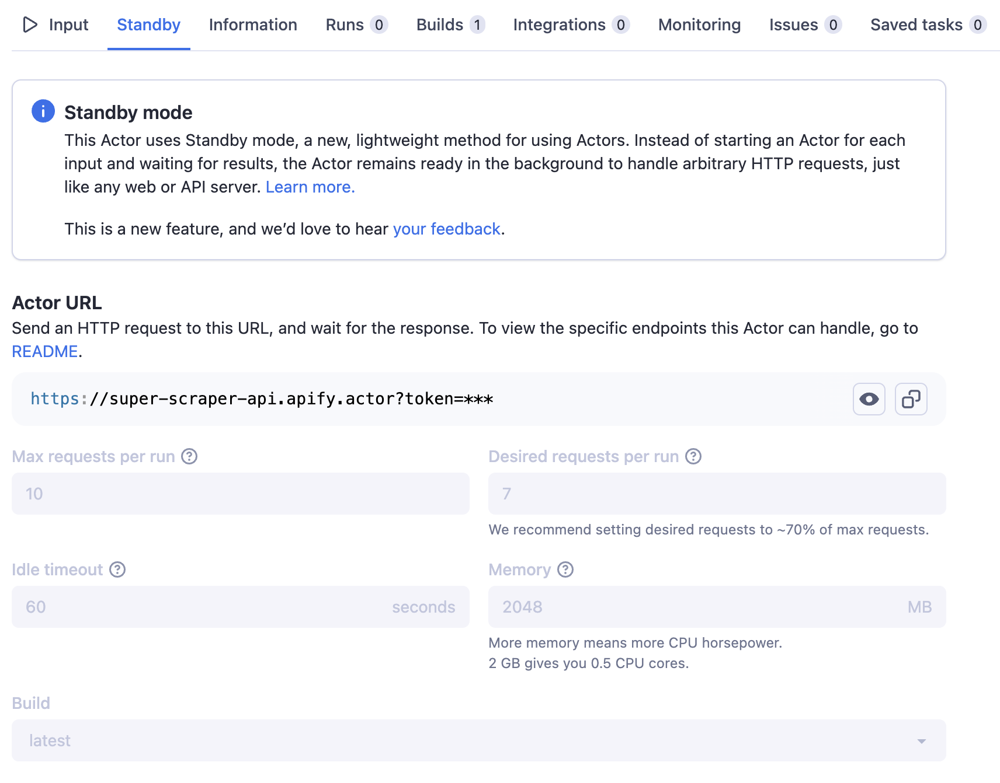

**Use Actors in lightweight Standby mode for fast API responses.**

---

Traditional Actors are designed to run a single job and then stop. They're mostly intended for batch jobs, such as when you need to perform a large scrape or data processing task.
However, in some applications, waiting for an Actor to start is not an option. Actor Standby mode solves this problem by letting you have the Actor ready
in the background, waiting for the incoming HTTP requests. In a sense, the Actor behaves like a real-time web server or standard API server.

## How do I know if Standby mode is enabled

You will know that the Actor is enabled for Standby mode if you see the **Standby** tab on the Actor's detail page.
In the tab, you will find the hostname of the server, the description of the Actor's endpoints,
the parameters they accept, and what they return in the Actor README.

To use the Actor in Standby mode, you don't need to click a start button or not need to do anything else. Simply use the provided hostname and endpoint in your application,
hit the API endpoint and get results.



## How do I pass input to Actors in Standby mode

If you're using an Actor built by someone else, see its Information tab to find out how the input should be passed.

Generally speaking, Actors in Standby mode behave as standard HTTP servers. You can use any of the existing [HTTP request methods](https://developer.mozilla.org/en-US/docs/Web/HTTP/Methods) like GET, POST, PUT, DELETE, etc. You can pass the input via [HTTP request query string](https://en.wikipedia.org/wiki/Query_string) or via [HTTP request body](https://developer.mozilla.org/en-US/docs/Web/HTTP/Messages#body).

## How do I authenticate my requests

To authenticate requests to Actor Standby, follow the same process as [authenticating requests to the Apify API](../../integrations/programming/api.md).
You can provide your [API token](../../integrations/programming/api.md#api-token) in one of two ways:

1. _Recommended_: Include the token in the `Authorization` header of your request as `Bearer <token>`. This approach is recommended because it prevents your token from being logged in server logs.

    ```shell
    curl -H "Authorization: Bearer my_apify_token" \
      https://rag-web-browser.apify.actor/search?query=apify
    ```

2. Append the token as a query parameter named `token` to the request URL.
This approach can be useful if you cannot modify the request headers.

    ```text
    https://rag-web-browser.apify.actor/search?query=apify&token=my_apify_token
    ```

:::tip
You can use [scoped tokens](/platform/integrations/api#limited-permissions) to send standby requests. This is useful for allowing third-party services to interact with your Actor without granting access to your entire account.

However, [restricting what an Actor can access](/platform/integrations/api#restricted-access-restrict-what-actors-can-access-using-the-scope-of-this-actor) using a scoped token is not supported when running in Standby mode.
:::

## Can I still run the Actor in normal mode

Yes, you can still modify the input and click the Start button to run the Actor in normal mode. However, note that the Standby Actor might
not support this mode; the run might fail or return empty results. The normal mode is always supported in Standby Beta, even for Actors that don't handle
it well. Please head to the Actor README to learn more about the capabilities of your chosen Actor.

## Is there any scaling to accommodate the incoming requests

When you use the Actor in Standby mode, the system automatically scales the Actor to accommodate the incoming requests. Under the hood,
the system starts new Actor runs, which you will see in the Actor runs tab, with the origin set to Standby.

## How do I customize Standby configuration

The Standby configuration currently consists of the following properties:

- **Max requests per run** - The maximum number of concurrent HTTP requests a single Standby Actor run can accept. If this limit is exceeded, the system starts a new Actor run to handle the request, which may take a few seconds.
- **Desired requests per run** - The number of concurrent HTTP requests a single Standby Actor run is configured to handle. If this limit is exceeded, the system preemptively starts a new Actor run to handle the additional requests.
- **Memory (MB)** - The amount of memory (RAM) allocated for the Actor in Standby mode, in megabytes. With more memory, the Actor can typically handle more requests in parallel, but this also increases the number of compute units consumed and the associated cost.
- **Idle timeout (seconds)** - If a Standby Actor run doesn’t receive any HTTP requests within this time, the system will terminate the run. When a new request arrives, the system might need to start a new Standby Actor run to handle it, which can take a few seconds. A higher idle timeout improves responsiveness but increases costs, as the Actor remains active for a longer period.
- **Build** - The Actor build that the runs of the Standby Actor will use. Can be either a build tag (e.g. `latest.`), or a build number (e.g. `0.1.2`).

You can see these in the Standby tab of the Actor detail page. However, note that these properties are not configurable at the Actor level. If you wish to
use the Actor-level hostname, this will always use the default configuration. To override this configuration, just create a new Task from the Actor.
You can then head to the Standby tab of the created Task and modify the configuration as needed. Note that the task has a specific hostname, so make
sure to use that in your application if you wish to use the custom configuration.

## Are the Standby runs billed differently

No, the Standby runs are billed in the same fashion as the normal runs.
However, running Actors in Standby mode might have unexpected costs, as the Actors run in the background and consume resources even when no requests are being sent until they are terminated after the idle timeout period.

## Are the Standby runs shared among users

No, even if you use the Actor-level hostname with the default configuration, the background Actor runs for your requests are not shared with other users.

## How can I develop Actors using Standby mode

See the [Actor Standby development section](../development/programming_interface/actor_standby.md).
