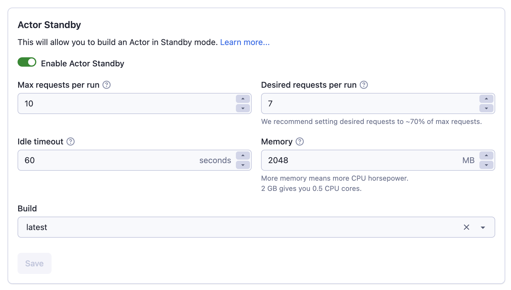

**Use the Actors in a lightweight mode as a blazingly fast API server.**

---

Traditional Actors are designed to run a single task and then stop. They are mostly intended for batch jobs, such as when you need to perform a large scrape or data processing task.
However, in some applications, waiting for an Actor to start is not an option. Actor Standby mode solves this problem by enabling you to have the Actor ready
in the background, waiting for the incoming HTTP requests. In a sense, Actor behaves like a real-time web server or standard API server.

#### How do I know if Standby mode is enabled?
You will know that the Actor is enabled for the Standby if you see the **Standby** tab on the Actor's detail page.
In the tab, you will most importantly find the hostname of the server. You will find the description of the endpoints for this Actor,
what parameters they accept and what they return, in the Actor README.

To use the Actor in the Standby mode, you do not need to do anything, no clicking start button, etc. Simply use the provided hostname and endpoint in your application,
hit the API endpoint, and consume results.

#### Can I still run the Actor in normal mode?
Yes, you can still modify the input and click the Start button to run the Actor in normal mode. However, note that the Standby Actor might
not support this mode; the run might fail or return empty results. The normal mode is always supported in the Standby Beta, even for Actors that do not handle
it well. Please head to the Actor README to learn more about the capabilities of your chosen Actor.

#### Is there any scaling to accommodate the incoming requests?
When you use the Actor in the Standby mode, the system automatically scales the Actor to accommodate the incoming requests. Under the hood,
the system starts new Actor runs, which you will see in the Actor runs tab, with the origin set to Standby.

#### How do I customize standby configuration?
The Standby configuration currently consists of the following properties
- **Max requests per run** - The maximum number of concurrent HTTP requests a single standby Actor run can accept. If this limit is exceeded, the system starts a new Actor run to handle the request, which may take a few seconds.
- **Desired requests per run** - The number of concurrent HTTP requests a single Standby Actor run is configured to handle. If this limit is exceeded, the system preemptively starts a new Actor run to handle the additional requests.
- **Memory (MB)** - The amount of memory (RAM) allocated for the Actor in Standby mode, in megabytes. With more memory, the Actor can typically handle more requests in parallel, but this also increases the number of compute units consumed and the associated cost.
- **Idle timeout (seconds)** - If a Standby Actor run doesn’t receive any HTTP requests within this time, the system will terminate the run. When a new request arrives, the system might need to start a new Standby Actor run to handle it, which can take a few seconds. A higher idle timeout improves responsiveness but increases costs, as the Actor remains active for a longer period.
- **Build** - The Actor build that the runs of the Standby Actor will use. Can be either a build tag (e.g. `latest.`), or a build number (e.g. `0.1.2`).

You can see these in the Standby tab of the Actor detail page. However, note that these properties are not configurable at the Actor level. If you wish to
use the Actor-level hostname, this will always use the default configuration. In order to override this configuration, just create a new Task from the Actor.
You can then head to the Standby tab of the created Task and modify the configuration as needed. Note that the task has a specific hostname, so make
sure to use that in your application if you wish to use the custom configuration.

#### Are the Standby runs billed differently?
No, the Standby runs are billed in the same fashion as the normal runs.
However, there might be unexpected costs for running Actors in the Standby mode, as the Actors are running in the background and consuming resources even when no requests are being sent, until they are terminated after the idle timeout period.

#### Are the Standby runs shared among users?
No, even if you use the Actor-level hostname with the default configuration, the background Actor runs for your requests are not shared with other users.

#### How can I enable standby for my Actor?
You can head to the Settings tab of your Actor, enable Standby mode, and set the default configuration.

Please make sure to properly describe your Actors, their endpoints, and the schema for their
inputs and ouputs in your README.

#### Can I monetize my Actor in the Standby mode?
No, the Standby mode is currently in Beta and the monetization is not supported.
