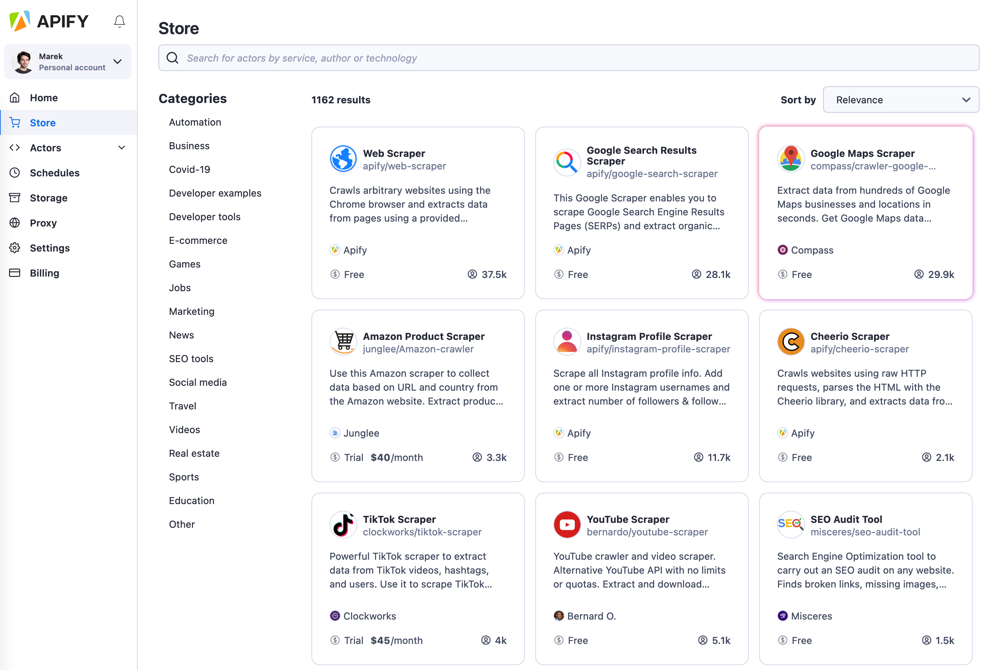
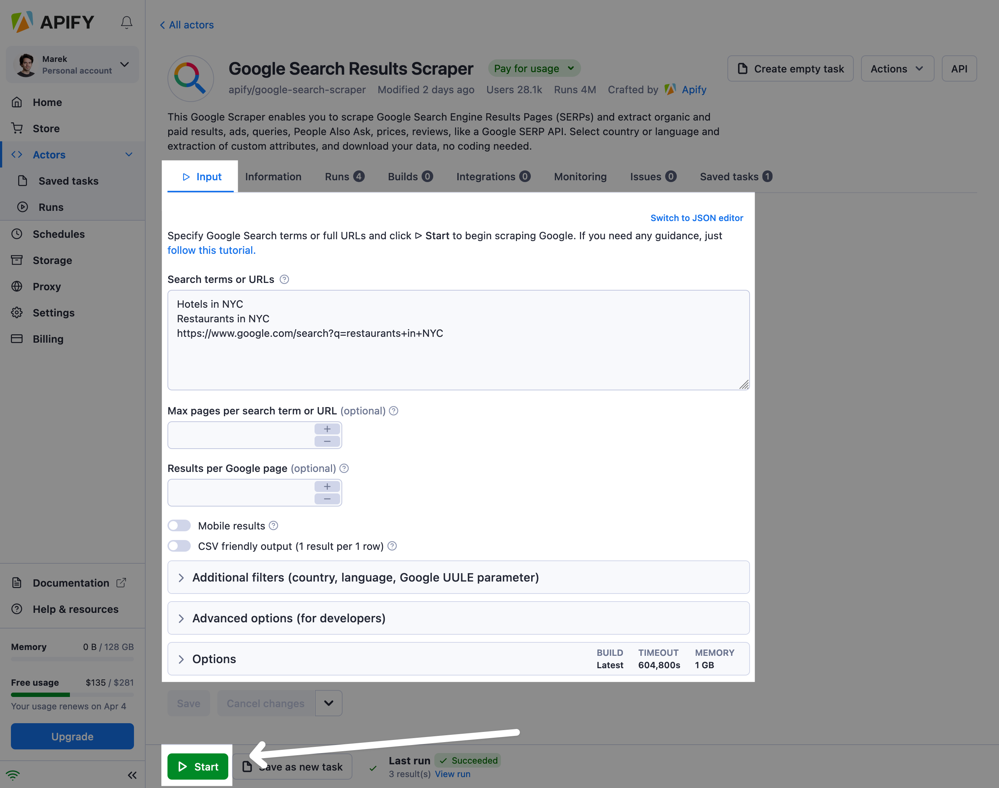
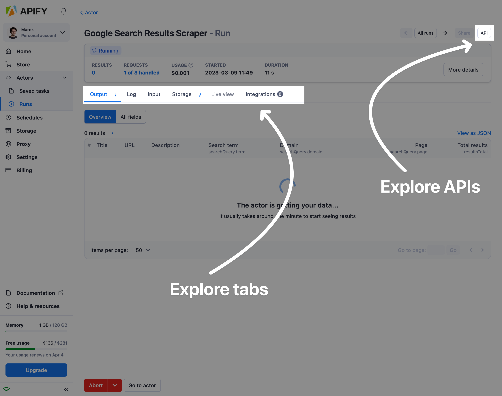
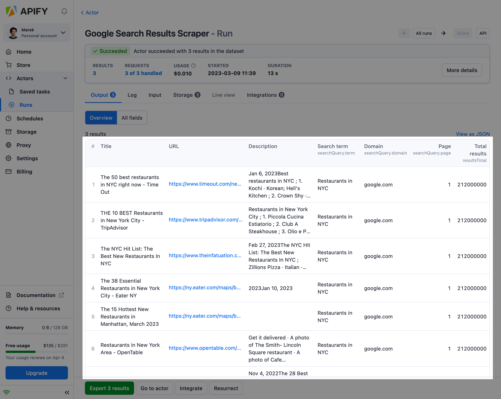
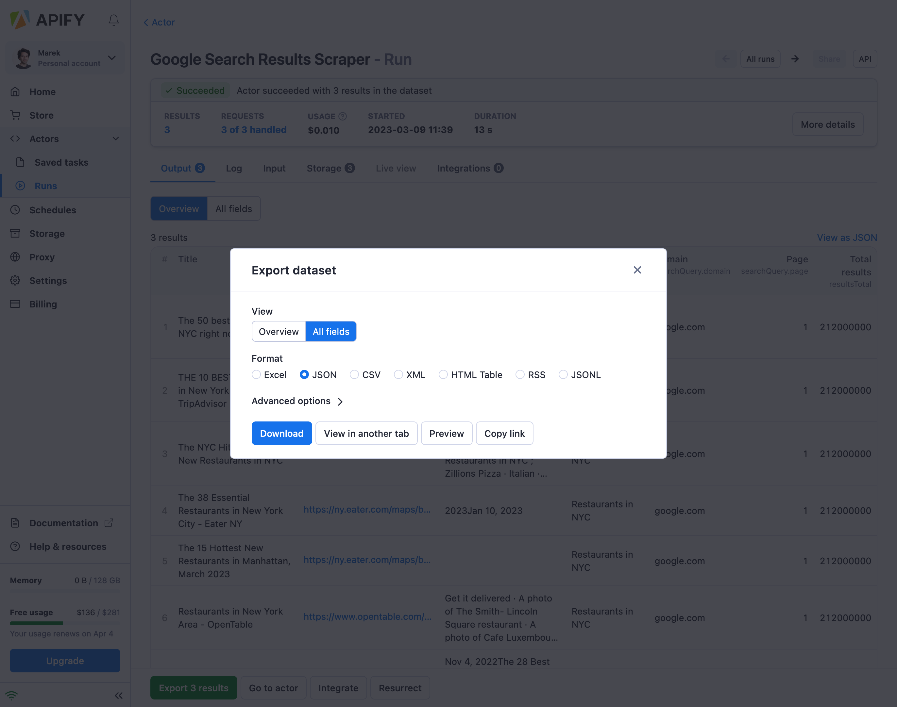

import Tabs from '@theme/Tabs';
import TabItem from '@theme/TabItem';

# Running

**In this section, you learn how to run Apify Actors using Apify Console or programmatically. You will learn about their configuration, versioning, data retention, usage, and pricing.**

---

## Run your first Apify Actor

Before you can run an Actor, you have to either choose one of the existing ones from [Apify Store](https://apify.com/store) or [build your own](./development). To get started, we recommend trying out an Actor from the [Store](https://apify.com/store). Once you have chosen an Actor, you can start it in a number of ways.

> **You will need an Apify account to complete this tutorial. If you don't have one, [complete the sign-up process](https://console.apify.com/sign-up) first. Don't worry about the price - it's free.**

### 1. Choose your actor

After you sign-in to Apify Console, navigate to [Apify Store](https://console.apify.com/store). We'll pick the [Google Maps Scraper](https://console.apify.com/actors/nwua9Gu5YrADL7ZDj#/information/latest/readme):



### 2. Configure it

On the Actor's page, head over to the **Input** tab. Don't be put off by all the boxes - the Actor is pre-configured to run without any extra input. Just click the **Start** button in the bottom-left corner.

Alternatively, you can play around with the settings to make the results more interesting for you.




### 3. Wait for the results

The Actor might take a while to gather its first results and finish its run. Meanwhile, let's take some time to explore the platform options:

- There are more tabs providing you with information about the Actor run. For example, you can access the run **Log** and **Storage**.
- At the top right, you can click on the API button to explore the related API endpoints



### 4. Get the results

Shortly you will see the first results popping up:




And you can use the export button at the bottom left to export the data in multiple formats:



And that's it! Now you can get back to the Actor's input, play with it, and try out more of the [Apify Actors](https://apify.com/store) or [build your own](./development).

## Running via Apify API

Actors can also be invoked using the Apify API by sending an HTTP POST request to the [Run Actor](/api/v2/#/reference/actors/run-collection/run-actor) endpoint, such as:

```text
https://api.apify.com/v2/acts/compass~crawler-google-places/runs?token=<YOUR_API_TOKEN>
```

An actor's input and its content type can be passed as a payload of the POST request, and additional options can be specified using URL query parameters. For more details, see the [Run Actor](/api/v2/#/reference/actors/run-collection/run-actor) section in the API reference.

> To learn more about this, read the [Run an Actor or task and retrieve data via API](/academy/api/run-actor-and-retrieve-data-via-api) tutorial.

## Running programmatically

Actors can also be invoked programmatically from your own applications or from other actors.

To start an Actor from your own application, we recommend using our API client libraries for [JavaScript](/api/client/js/reference/class/ActorClient#call) or [Python](/api/client/python/reference/class/ActorClient#call).

<Tabs groupId="main">

<TabItem value="JavaScript" label="JavaScript">

```javascript
import { ApifyClient } from 'apify-client';

const client = new ApifyClient({
    token: 'MY-API-TOKEN',
});

// Start the Google Maps Scraper Actor and wait for it to finish.
const actorRun = await client.actor('compass/crawler-google-places').call({
    queries: 'apify',
});
// Fetch scraped results from the Actor's dataset.
const { items } = await client.dataset(actorRun.defaultDatasetId).listItems();
console.dir(items);
```

</TabItem>


<TabItem value="Python" label="Python">

```python
from apify_client import ApifyClient

apify_client = ApifyClient('MY-API-TOKEN')

# Start the Google Maps Scraper Actor and wait for it to finish.
actor_run = apify_client.actor('compass/crawler-google-places').call(
    run_input={ 'queries': 'apify' }
)

# Fetch scraped results from the Actor's dataset.
dataset_items = apify_client.dataset(actor_run['defaultDatasetId']).list_items().items
print(dataset_items)
```

</TabItem>

</Tabs>

The newly started Actor runs under the account associated with the provided `token`, and therefore all resources consumed are charged to this user account.

Internally, the `call()` function invokes the [Run Actor](/api/v2/#/reference/actors/run-collection/run-actor) API endpoint, waits for the Actor to finish, and reads its output using the [Get items](/api/v2/#/reference/datasets/item-collection/get-items) API endpoint.

