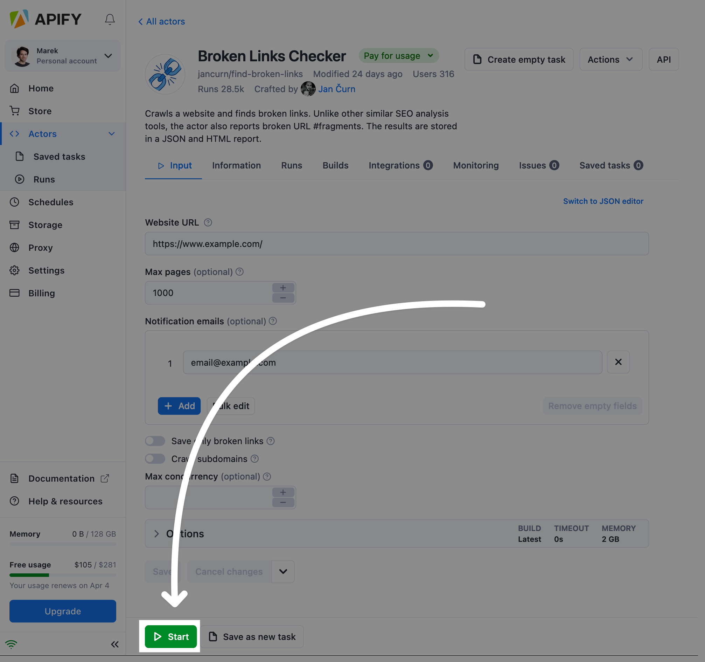

import Tabs from '@theme/Tabs';
import TabItem from '@theme/TabItem';

# Running

**Start an actor from the Apify Console or via API. Learn about actor lifecycles, how to specify settings and version, provide input and resurrect finished runs.**

---

If you have not [built](../development) your own actor yet, then choose one from the [Apify Store](https://apify.com/store). Once you have an actor chosen, you can start it in a number of ways.

## Running from Apify Console UI

One option is to start an actor from its page in [Apify Console](https://console.apify.com/actors):



After setting up an input, you can specify run options such as [build](../development/builds.md), timeout, and [memory](./usage_and_resources.md) for your actor run.

<!-- Using an HTML table because it doesn't have a header - markdown doesn't allow tables with no headers -->
<table>
    <tr>
        <td>Build</td>
        <td>Tag or number of the build to run (e.g. <strong>latest</strong> or <strong>1.2.34</strong>).</td>
    </tr>
    <tr>
        <td>Timeout</td>
        <td>Timeout for the actor run in seconds. Zero value means there is no timeout.</td>
    </tr>
    <tr>
        <td>Memory</td>
        <td>Amount of memory allocated for the actor run, in megabytes.</td>
    </tr>
</table>

## Running via Apify API

Actors can also be invoked using the Apify API by sending an HTTP POST request to the [Run actor](/api/v2/#/reference/actors/run-collection/run-actor) endpoint, such as:

```text
https://api.apify.com/v2/acts/apify~hello-world/runs?token=<YOUR_API_TOKEN>
```

An actor's input and its content type can be passed as a payload of the POST request, and additional options can be specified using URL query parameters. For more details, see the [Run actor](/api/v2/#/reference/actors/run-collection/run-actor) section in the API reference.

## Running programmatically

Actors can also be invoked programmatically from other actors and your Python or JavaScript code:

- JavaScript: using the [`call()`](/sdk/js/reference/class/Actor#call) function of [`Actor`](/sdk/js/reference/class/Actor) class provided by the [`apify`](/sdk/js/) NPM package.
- Python: using the [`call()`](/api/client/python/reference/class/ActorClient#call) function provided by the [`apify-client`](/api/client/python) Python package.

<Tabs groupId="main">

<TabItem value="NodeJS" label="NodeJS">

```javascript
import { Actor } from 'apify';

await Actor.init();
// ...
const run = await Actor.call('apify/hello-world', {
    message: 'Hello!',
});
console.dir(run.output);
// ...
await Actor.exit();

```

</TabItem>


<TabItem value="Python" label="Python">

```python

run = apify_client.actor('apify/hello-world').call(run_input={ 'message': 'Hello!' })
print(run['id'])


```

</TabItem>

</Tabs>

The newly started actor runs under the same user account as the initial actor, and therefore all resources consumed are charged to the same user account. This allows more complex actors to be built using simpler actors built and owned by other users.

Internally, the `call()` function takes the user's API token from the `APIFY_TOKEN` environment variable, then it invokes the [Run actor](/api/v2/#/reference/actors/run-collection/run-actor) API endpoint, waits for the actor to finish and reads its output using the [Get record](/api/v2/#/reference/key-value-stores/record/get-record) API endpoint.


