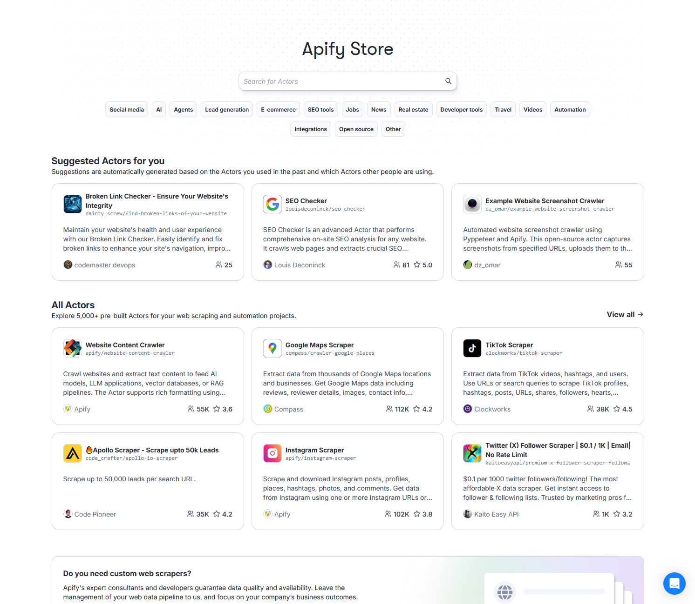
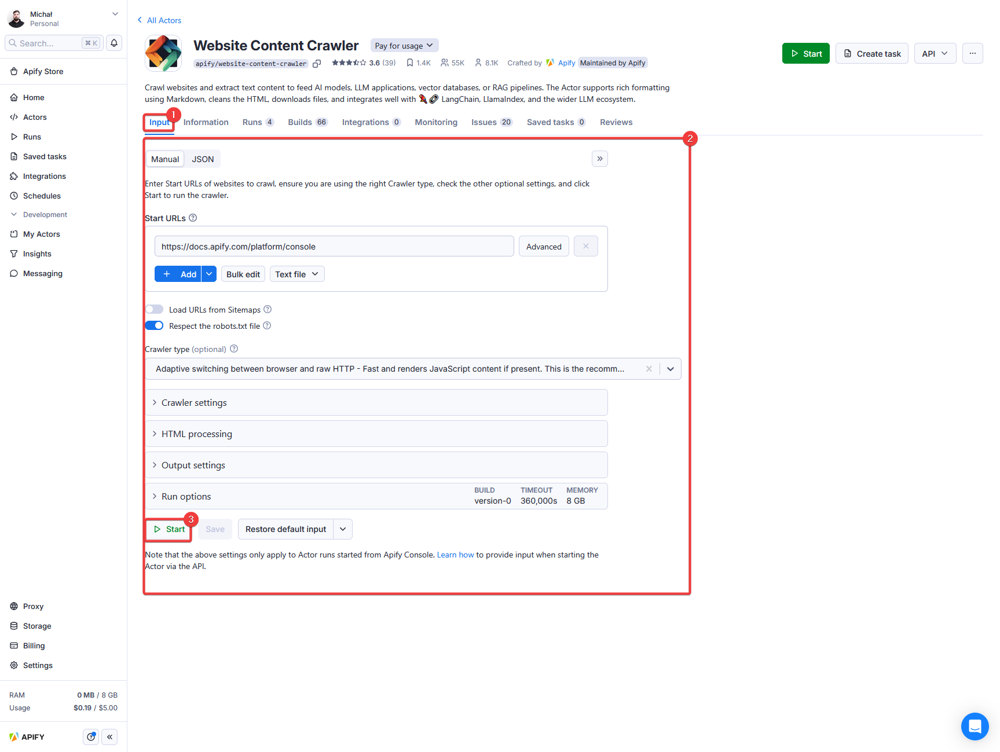
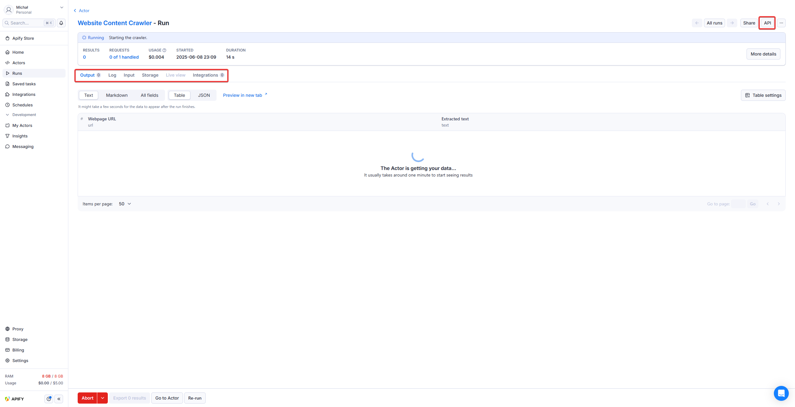
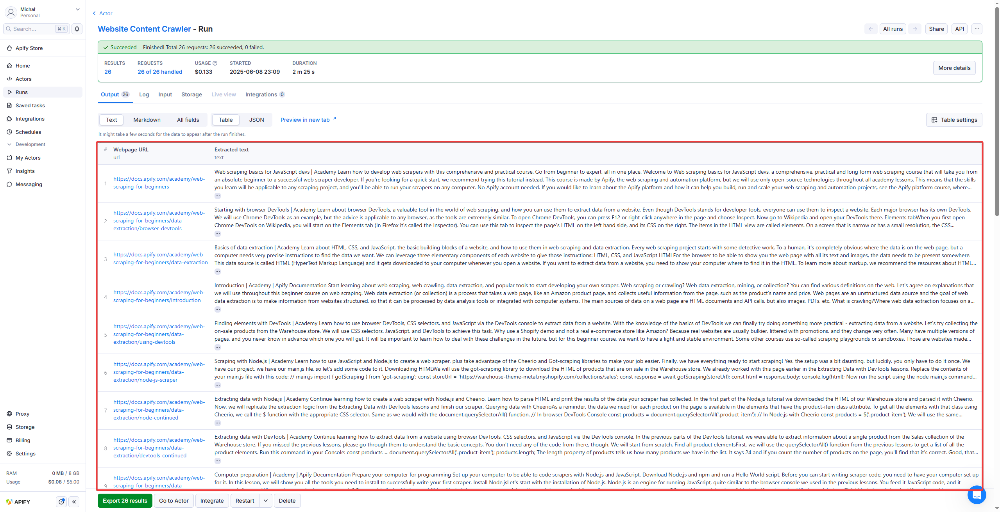
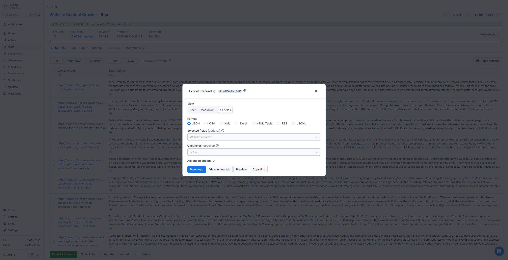

**In this section, you'll learn how to run Apify Actors using Apify Console or programmatically. You'll learn about their configuration, versioning, data retention, usage, and pricing.**

import Tabs from '@theme/Tabs';
import TabItem from '@theme/TabItem';

---

## Run your first Apify Actor

To get started, we recommend trying one of the existing Actors from [Apify Store](https://apify.com/store). For details on building your own, see [Actor development](./development).

### Prerequisites

To complete this tutorial, you need an Apify account. If you don't have it yet, [sign up for free](https://console.apify.com/sign-up).

### 1. Choose your Actor

To find an Actor in Apify Store:

1. Sign in to [Apify Console](https://console.apify.com).
1. Go to [Apify Store](https://console.apify.com/store).
1. Use the search bar or browse by categories.

For this tutorial, let's choose [Website Content Crawler](https://console.apify.com/actors/aYG0l9s7dbB7j3gbS/information/version-0/readme).



### 2. Configure and run your Actor

Once you select the Actor, click **Use Actor**.

In the **Input** tab, you can customize your Actor's behavior. Website Content Crawler is pre-configured to run without extra input, so you don't need to change anything.

To run the Actor, click **Save & Start**.



### 3. Wait for the results

The Actor might take a while to gather results and finish its run. While waiting, let's explore the remaining options:

- Check the tabs where you can find more information about the Actor run. For example, its logs or storage.
- Use the **API** button to view the related API endpoints.



### 4. Save the results

The results of the Actor run appear in the **Output** tab.



To save the data, click **Export**. You can choose from multiple formats.



And that's it! You've run your first Actor!

Now you can go back to the **Input** tab and try again with different settings, run other [Apify Actors](https://apify.com/store), or [build your own](./development).

## Run Actors with the Apify API

To invoke Actors with the Apify API, send an HTTP POST request to the [Run Actor](/api/v2/act-runs-post) endpoint. For example:

```text
https://api.apify.com/v2/acts/compass~crawler-google-places/runs?token=<YOUR_API_TOKEN>
```

An Actor's input and its content type can be passed as a payload of the POST request, and additional options can be specified using URL query parameters. To learn more, see [Run an Actor and retrieve data via API](/academy/api/run-actor-and-retrieve-data-via-api).

## Run Actors programmatically

You can also invoke Actors programmatically from your own applications or from other Actors.

To start an Actor from your own application, we recommend using Apify API client libraries for [JavaScript](/api/client/js/reference/class/ActorClient#call) or [Python](/api/client/python/reference/class/ActorClient#call).

<Tabs groupId="main">

<TabItem value="JavaScript" label="JavaScript">

```javascript
import { ApifyClient } from 'apify-client';

const client = new ApifyClient({
    token: 'MY-API-TOKEN',
});

// Start the Google Maps Scraper Actor and wait for it to finish.
const actorRun = await client.actor('compass/crawler-google-places').call({
    queries: 'apify',
});
// Fetch scraped results from the Actor's dataset.
const { items } = await client.dataset(actorRun.defaultDatasetId).listItems();
console.dir(items);
```

</TabItem>


<TabItem value="Python" label="Python">

```python
from apify_client import ApifyClient


apify_client = ApifyClient('MY-API-TOKEN')

# Start the Google Maps Scraper Actor and wait for it to finish.
actor_run = apify_client.actor('compass/crawler-google-places').call(
    run_input={ 'queries': 'apify' }
)

# Fetch scraped results from the Actor's dataset.
dataset_items = apify_client.dataset(actor_run['defaultDatasetId']).list_items().items
print(dataset_items)
```

</TabItem>

</Tabs>

The newly started Actor runs under the account associated with the provided `token`, so all consumed resources are charged to this user account.

Internally, the `call()` function invokes the [Run Actor](/api/v2/act-runs-post) API endpoint, waits for the Actor to finish, and reads its output using the [Get dataset items](/api/v2/dataset-items-get) API endpoint.
