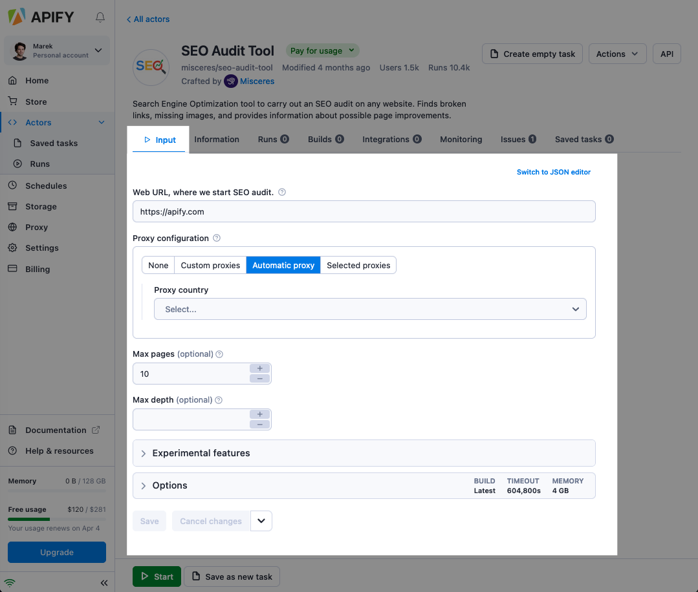
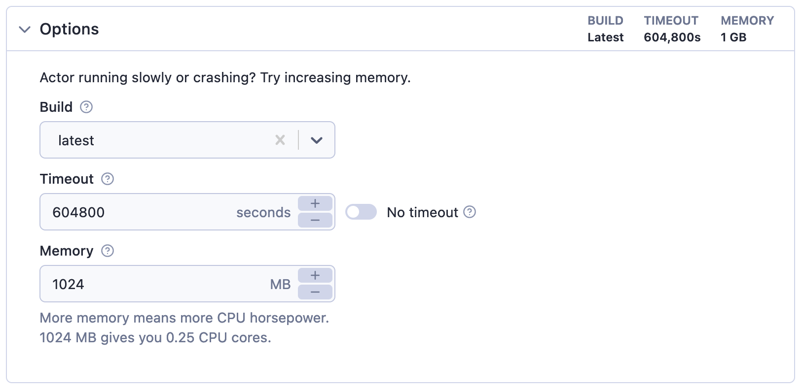
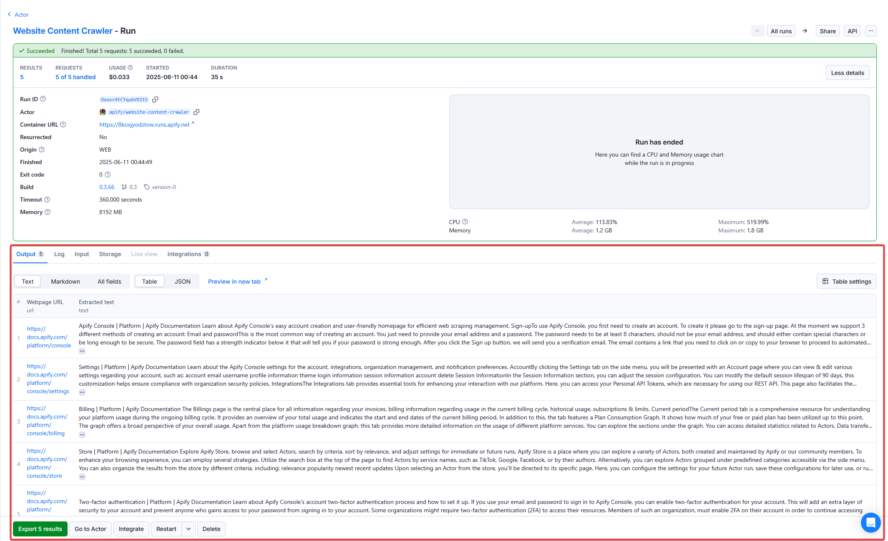
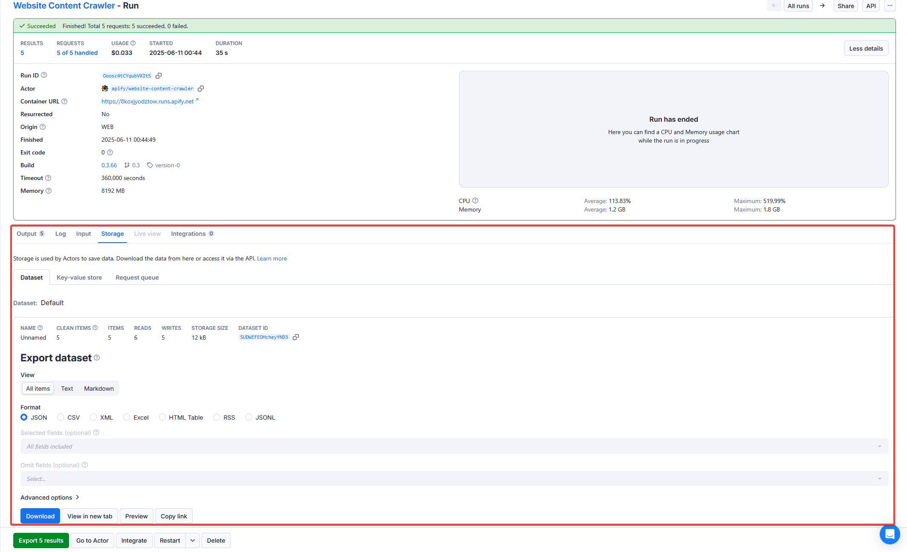

**Configure your actor's input parameters using the Apify Console, locally or via API. Access parameters in key-value stores from your actor's code.**

---

## Input

Each actor accepts input, which tells it what it should do. When running actor using the [Apify Console](https://console.apify.com) UI then, you can configure input using the autogenerated UI:



When running actor using the [API](https://docs.apify.com/api/v2) you can pass the same input as the JSON object. In this case, the corresponding JSON input looks as follows:

```json
{
    "maxRequestsPerCrawl": 10,
    "proxy": {
        "useApifyProxy": true
    },
    "startUrl": "https://apify.com"
}
```

### Options - Build, Timeout, and Memory

As part of the input, you can also specify run options such as [build](../development/builds.md), timeout, and [memory](./usage_and_resources.md) for your Actor run.



<!-- Using an HTML table because it doesn't have a header - markdown doesn't allow tables with no headers -->
<table>
    <tr>
        <td>Build</td>
        <td>Tag or number of the build to run (e.g. <strong>latest</strong> or <strong>1.2.34</strong>).</td>
    </tr>
    <tr>
        <td>Timeout</td>
        <td>Timeout for the Actor run in seconds. Zero value means there is no timeout.</td>
    </tr>
    <tr>
        <td>Memory</td>
        <td>Amount of memory allocated for the Actor run, in megabytes.</td>
    </tr>
</table>

## Output

While the input object provides a way to instruct Actors, an Actor can also generate an output, usually stored in its default [dataset](../../storage/dataset), but some additional files might be stored in its [key-value store](../../storage/key-value-store). Always read the Actor's README to learn more about its output.

> For more details about storages, visit the [storage](../../storage/index.md) section.

You can quickly access the actor's output from the run detail page:



And to access all the data associated with the run, see the **storage** tab where you can explore the actor's default [dataset](../../storage/dataset),[key-value store](../../storage/key-value-store), and [request queue](../../storage/request-queue):



> You can also use [API](https://docs.apify.com/api/v2) to retrieve the output. To learn more about this, read the [Run an actor or task and retrieve data via API](/academy/api/run-actor-and-retrieve-data-via-api) tutorial.

