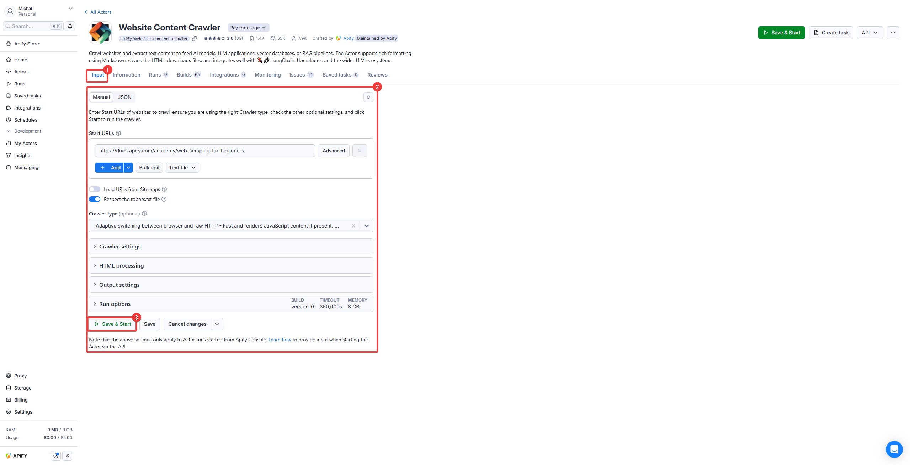
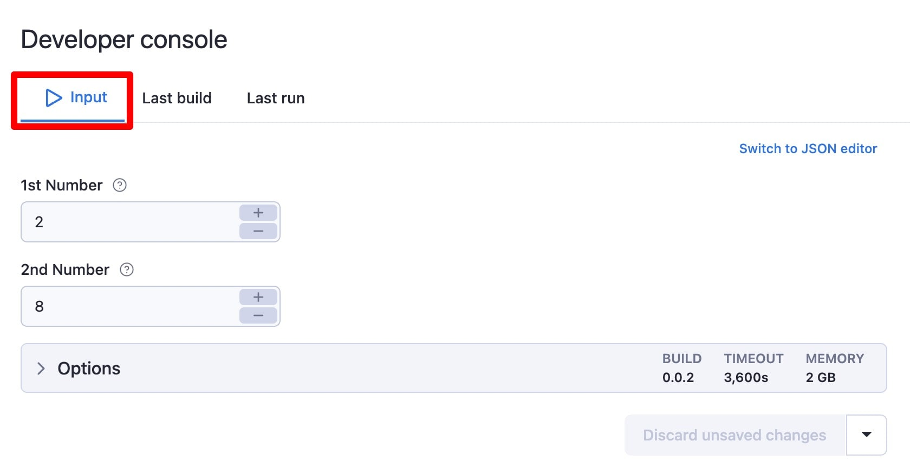
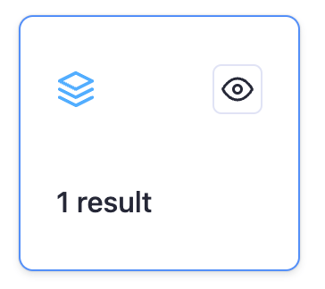
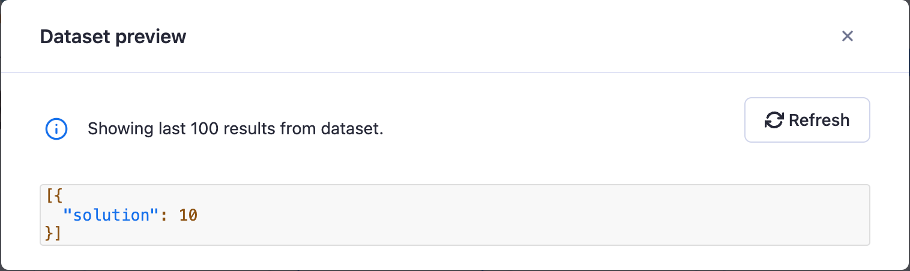

**Configure your Actor's input parameters using Apify Console, locally or via API. Access parameters in key-value stores from your Actor's code.**

---

## Input

Each Actor accepts input, which tells it what to do. You can run an Actor using the [Apify Console](https://console.apify.com) UI, then configure the input using the autogenerated UI:



When running an Actor using the [API](https://docs.apify.com/api/v2) you can pass the same input as the JSON object. In this case, the corresponding JSON input looks as follows:

```json
{
    "maxRequestsPerCrawl": 10,
    "proxy": {
        "useApifyProxy": true
    },
    "startUrl": "https://apify.com"
}
```

### Options - Build, Timeout, and Memory

As part of the input, you can also specify run options such as [Build](../development/builds_and_runs/builds.md), Timeout, and [Memory](./usage_and_resources.md) for your Actor run.


| Option | Description |
|:---|:---|
| Build | Tag or number of the build to run (e.g. **latest** or **1.2.34**). |
| Timeout | Timeout for the Actor run in seconds. Zero value means there is no timeout. |
| Memory | Amount of memory allocated for the Actor run, in megabytes. |


## Output

While the input object provides a way to instruct Actors, an Actor can also generate an output, usually stored in its default [Dataset](../../storage/dataset), but some additional files might be stored in its [Key-value store](../../storage/key-value-store). Always read the Actor's README to learn more about its output.

For more details about storages, visit the [Storage](../../storage/index.md) section.

You can quickly access the Actor's output from the run detail page:


And to access all the data associated with the run, see the **Storage** tab, where you can explore the Actor's default [Dataset](../../storage/dataset), [Key-value store](../../storage/key-value-store), and [Request queue](../../storage/request-queue).

You can also use [API](https://docs.apify.com/api/v2) to retrieve the output. To learn more about this, read the [Run an Actor or task and retrieve data via API](/academy/api/run-actor-and-retrieve-data-via-api) tutorial.

## Example

Here is a simple Actor that demonstrates how to access input and produce output. The Actor takes two numbers as input, adds them together, and pushes the result to its default dataset.

### Input

To create a user interface for this input in the Apify Console, you would define the following `INPUT_SCHEMA.json`:

```json title="INPUT_SCHEMA.json"
{
    "title": "Number adder",
    "type": "object",
    "schemaVersion": 1,
    "properties": {
        "num1": {
            "title": "1st Number",
            "type": "integer",
            "description": "First number.",
            "editor": "number"
        },
        "num2": {
            "title": "2nd Number",
            "type": "integer",
            "description": "Second number.",
            "editor": "number"
        }
    },
    "required": ["num1", "num2"]
}
```

When you run this Actor, you can enter the two numbers in the **Input** tab:



### Code

The Actor's code uses `Actor.getInput()` to retrieve the input values and `Actor.pushData()` to save the result.

```js title="main.js"
import { Actor } from 'apify';

await Actor.init();

// Get the input from the INPUT.json file
const { num1, num2 } = await Actor.getInput();

// Calculate the sum
const sum = num1 + num2;

// Push the result to the default dataset
await Actor.pushData({ sum });

await Actor.exit();
```

### Output

The results from the "number adder" example can be found in the **Results** tab of the Actor run.



On the results page, you can preview the data in various formats.


