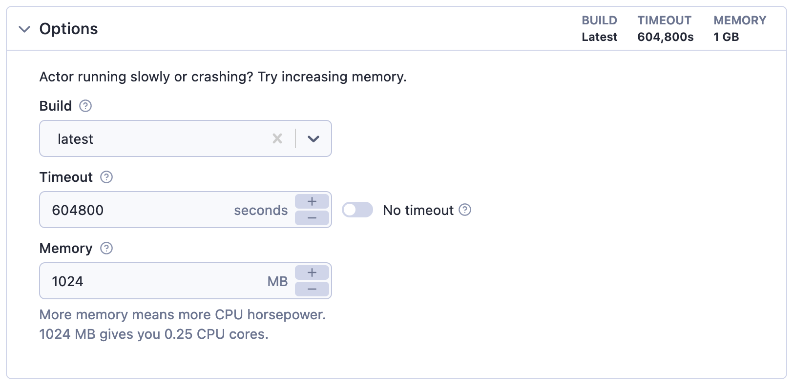
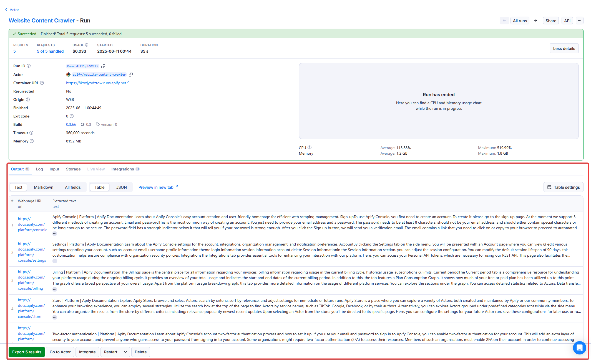
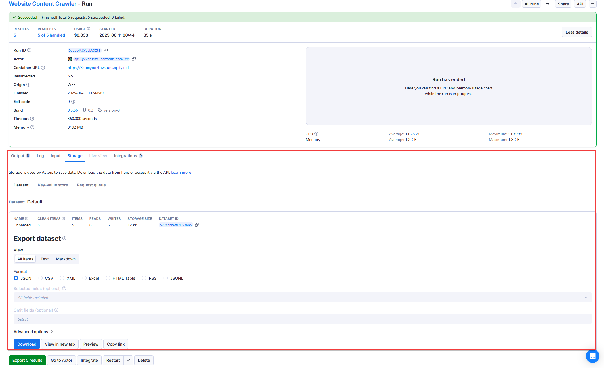

## Input

Each Actor accepts input, which tells it what to do. You can run an Actor using the [Apify Console](https://console.apify.com) UI, then configure the input using the autogenerated UI:


When running an Actor using the [API](https://docs.apify.com/api/v2) you can pass the same input as the JSON object. In this case, the corresponding JSON input looks as follows:

```json
{
    "maxRequestsPerCrawl": 10,
    "proxy": {
        "useApifyProxy": true
    },
    "startUrl": "https://apify.com"
}
```

### Options - Build, Timeout, and Memory

As part of the input, you can also specify run options such as [Build](../development/builds_and_runs/builds.md), Timeout, and [Memory](./usage_and_resources.md) for your Actor run.



| Option | Description |
| :--- | :--- |
| Build | Tag or number of the build to run (e.g. **latest** or **1.2.34**). |
| Timeout | Timeout for the Actor run in seconds. Zero value means there is no timeout. |
| Memory | Amount of memory allocated for the Actor run, in megabytes. |

:::info Dynamic memory

If the Actor is configured by developer to use [dynamic memory](../development/actor_definition/dynamic_actor_memory/index.md), the system will calculate the optimal memory allocation based on your input. In this case, the **Memory** option acts as an override - if you set it, the calculated value will be ignored.

:::

## Output

An Actor can produce results in several places. Structured, tabular results are usually stored in the run's default (or additional) [Dataset](../../storage/dataset), while files and other unstructured data go to its [Key-value store](../../storage/key-value-store). Always read the Actor's README to learn what an Actor produces and where it stores it. For more details about storages, visit the [Storage](../../storage/index.md) section.

To describe where its results are and how to reach them, an Actor can define an [output schema](/actors/development/actor-definition/output-schema). The platform uses this schema to automatically generate the Actor _output object_ - an immutable JSON object whose properties link to the run's results. The output object is defined solely by the output schema, not by the Actor's code, and the API returns it as the run's `output` property immediately when the run starts, without waiting for the run to finish or for the results to be produced. This makes it useful for previewing results, generating API examples, and building integrations.

The output object is separate from the storages that hold the data: its properties point to results wherever they live, whether that's the dataset, the key-value store, or a URL exposed by the running Actor.

You can quickly access the Actor's results from the run detail page:



To access all the data associated with the run, open the **Storage** tab, where you can explore the run's default [Dataset](../../storage/dataset), [Key-value store](../../storage/key-value-store), and [Request queue](../../storage/request-queue):



You can also use the [API](https://docs.apify.com/api/v2) to retrieve the results. To learn more, read the [Run an Actor or task and retrieve data via API](/academy/api/run-actor-and-retrieve-data-via-api) tutorial.
