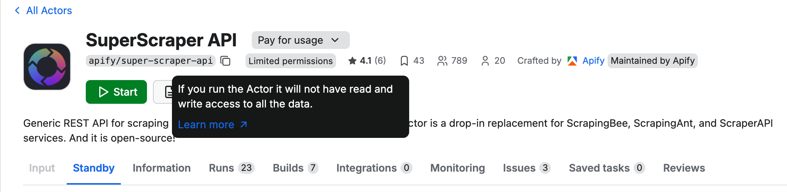
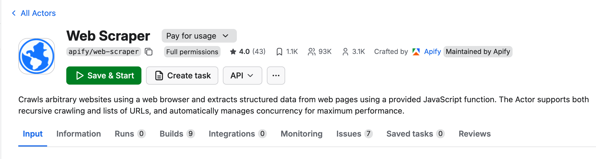

**Learn how permissions work when running and building Actors, what permission levels mean, how to request, grant, and review permissions, and how to keep your data and projects secure.**

---

When you run an Actor, it runs under your Apify account and may need access to your data to complete its task. Actor permissions define how much data the Actor can access. Each Actor declares its required permission level in its configuration, and the platform enforces this level at runtime.

:::note Understanding Actor permissions

The approach is similar to mobile platforms (Android, iOS) where each app explicitly requests the access it needs and the user approves it. The difference is that instead of granular per-Actor permissions, we use two broad permission levels which cover the vast majority of use cases. If you are a developer, see the [development guide on Actor permissions](../development/permissions) to learn how to declare and manage permissions for your Actors.

::::

The permissions model follows the principle of least privilege. Actors run only with the access they explicitly request, giving you transparency and control over what the Actor can access in their account.

There are two permission levels:

- **Limited permissions:** Actors with this permission level have restricted access, primarily to their own storages, the data they generate, and resources they are given an explicit access to. They cannot access any other data in your Apify account.
- **Full permissions (default):** Grants the Actor a access to all data in your Apify account.

This model protects your data and strengthens platform security by clearly showing what level of access each Actor requires.

Actors using **Limited permissions** are safer to run and suit most tasks. Actors that need **full permissions** (for example to perform administrative tasks in your account, manage your datasets or schedules) clearly indicate this in their detail page.

## How Actor permissions work

When a user runs an Actor, it receives an Apify API token. Traditionally, this token grants access to the user's entire Apify account via Apify API. Actors with **full permissions** will continue to operate this way.

Actors with **limited permissions** receive a restricted token. This token only allows the Actor to perform a specific set of actions, which covers the vast majority of common use cases.

A limited-permission Actor can:

- Read and write to its default storages.
- Create any additional storage, and write to that storage.
- Read and write to storages created in previous runs.
- Update the current run's status or abort the run.
- [Metamorph](../development/programming_interface/metamorph.md) to another Actor with limited permissions.
- Read and write to storages provided via Actor input (for example, when the user provides a dataset that the Actor should write into).
- Read basic user information from the environment (whether the user is paying, their proxy password, or public profile).
- Run any other Actor with limited permissions.

This approach ensures the Actor has everything it needs to function while protecting your data from unnecessary exposure.

### Recognizing permission levels in Console and Store

When you browse Actors in Apify Console or Store, you’ll notice a small badge next to each Actor showing its permission level. Hover over the badge to see a short explanation of what access that Actor will have when it runs under your account. Here's how they appear in the Console.

**Limited permissions Actors:**

**Full permissions Actors:**

Whenever possible, choose Actors that use **limited permissions**. They are safer, easier to trust, and sufficient for most workflows.
