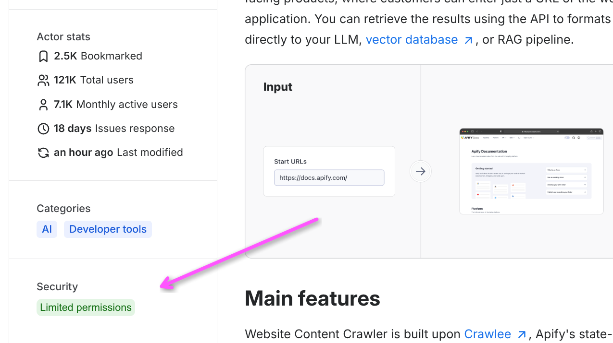
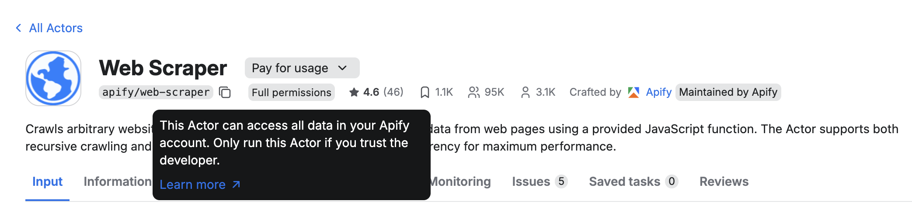
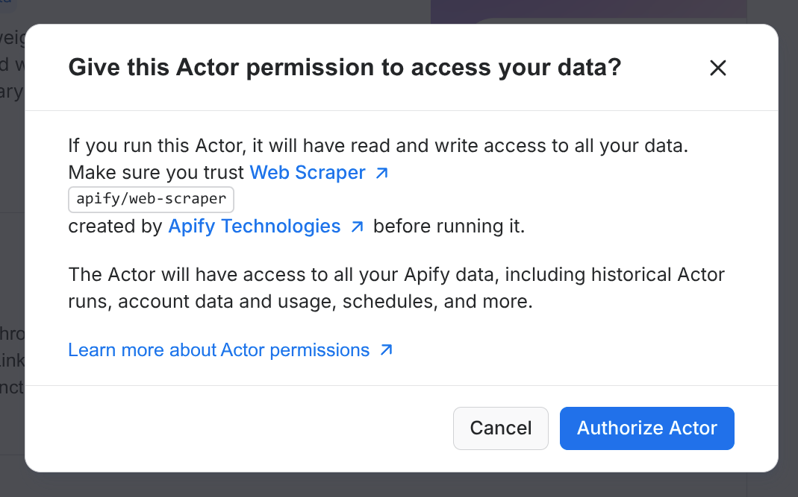
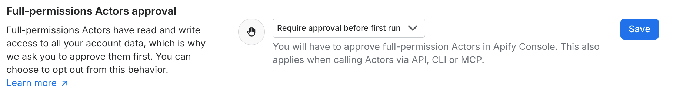

When you run an Actor, it runs under your Apify account and may need access to your data to complete its task. Actor permissions define how much data the Actor can access. Each Actor declares its required permission level in its configuration, and the platform enforces this level at runtime.

:::note Understanding Actor permissions

The approach is similar to mobile platforms (Android, iOS) where each app explicitly requests the access it needs and the user approves it. The difference is that instead of granular per-Actor permissions, we use two broad permission levels which cover the vast majority of use cases. If you are a developer, see the [development guide on Actor permissions](../development/permissions) to learn how to declare and manage permissions for your Actors.

:::

The permissions model follows the principle of least privilege. Actors run only with the access they explicitly request, giving you transparency and control over what the Actor can access in your account.

There are two permission levels:

- **Limited permissions (default):** Actors with this permission level have restricted access, primarily to their own storages, the data they generate, and resources they are given an explicit access to. They cannot access any other data in your Apify account.
- **Full permissions:** Grants the Actor access to all data in your Apify account.

This model protects your data and strengthens platform security by clearly showing what level of access each Actor requires.

Actors using **Limited permissions** are safer to run and suit most tasks. Actors that need **full permissions** (for example, to perform administrative tasks in your account, manage your datasets or schedules) clearly indicate this in their detail page and will require your **explicit approval** before running for the first time.

## How Actor permissions work

When a user runs an Actor, it receives an Apify API token. Traditionally, this token grants access to the user's entire Apify account via the Apify API. Actors with **full permissions** will continue to operate this way.

Actors with **limited permissions** receive a restricted token. This token only allows the Actor to perform a specific set of actions, which covers the vast majority of common use cases.

A limited-permission Actor can:

- Read and write to its default storages.
- Create any additional storage, and write to that storage.
- Read and write to storages created in previous runs.
- Update the current run's status or abort the run.
- [Metamorph](../development/programming_interface/metamorph.md) to another Actor with limited permissions.
- Read and write to storages provided via Actor input (for example, when the user provides a dataset that the Actor should write into).
- Read basic user information from the environment (whether the user is paying, their proxy password, or public profile).
- Run any other Actor with limited permissions and obtain the results.

This approach ensures the Actor has everything it needs to function while protecting your data from unnecessary exposure.

### Recognizing permission levels in Apify Console and Apify Store

When you browse Actors in Apify Console or Apify Store, you can see the Actor's permissions level in the **Security** section in the left bar. Hover over the badge to see a short explanation of what access that Actor will have when it runs under your account.



Moreover, full-permission Actors will have a small badge on the Actor detail page and will ask you for approval before you run them (read more below).



Whenever possible, choose Actors that use **limited permissions**. They are safer, easier to trust, and sufficient for most workflows.

## Full-permission Actors

Before you can run a full-permission Actor you don't own, you must approve its permissions in Apify Console. This is a one-time action per Actor. Once you approve it, the approval persists and you can run the Actor freely.

To approve the Actor, click the **Start** button on the Actor detail screen and a confirmation modal shows up. Alternatively, you can open the three-dot menu in the top right corner and select **Approve Actor permissions**.



This approval step protects you from accidentally running Actors that have unrestricted access to your entire Apify account. It applies to all execution paths: Console, API, CLI, schedules, and webhooks.

If you try to run an unapproved full-permission Actor through the API or any other channel, the request fails with a `403` error. The error response includes a direct link to the Actor's page in Console where you can review and approve its permissions:

```json
{
    "error": {
        "type": "full-permission-actor-not-approved",
        "message": "This Actor requires full access to your account. You must approve its permissions before running it.",
        "data": {
            "approvalUrl": "https://console.apify.com/actors/<ACTOR_ID>?approvePermissions=true"
        }
    }
}
```

:::tip Approval through Console only

You can only approve an Actor's permissions through Apify Console, not through the API. This is by design — it prevents automated tools and AI agents from bypassing the approval check on your behalf.

:::

:::tip You are always protected

If you scheduled (or integrated with) a limited-permission Actor from the Store, and its author changes its permissions to full permissions, the schedule will stop working until you approve the Actor.

:::

### Exceptions: When the approval is not needed

- **Your own Actors**: You never need to approve Actors you own. They always run without an approval step.
- **Actor-to-Actor calls**: When an approved full-permission Actor calls or [metamorphs](../development/programming_interface/metamorph.md) into another full-permission Actor, the called Actor runs without requiring separate approval. By approving the first Actor, you are choosing to trust it in whatever it does — including calling other Actors.

### Skip approvals {#skip-approval}

If you prefer not to be prompted for approval, you can opt out in your account settings. Go to **Settings > Login & Privacy** and change the **Actor permission approval** setting to **Skip approval**.



:::warning Disabling approval removes a safety check

When you skip the approval requirement, any full-permission Actor can run under your account without explicit consent. Only disable this if you understand the risk.

:::
