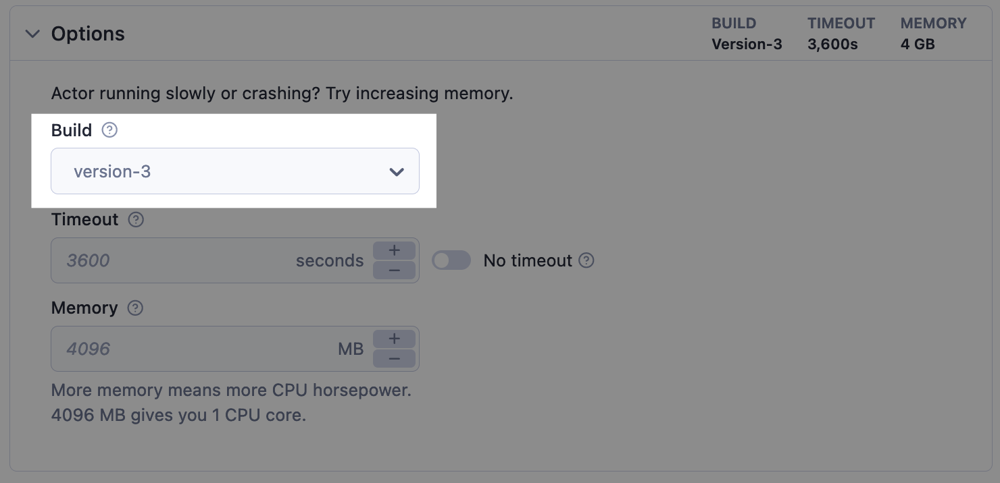
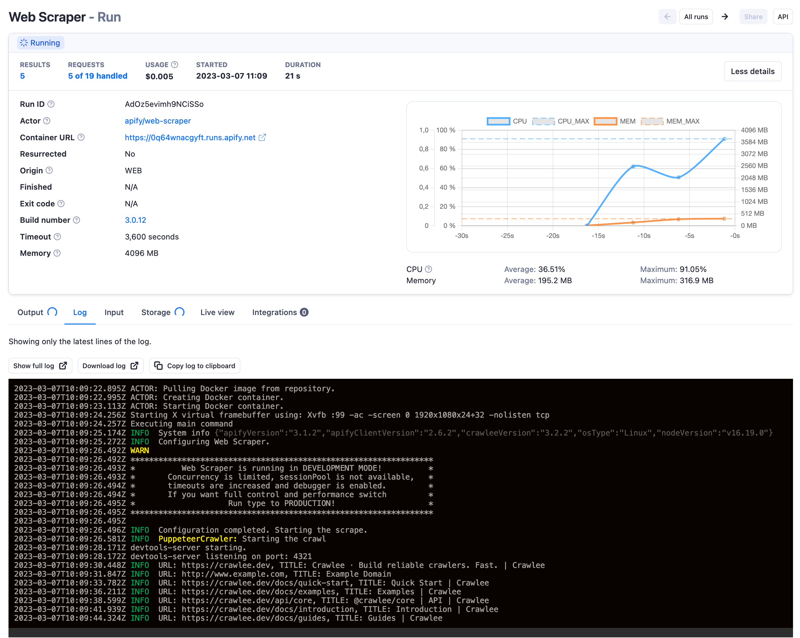
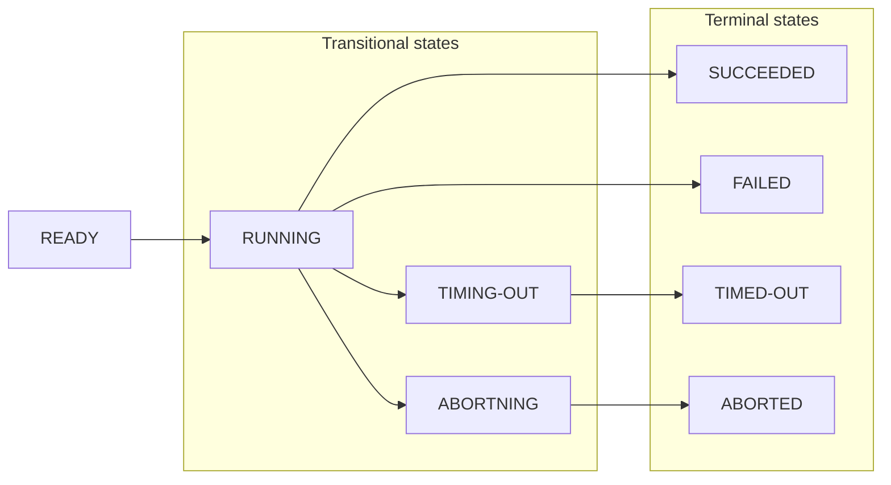

**Learn about Actor builds and runs, their lifecycle, sharing, and data retention policy.**

---

## Builds

An Actor is a combination of source code and various settings in a Docker container. In order to be able to run, it first needs to be built. An Actor build consists of the source code built as a Docker container image, making the Actor ready to run on the Apify platform.

> A Docker container image is a lightweight, standalone, executable package of software that includes everything needed to run an application: code, runtime, system tools, system libraries, and settings.
> <https://www.docker.com/resources/what-container/>

With every new version of an Actor, a new build gets created. Each Actor build has its own number (for example <strong>1.2.34</strong>), and some of the builds are tagged for easier use (for example <strong>latest</strong> or <strong>beta</strong>). When running an Actor, you can choose what build you want to run by selecting a tag or number in the run options.

Each build may have different features, input, or output. By fixing the build to an exact version, you can ensure that you won't be affected by a breaking change in a new actor version. But on the other hand, you lose updates.

## Runs

When you start an Actor, an actor run gets created. An Actor run is a Docker container created from the build's Docker image with dedicated resources (CPU, memory, disk space). For more on this topic, see [usage and resources](./usage_and_resources.md).

Each run has its own (default) [storages](../../storage) assigned, which it may but not nesseserarly need to use:

- [Key-value store](../../storage/key-value-store) containing the input and enabling actor to store other files
- [Dataset](../../storage/dataset) enabling actor to store the results
- [Request queue](../../storage/request-queue) to maintain a queue of URLs to be processed

What's happening inside of an Actor is visible on the Actor run log in the Actor run detail:

## Lifecycle

Each run and build starts with the initial status **READY** and goes through one or more transitional statuses to one of the terminal statuses.

---

| Status     | Type         | Description                                 |
|------------|--------------|---------------------------------------------|
| READY      | initial      | Started but not allocated to any worker yet |
| RUNNING    | transitional | Executing on a worker machine               |
| SUCCEEDED  | terminal     | Finished successfully                       |
| FAILED     | terminal     | Run failed                                  |
| TIMING-OUT | transitional | Timing out now                              |
| TIMED-OUT  | terminal     | Timed out                                   |
| ABORTING   | transitional | Being aborted by user                       |
| ABORTED    | terminal     | Aborted by user                             |

### Aborting runs

You can abort runs with the statuses **READY**, **RUNNING**, or **TIMING-OUT** in two ways:

- **Immediately** - this is the default option.
- **Gracefully** - the Actor run receives a signal about aborting via the `aborting` and `persistState` events and is force-aborted after 30 seconds. This is helpful in cases where you plan to resurrect the run later because it saves the actor's state. When resurrected, the Actor can restart where it left off.

You can abort a run in Apify Console using the **Abort** button or via API using the [Abort run](/api/v2#/reference/actor-runs/abort-run/abort-run) endpoint.

### Resurrection of finished run

Any Actor run in a terminal state, i.e., run with status **FINISHED**, **FAILED**, **ABORTED**, and **TIMED-OUT**, might be resurrected back to a **RUNNING** state. This is helpful in many cases, for example, when the timeout for an Actor run was too low or in case of an unexpected error.

The whole process of resurrection looks as follows:

- Run status will be updated to **RUNNING**, and its container will be restarted with the same storages (the same behavior as when the run gets migrated to the new server).
- Updated duration will include the time when the actor was not running. This does not affect compute unit consumption.
- Timeout will be counted from the point when this Actor run was resurrected.

Resurrection can be performed in Apify Console using the **resurrect** button or via API using the [Resurrect run](/api/v2#/reference/actors/resurrect-run) API endpoint.

> You can also adjust timeout, memory, or change actor build prior to the resurrection. This is especially helpful in a case of an error in a code of an actor as it enables you to:
>
> - Abort a broken run
> - Update the Actor's code and build the new version
> - Resurrect the run using the new build

### Data retention

An **Actor run** is deleted along with its default storages (key-value store, dataset, request queue) after a data retention period which is based on your [subscription plan](https://apify.com/pricing).

An **Actor build** is deleted only when it is not tagged and has not been used for over 90 days.

## Sharing

You can share your Actor runs with other Apify users via the [access rights](../../access_rights/index.md) system.

