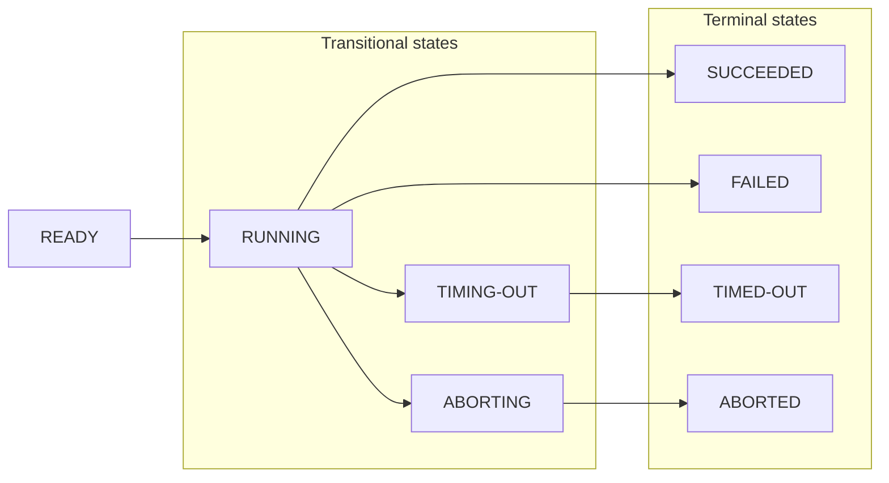

**Learn about Actor builds and runs, their lifecycle, sharing, and data retention policy.**

---

## Builds

An Actor is a combination of source code and various settings in a Docker container. To run, it needs to be built. An Actor build consists of the source code built as a Docker image, making the Actor ready to run on the Apify platform.

:::info What is Docker image?
A Docker image is a lightweight, standalone, executable package of software that includes everything needed to run an application: code, runtime, system tools, system libraries, and settings. For more information visit Docker's [site](https://www.docker.com/resources/what-container/).
:::

With every new version of an Actor, a new build is created. Each Actor build has its number (for example, **1.2.34**), and some builds are tagged for easier use (for example, _latest_ or _beta_). When running an Actor, you can choose what build you want to run by selecting a tag or number in the run options.

Each build may have different features, input, or output. By fixing the build to an exact version, you can ensure that you won't be affected by a breaking change in a new Actor version. However, you will lose updates.

## Runs

When you start an Actor, an Actor run is created. An Actor run is a Docker container created from the build's Docker image with dedicated resources (CPU, memory, disk space). For more on this topic, see [Usage and resources](./usage_and_resources.md).

Each run has its own (default) [storages](../../storage) assigned, which it may but not necessarily need to use:

- [Key-value store](../../storage/key-value-store) containing the input and enabling Actor to store other files.
- [Dataset](../../storage/dataset) enabling Actor to store the results.
- [Request queue](../../storage/request-queue) to maintain a queue of URLs to be processed.

What's happening inside of an Actor is visible on the Actor run log in the Actor run detail:

### Origin

All **Actor runs** have an **Origin** field indicating where the Actor run was invoked.

|Name|Origin|
|:---|:---|
|DEVELOPMENT|Manually from Apify Console in Development mode (own Actor)|
|WEB|Manually from Apify Console in "normal" mode (someone else's Actor or task)|
|API|From API|
|CLI|From Apify CLI|
|SCHEDULER|Using a Schedule|
|WEBHOOK|Using a webhook|
|ACTOR|From another Actor run|

## Lifecycle

Each run and build starts with the initial status **READY** and goes through one or more transitional statuses to one of the terminal statuses.

---

| Status     | Type         | Description                                 |
|:-----------|:-------------|:--------------------------------------------|
| READY      | initial      | Started but not allocated to any worker yet |
| RUNNING    | transitional | Executing on a worker machine               |
| SUCCEEDED  | terminal     | Finished successfully                       |
| FAILED     | terminal     | Run failed                                  |
| TIMING-OUT | transitional | Timing out now                              |
| TIMED-OUT  | terminal     | Timed out                                   |
| ABORTING   | transitional | Being aborted by the user                       |
| ABORTED    | terminal     | Aborted by the user                             |

### Aborting runs

You can abort runs with the statuses **READY**, **RUNNING**, or **TIMING-OUT** in two ways:

- _Immediately_ - this is the default option. The Actor process is killed immediately with no grace period.
- _Gracefully_ - the Actor run receives a signal about aborting via the `aborting` event and is granted a 30-second window to finish in-progress tasks before getting aborted. This is helpful in cases where you plan to resurrect the run later because it gives the Actor a chance to persist its state. When resurrected, the Actor can restart where it left off.

You can abort a run in Apify Console using the **Abort** button or via API using the [Abort run](/api/v2#/reference/actor-runs/abort-run/abort-run) endpoint.

### Resurrection of finished run

Any Actor run in a terminal state, i.e., run with status **FINISHED**, **FAILED**, **ABORTED**, and **TIMED-OUT**, might be resurrected back to a **RUNNING** state. This is helpful in many cases, for example, when the timeout for an Actor run was too low or in case of an unexpected error.

The whole process of resurrection looks as follows:

- Run status will be updated to **RUNNING**, and its container will be restarted with the same storage (the same behavior as when the run gets migrated to the new server).
- Updated duration will not include the time when the Actor was not running.
- Timeout will be counted from the point when this Actor run was resurrected.

Resurrection can be performed in Apify Console using the **resurrect** button or via API using the [Resurrect run](/api/v2#/reference/actors/resurrect-run) API endpoint.

:::info Settings adjustments
You can also adjust timeout and memory or change Actor build before the resurrection. This is especially helpful in case of an error in the Actor's source code as it enables you to:

1. Abort a broken run
2. Update the Actor's code and build the new version
3. Resurrect the run using the new build
:::

### Data retention

All **Actor runs** and default storages (Key-value store, Dataset, Request queue) are deleted after the data retention period, based on your [subscription plan](https://apify.com/pricing).

**Actor builds** are deleted only when they are _not tagged_ and have not been used for over 90 days.

## Sharing

Share your Actor runs with other Apify users via the [access rights](../../collaboration/index.md) system.
