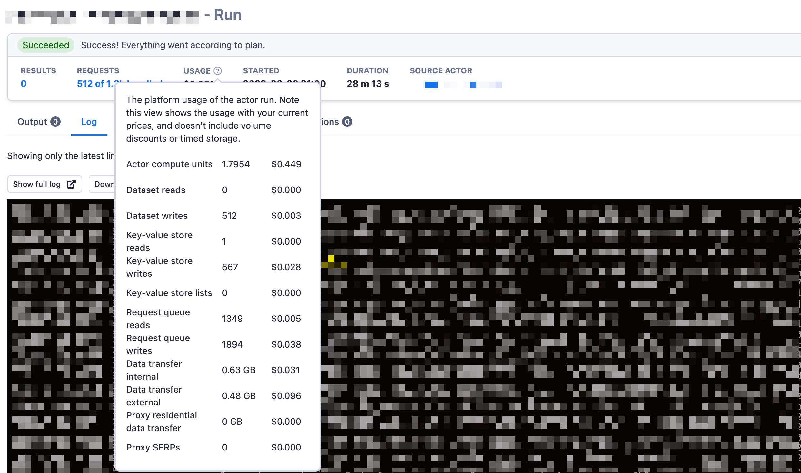
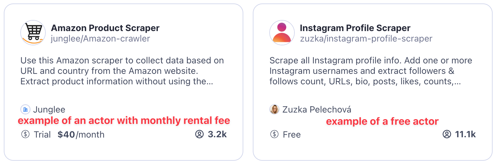
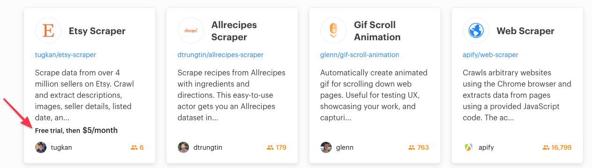
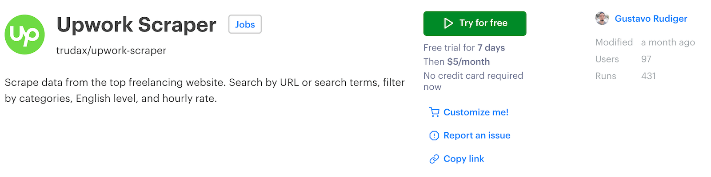
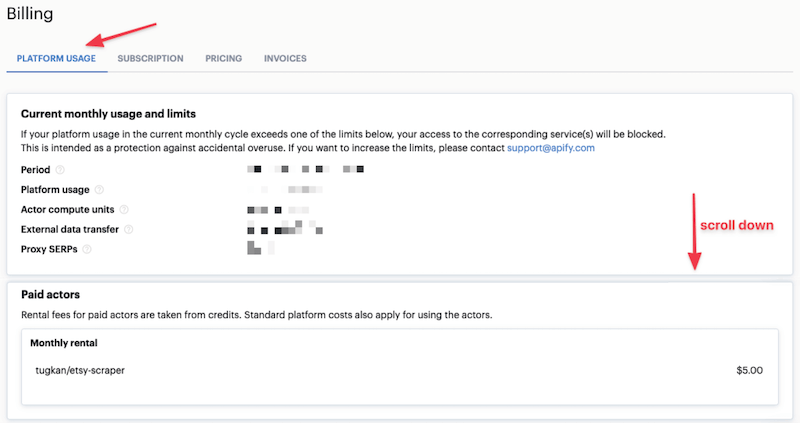
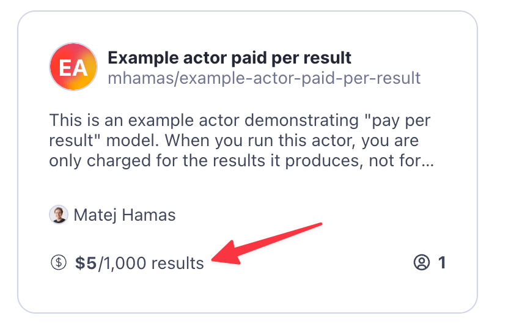
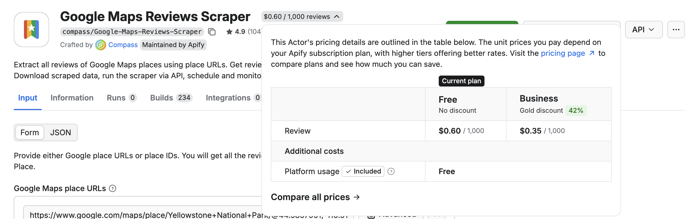
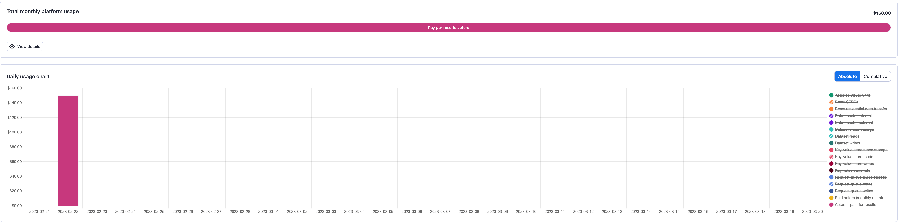
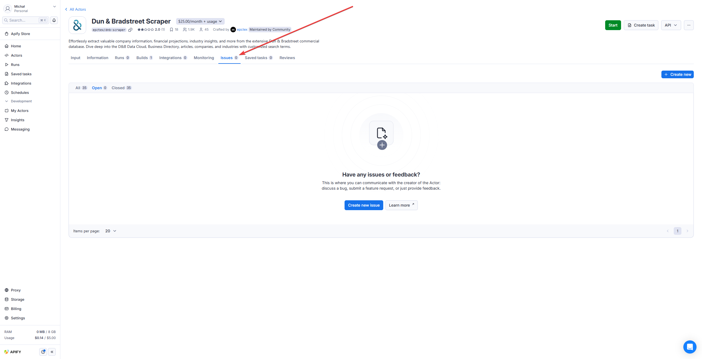

**[Apify Store](https://apify.com/store) is home to hundreds of public actors available to the Apify community. It's the easiest way for you to start with Apify.**

---

> Anyone is welcome to [publish actors](/platform/actors/publishing) in the store, and you can even [monetize your actors](https://get.apify.com/monetize-your-code) by renting them out to users of the platform. For more information about how to monetize your actor, best practices and SEO and promotion tips and tricks, head over to the [Getting the most of your public actors on Apify Store](/academy/get-most-of-actors) section of the Apify Developers Academy.

Some actors are free to use (you will be charged only for the Apify platform usage), while the others are paid with different pricing models. This page will explain to you all the approaches.

## Pricing models

All actors in [Apify Store](https://apify.com/store) fall into one of these three pricing models:

1. [**free**](#free-actors) - you can run the actor freely and you only pay for platform usage the actor generates.
2. [**paid**](#paid-actors) - same as free, but in order to be able to run the actor after the trial period, you need to rent the actor from the developer and pay a flat monthly fee on the top of the platform usage the actor generates.
3. [**paid per result**](#actors-paid-per-result) - you do not pay for platform usage the actor generates and only pay for the results it produces.

### Free actors

When you use a free actor you are only charged the platform usage the runs of this actor generate. [Platform usage](./usage_and_resources.md) includes components such as compute units, operations on [storages](https://docs.apify.com/platform/storage), and usage of [residential proxies](https://docs.apify.com/platform/proxy/residential-proxy) or [SERPs](<https://docs.apify.com/platform/proxy/google-serp-proxy>). You can find the details of your actor usage on the run detail page.

> With this model, it is quite difficult to know beforehand exactly how much usage the actor will generate when you run it, so you cannot easily estimate your costs upfront. The easiest approach to do so is to try out the actor on a limited scope, for example on a small number of pages, and evaluate the consumption.
>
> **For more information on platform usage cost see the [usage and resources](./usage_and_resources.md) page.**

### Paid actors

Paid actors are like free actors, but with a slight difference. When you use a paid actor, you pay a fee to the actor developer. This empowers the developer to dedicate more time and effort to their actors. It ensures that these actors are of the **highest quality** and receive **ongoing maintenance**.

Each paid actor has a **free trial,** where the trial's length is always shown for each paid actor.

---

After a trial, a flat monthly **actor rental** fee that is automatically charged from your prepaid platform usage in advance for the following month. This fee goes directly to the developer and it is paid on the top of the platform usage generated by the actor.

<!-- You can read more about why we released paid actors in [this blog post](tbd) from Apify CEO Jan Čurn. -->

**Can I run paid actors via API or the Apify client?**

Yes, when you are renting a paid actor, you can run it using either our [API](/api/v2), [JavaScript](/api/client/js) or [Python](/api/client/python) clients as you would do with private or free public actors.

**Do I pay platform costs for running paid actors?**

Yes, you will pay normal [platform usage costs](https://apify.com/pricing/actors) on top of the monthly actor rental fee. The platform costs work exactly the same way as for free public actors or your private actors. You should find estimates of the cost of usage in each individual paid actor's README ([see an example](https://apify.com/drobnikj/crawler-google-places#how-much-will-it-cost)).

**Do I need an Apify paid plan to use paid actors?**

You don't need a paid plan to start a paid actor's free trial. Just activate the trial, and you are good to go. After that, you will need to subscribe to one of [Apify's paid plans](https://apify.com/pricing) in order to keep renting the actor and continue using it.

**When will I be charged for the actor rental?**

You always prepay the actor rental for the following month. The first payment happens when the trial expires, and then recurs monthly. When you open the actor in the Apify Console, you will see when the next rental payment is due, and you will also receive a notification when it happens.

**Example**: You activate a 7-day trial of an actor at **noon of April 1, 2021**. If you don't turn off auto-renewal, you will be charged at **noon on April 8, 2021**, then **May 8, 2021**, and so on.

**How am I charged for actor rental?**

The rental fee for an actor is automatically subtracted from your prepaid platform usage, similarly to, e.g. [compute units](/platform/actors/running/compute-units). If you don't have enough usage prepaid, you will need to cover any overage in the next invoice.

**Will I be automatically charged at the end of the free trial?**

If you have an [Apify paid plan](https://apify.com/pricing), you will be automatically charged the monthly rental fee at the end of your free trial and you will be able to run the actor for another month. If you are not subscribed to an Apify plan, you will need to subscribe to one of [Apify's paid plans](https://apify.com/pricing) in order to continue using the actor after the trial has ended.

**Can I cancel my actor rental?**

During your trial or any time after that, **you can always turn off auto-renewal** so that you are not charged when your current actor rental expires. If you choose to do so, you can always turn it back on later.

**Where can I see how much I have paid for actor rental?**

Since actor rental fees are paid from prepaid platform usage, these fees conceptually belong under platform usage.

Hence, you can find the breakdown of how much you have been charged for paid actors on the bottom of the **Platform usage** tab in the [Billing](https://console.apify.com/billing) section. The overall sum will also be visible in the usage bar chart and the table on the top of the same tab.

### Actors paid per result

When you run an actor that is **paid per result**, you only pay for the results that an actor returns when you run it, and you are not charged for the underlying platform usage. Technically, **results** you are charged for are the clean items in the default [dataset](https://docs.apify.com/platform/storage/dataset) created by the actor run.

> This makes it transparent and easy to estimate upfront costs. If you have any feedback or would like to ask something, please join our [Discord](https://discord.gg/qkMS6pU4cF) community and let us know!

<!-- TODO - add a bit about the ability to set the maximum limits actor should return -->

**How do I know an actor is paid per result?**

An actor that is paid per result will display the price per 1,000 items in the store.

When you try the actor on the platform, you will see that the actor is paid per result next to the actor name.

**Do I need to pay a monthly rental fee to run the actor?**

No, the actor is free to run. You only pay for the results.

**What happens when I interact with the dataset after the run finishes?**

Under the **pay per result** model, all platform costs generated **during the run of an actor** are not charged towards your account; you pay for the results instead. After the run finishes, any interactions with the default dataset storing the results, such as reading the results or writing additional data, will incur the standard platform usage costs. But do not worry, in the vast majority of cases, you only want to read the result from the dataset and that costs near to nothing.

**Do I pay for the storage of results on the Apify platform?**

You will still be charged for the timed storage of the data in the same fashion as with any other actor. You can always decide to delete the dataset to reduce your costs after you export the data from the platform. By default, any unnamed dataset will be automatically removed after your data retention period, so in most cases, this is nothing to worry about.

**Can I publish an actor that is paid per result?**

Publishing an actor that is paid per result is not yet available publicly as this pricing model is still in beta.

**Where do I see how much I was charged for the pay-per-result actors?**

You can see the overview of how much you have been charged for actors paid by result on your invoices and in the [Usage tab](https://console.apify.com/billing) of the Billing section in Console. It will be shown there as a separate service.

<!-- TODO - add info about where to see this at per-actor level -->
<!-- TODO - add info about how to see this on run detail -->

## Reporting issues with actors

Each actor has an `Issues` tab present in the Apify Console. There, you can open an issue (ticket) and chat with the actor's author, platform admins,
and other users of this actor. Please, feel free to use the tab to ask any questions, request new features or give feedback. Alternatively, you can
always write to [community@apify.com](mailto:community@apify.com).

