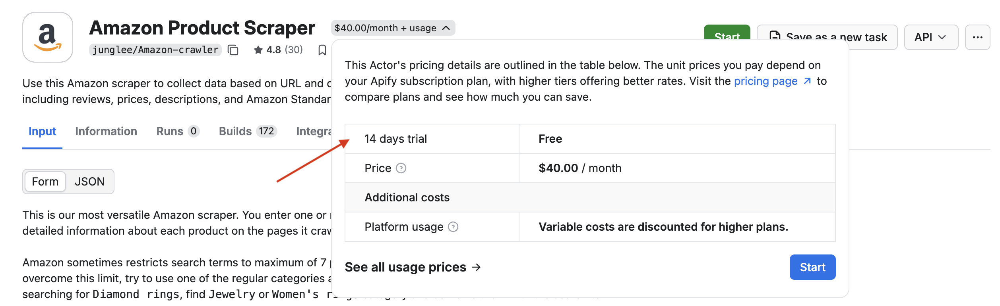
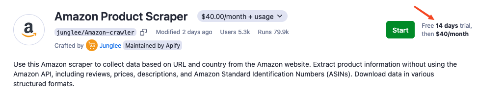
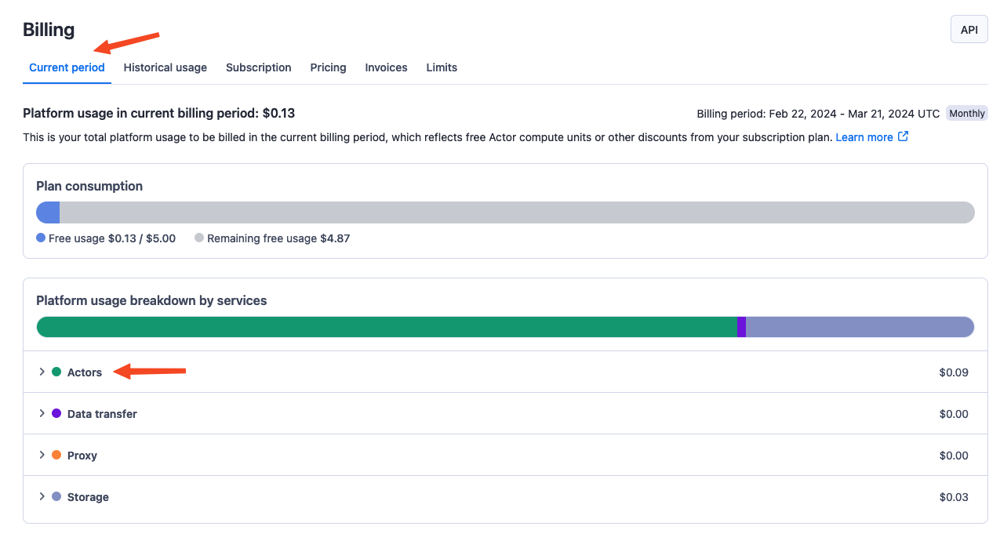
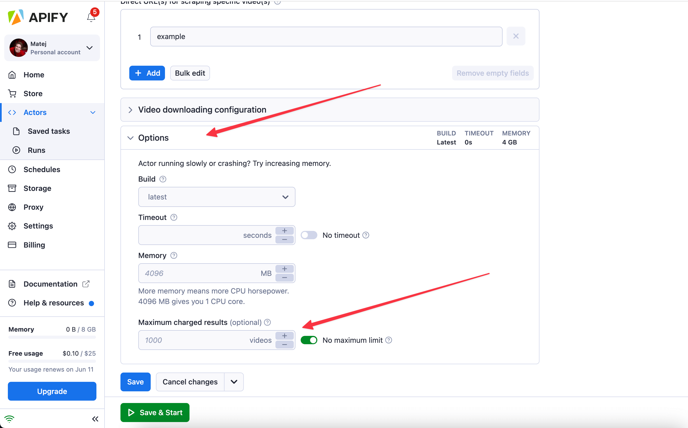
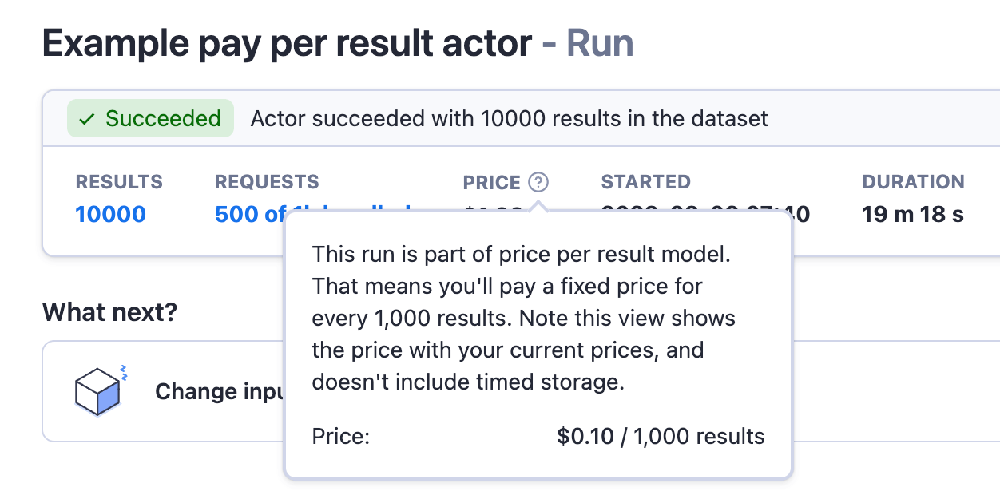
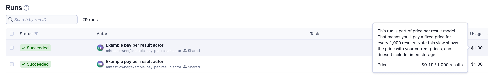
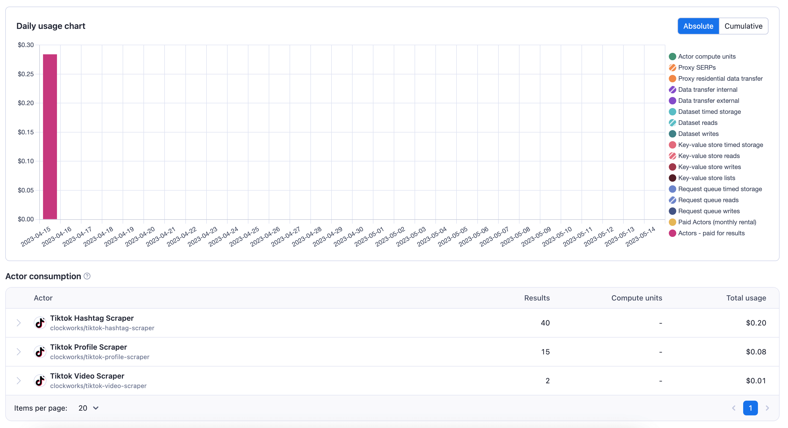
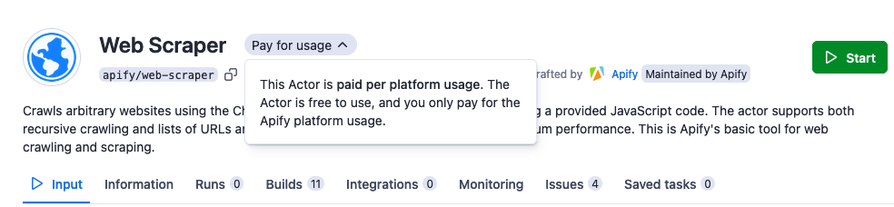

**[Apify Store](https://apify.com/store) is home to hundreds of public Actors available to the Apify community. It's the easiest way for you to start with Apify.**

---

:::info Publishing and monetizing Actors

Anyone is welcome to [publish Actors](/platform/actors/publishing) in the store, and you can even [monetize your Actors](/platform/actors/publishing/monetize). For more information about how to monetize your Actor, best practices, SEO, and promotion tips and tricks, head over to the [Getting the most of your public Actors in Apify Store](/academy/get-most-of-actors) section of the Apify Developers Academy.

:::

## Pricing models

All Actors in [Apify Store](https://apify.com/store) fall into one of the three pricing models:

1. [**Rental**](#rental-actors) - same as free, but to be able to run the Actor after the trial period, you need to rent the Actor from the developer and pay a flat fee per month on the top of the platform usage the Actor generates.
2. [**Pay per result**](#pay-per-result) - you do not pay for platform usage the Actor generates and instead just pay for the results it produces.
3. [**Pay per usage**](#pay-per-usage) - you can run the Actor and you pay for the platform usage the Actor generates.

### Rental Actors

Rental Actors are Actors for which you have to pay a recurring fee to the developer after your trial period ends. This empowers the developer to dedicate more time and effort to their Actors, thus ensuring they are of the _highest quality_ and receive _ongoing maintenance_.

Each rental Actor has a _free trial_, where the trial's length is always shown for each rental Actor.

After a trial period, a flat monthly **Actor rental** fee is automatically subtracted from your prepaid platform usage in advance for the following month. This fee goes directly to the developer and is paid on top of the platform usage generated by the Actor. You can read more about our motivation for releasing rental Actors in [this blog post](https://blog.apify.com/make-regular-passive-income-developing-web-automation-actors-b0392278d085/) from Apify's CEO Jan Čurn.

#### Rental Actors - Frequently Asked Questions

##### Can I run rental Actors via API or the Apify client?

Yes, when you are renting an Actor, you can run it using either our [API](/api/v2), [JavaScript](/api/client/js) or [Python](/api/client/python) clients as you would do with private or free public Actors.

##### Do I pay platform costs for running rental Actors?

Yes, you will pay normal [platform usage costs](https://apify.com/pricing/actors) on top of the per month Actor rental fee. The platform costs work exactly the same way as for free public Actors or your private Actors. You should find estimates of the cost of usage in each individual rental Actor's README ([see an example](https://apify.com/drobnikj/crawler-google-places#how-much-will-it-cost)).

##### Do I need an Apify paid plan to use rental Actors?

You don't need a paid plan to start a rental Actor's free trial. Just activate the trial, and you are good to go. After that, you will need to subscribe to one of [Apify's paid plans](https://apify.com/pricing) in order to keep renting the Actor and continue using it.

##### When will I be charged for the Actor rental?

You always prepay the Actor rental for the following month. The first payment happens when the trial expires, and then recurs monthly. When you open the Actor in the Apify Console, you will see when the next rental payment is due, and you will also receive a notification when it happens.

_Example_: You activate a 7-day trial of an Actor at _noon of April 1, 2021_. If you don't turn off auto renewal, you will be charged at _noon on April 8, 2021_, then _May 8, 2021_.

##### How am I charged for Actor rental?

The rental fee for an Actor is automatically subtracted from your prepaid platform usage, similarly to, e.g. [compute units](./usage_and_resources.md). If you don't have enough usage prepaid, you will need to cover any overage in the next invoice.

##### Will I be automatically charged at the end of the free trial?

If you have an [Apify paid plan](https://apify.com/pricing), the per month rental fee will be automatically subtracted from your plans' prepaid usage at the end of your free trial and you will be able to run the Actor for another month. If you are not subscribed to an Apify plan, you will need to subscribe to one of [Apify's paid plans](https://apify.com/pricing) in order to continue using the Actor after the trial has ended.

##### Can I cancel my Actor rental?

_You can cancel the Actor rental_ during your trial or any time after that so that don't get charged when your current Actor rental expires. You can always turn it back on later if you want.

##### Where can I see how much I have paid for Actor rental?

Since Actor rental fees are paid from prepaid platform usage, these fees conceptually belong under platform usage.

You can find the breakdown of how much you have been charged for rental Actors within **Actors** tab in **Current period** tab in the [Billing](https://console.apify.com/billing) section.

### Pay per result

When you run an Actor that is _paid per result_, you pay for the successful results that an Actor returns when you run it, and you are not charged for the underlying platform usage. Technically, we validate the _results_ against a schema, and you are only charged for the valid items in the [dataset](https://docs.apify.com/platform/storage/dataset) of the Actor run.

:::info Estimation simplified

This makes it transparent and easy to estimate upfront costs. If you have any feedback or would like to ask something, please join our [Discord](https://discord.gg/qkMS6pU4cF) community and let us know!

:::

<!-- TODO - add a bit about the ability to set the maximum limits Actor should return -->

#### Pay per result Actors - Frequently Asked Questions

##### How do I know an Actor is paid per result?

When you try the Actor on the platform, you will see that the Actor is paid per result next to the Actor name.

##### Do I need to pay a monthly rental fee to run the Actor?

No, the Actor is free to run. You only pay for the results.

##### What happens when I interact with the dataset after the run finishes?

Under the **pay per result** model, all platform costs generated _during the run of an Actor_ are not charged towards your account; you pay for the results instead. After the run finishes, any interactions with the default dataset storing the results, such as reading the results or writing additional data, will incur the standard platform usage costs. But do not worry, in the vast majority of cases, you only want to read the result from the dataset and that costs near to nothing.

##### Do I pay for the storage of results on the Apify platform?

You will still be charged for the timed storage of the data in the same fashion as with any other Actor. You can always decide to delete the dataset to reduce your costs after you export the data from the platform. By default, any unnamed dataset will be automatically removed after your data retention period, so usually, this is nothing to worry about.

##### Can I set a cap on how many results an Actor should return?

You can set a limit on how many items an Actor should return and the amount you will be charged in Options on the Actor detail page in the section below the Actor input.

##### Can I publish an Actor that is paid per result?

Publishing an Actor that is paid per result is not yet available publicly as this pricing model is still in beta.

##### Where do I see how much I was charged for the pay per result Actors?

You can see the overview of how much you have been charged for Actors paid by result on your invoices and in the [Usage tab](https://console.apify.com/billing) of the Billing section in Console. It will be shown there as a separate service.

On the top of that, you can see how much you have been charged for a specific run in the detail of that run and also in the overview table showing all runs.

If you wish to see how much you have been charged for a particular Actor, you will find this information
at the bottom of the [Usage tab](https://console.apify.com/billing).

### Pay per usage

When you use a pay per usage Actor, you are only charged for the platform usage that the runs of this Actor generate. [Platform usage](./usage_and_resources.md) includes components such as compute units, operations on [storages](/platform/storage), and usage of [residential proxies](/platform/proxy/residential-proxy) or [SERPs](/platform/proxy/google-serp-proxy).

You can find the details of your Actor usage on the run detail page.

:::info Estimating Actor usage cost

With this model, it's very easy to see how many platform resources each Actor run consumed, but it is quite difficult to estimate their usage beforehand. The best way to find the costs of free Actors upfront is to try out the Actor on a limited scope (for example, on a small number of pages) and evaluate the consumption. You can easily do that using our [free plan](https://apify.com/pricing).

_For more information on platform usage cost see the [usage and resources](./usage_and_resources.md) page._

:::

## Reporting issues with Actors

Each Actor has an **Issues** tab present in the Apify Console. There, you can open an issue (ticket) and chat with the Actor's author, platform admins,
and other users of this Actor. Please, feel free to use the tab to ask any questions, request new features or give feedback. Alternatively, you can
always write to [community@apify.com](mailto:community@apify.com).

