:::info Publishing and monetizing Actors

Anyone is welcome to [publish Actors](/platform/actors/publishing) in the store, and you can even [monetize your Actors](/platform/actors/publishing/monetize). For more information about how to monetize your Actor, best practices, SEO, and promotion tips and tricks, head over to the [Marketing checklist](/academy/actor-marketing-playbook/promote-your-actor/checklist) section of the Apify Developers Academy.

:::

import RentalSunset from '../../../_partials/_rental-sunsetting.mdx';

## Pricing models

All Actors in [Apify Store](https://apify.com/store) fall into one of three pricing models:

1. [**Pay per event**](#pay-per-event) - you pay for specific events the Actor creator defines, such as generating a single result or starting the Actor. Most Actors include platform usage in the price, but some may charge it separately - check the Actor's pricing for details.
1. [**Pay per result**](#pay-per-result) - you do not pay for platform usage the Actor generates and instead just pay for the results it produces.
1. [**Rental**](#rental-actors) - to continue using the Actor after the trial period, you must rent the Actor from the developer and pay a flat monthly fee in addition to the costs associated with the platform usage that the Actor generates.

:::note Post-run storage costs
After a run finishes, any interactions with the dataset - such as reading or writing additional data - incur standard platform usage costs. This applies to all pricing models. Unnamed datasets are automatically removed after your data retention period, so long-term storage is rarely a concern.
:::

### Pay per event

With pay per event pricing, you pay for specific events defined by the Actor creator, such as producing a single result, uploading a file, or starting an Actor. These events and their prices are always described on each Actor's page.

[//]: # (TODO: also show the screenshot from Apify Store on Web)

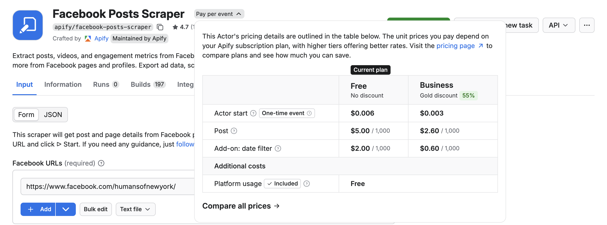

:::caution Some Actors charge platform usage separately

Most pay per event Actors include [platform usage](./usage_and_resources.md) in the event price. However, some Actors may require you to pay for platform usage separately. Always check the Actor's pricing section to understand what's included.

:::

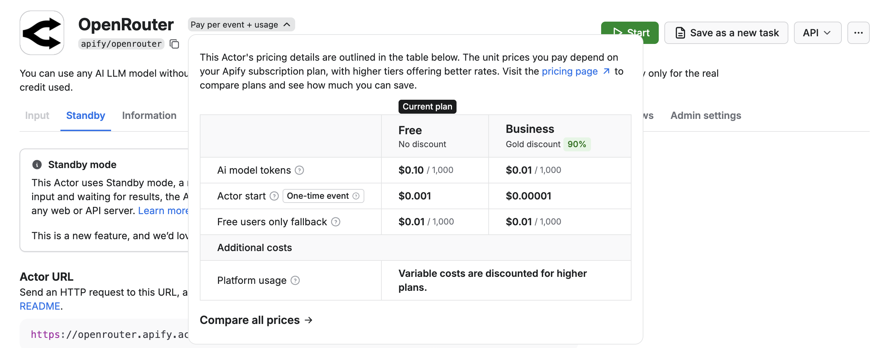

When starting a run, you can define a maximum charge limit. The Actor terminates gracefully when it reaches that limit - and even if it does not stop immediately, you are never charged for produced events over the defined limit.

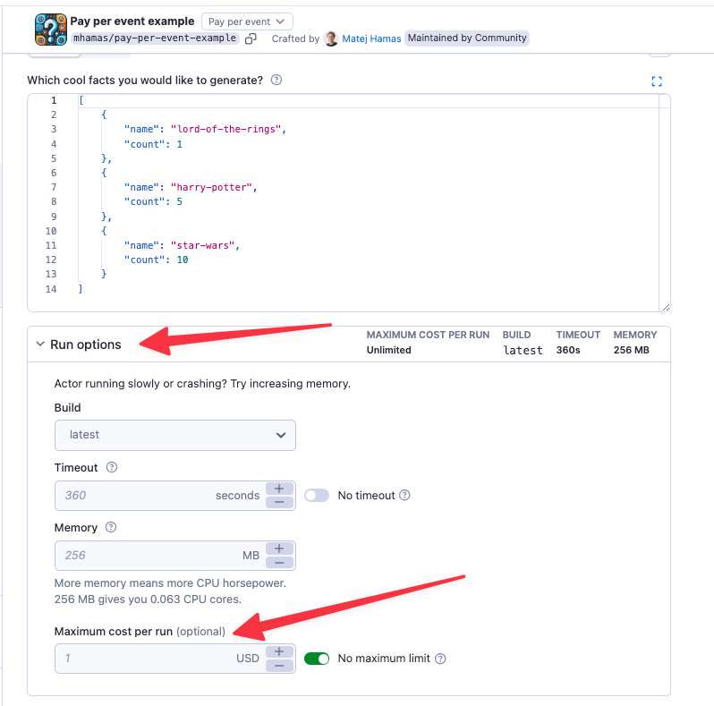

Your charges appear on your invoices and in the [Historical usage tab](https://console.apify.com/billing/historical-usage) in the Billing section of Apify Console. The cost of each run also appears on the run detail page.

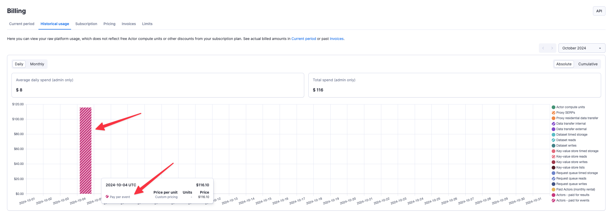

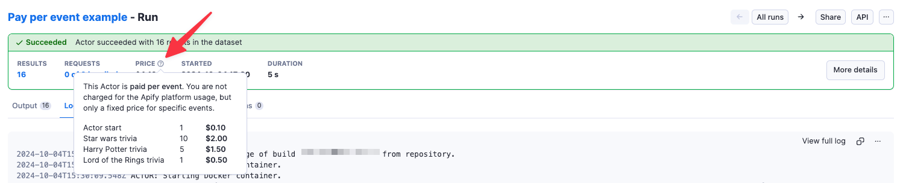

If charges seem incorrect, contact the Actor author or the Apify support team. You can also open an issue directly on the Actor's detail page in Apify Console.

### Pay per result

When you run an Actor that is _paid per result_, you pay for the successful results the Actor returns, and you are not charged for the underlying platform usage.

:::info Estimation simplified

This makes it transparent and easy to estimate upfront costs. If you have any feedback or would like to ask something, please join our [Discord](https://discord.gg/qkMS6pU4cF) community and let us know!

:::

<!-- TODO - add a bit about the ability to set the maximum limits Actor should return -->

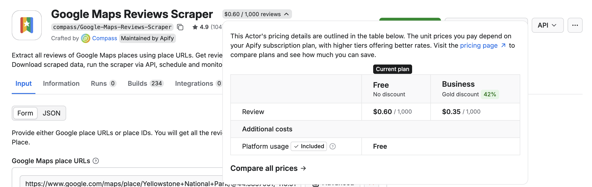

All platform costs generated _during_ the Actor run are not charged to your account.

You can limit how many results an Actor returns - and therefore control how much you're charged - by setting a maximum items limit in the Options section below the Actor input on the Actor detail page.

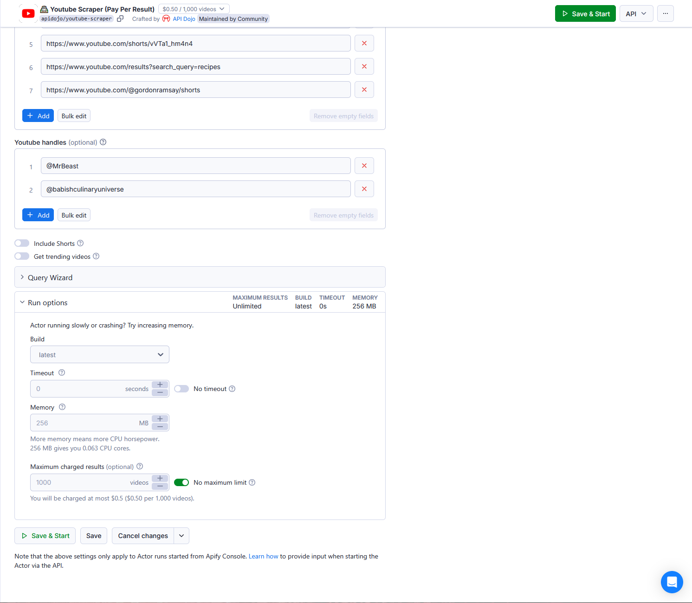

Your charges appear on your invoices and in the [Historical usage tab](https://console.apify.com/billing/historical-usage) in the Billing section of Apify Console, where pay per result charges are shown as a separate service. The cost also appears on individual run detail pages and in the overview of all runs.

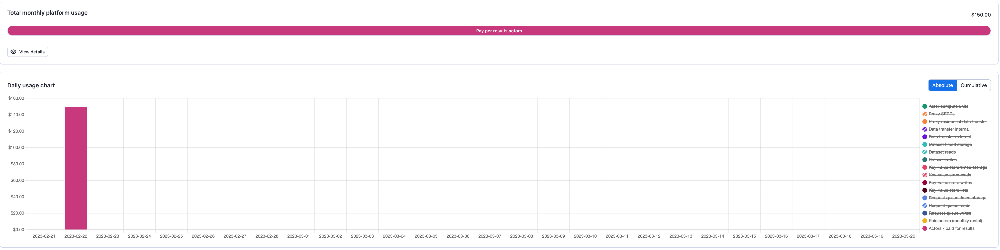

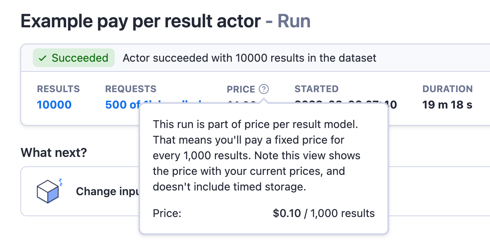

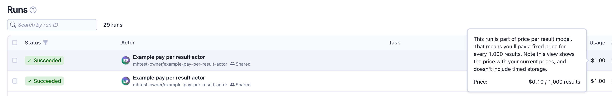

To see total charges for a specific Actor, check the bottom of the [Historical usage tab](https://console.apify.com/billing/historical-usage).

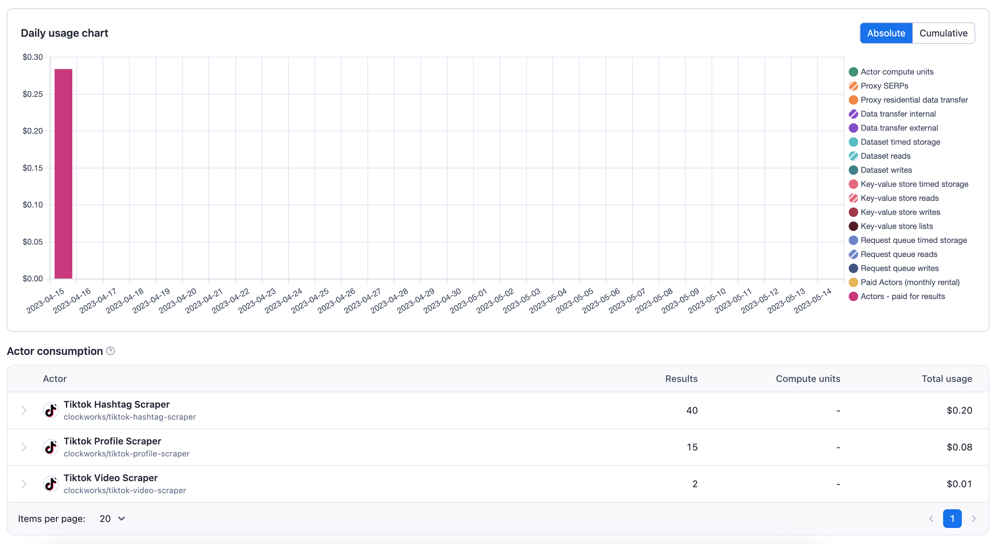

Pay per result is also available as a pricing option when you publish your own Actors - see [Monetizing your Actor](/platform/actors/publishing/monetize) for details.

### Rental Actors

<RentalSunset/>

Rental Actors are Actors for which you have to pay a recurring fee to the developer after your trial period ends.

Most rental Actors have a _free trial_ period. The length of the trial is displayed on each Actor's page.

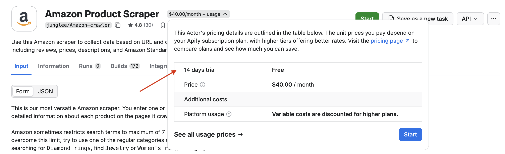

You don't need a paid plan to start a rental Actor's free trial. After the trial, you must subscribe to one of [Apify's paid plans](https://apify.com/pricing) to continue renting and using the Actor. If you are on a paid plan, the monthly rental fee is automatically subtracted from your prepaid platform usage when the trial expires, then recurs monthly. If you are not on a paid plan when the trial ends, you are not charged but cannot use the Actor until you subscribe.

You always prepay the rental fee for the following month. The first payment occurs when the trial expires, then recurs monthly. You can check when the next payment is due by opening the Actor in Apify Console - you'll also receive a notification when it happens.

_Example_: You activate a 7-day trial at _noon on April 1, 2021_. Without cancellation, you are charged at _noon on April 8, 2021_, then _May 8, 2021_.

[//]: # (TODO better link for platform usage costs explaining what it is!)

Rental fees are subtracted automatically from your prepaid platform usage, similarly to [compute units](./usage_and_resources.md). Most of the fee goes directly to the developer, and you also pay normal [platform usage costs](https://apify.com/pricing) on top - usage cost estimates are usually included in each rental Actor's README ([see an example](https://apify.com/compass/crawler-google-places#how-much-will-it-cost)). If your prepaid usage is insufficient, any overage is covered in the next invoice.

You can cancel the rental at any time during the trial or afterward so you are not charged when the current rental period expires. You can always turn it back on later.

To see a breakdown of rental charges, go to the **Actors** tab within the **Current period** tab in the [Billing](https://console.apify.com/billing) section.

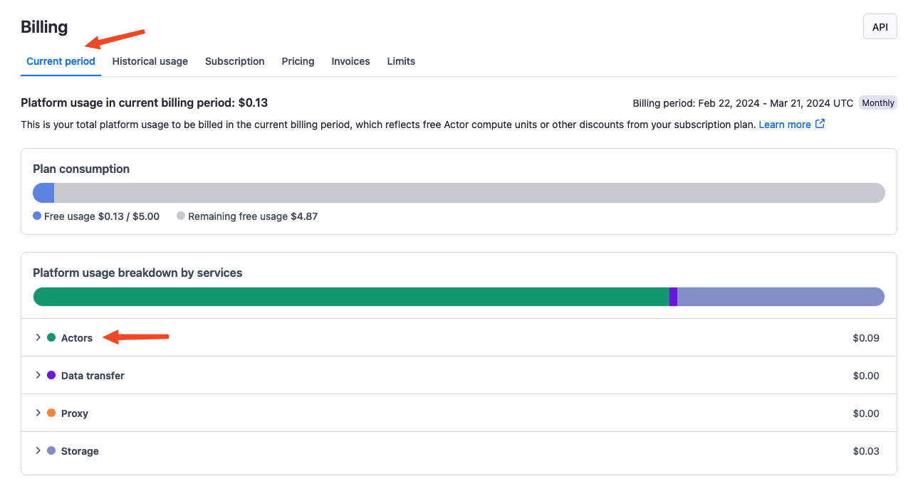

## Report issues with Actors

Each Actor has an **Issues** tab in Apify Console. There, you can open an issue (ticket) and chat with the Actor's author, platform admins,
and other users of this Actor. Please feel free to use the tab to ask any questions, request new features, or give feedback. Alternatively, you can
always write to [community@apify.com](mailto:community@apify.com).

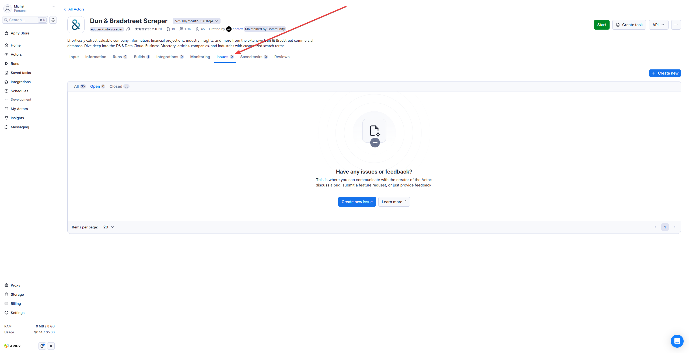

## Apify Store discounts

Each Apify subscription plan includes a discount tier (_BRONZE_, _SILVER_, _GOLD_) that provides access to increasingly lower prices on selected Actors.

:::note Discount participation

Discount offers are optional and determined by Actor owners. Not all Actors participate in the discount program.

:::

Additional discounts are available for Enterprise customers.

To check an Actor's pricing and available discounts, visit the Pricing section on the Actor's detail page in Apify Store.

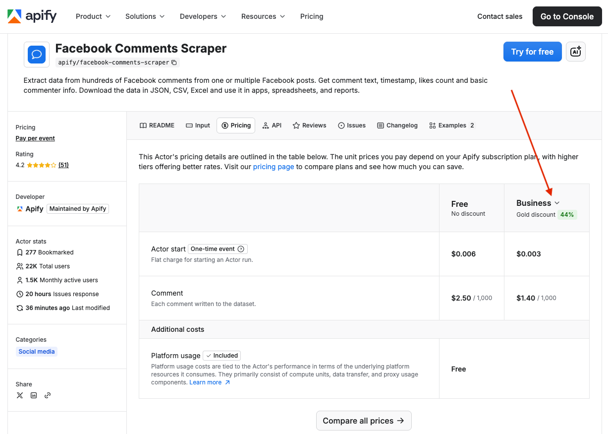

In the Apify Console, you can find information about pricing and available discounts in the Actor's header section.

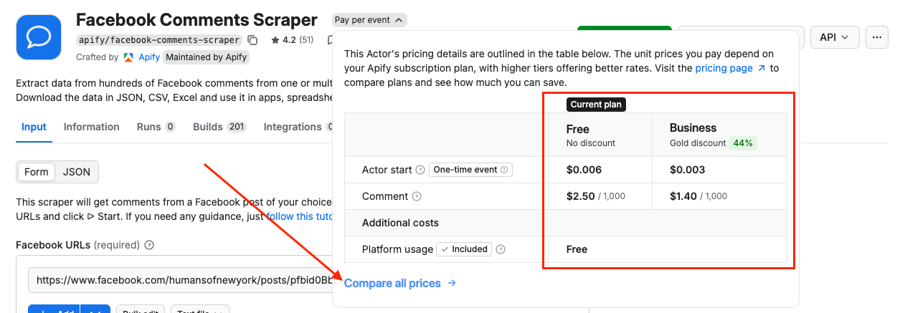

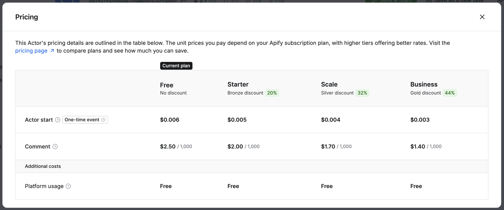
