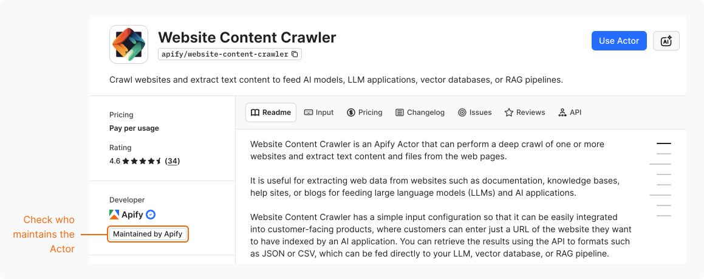

import VerifiedDev from '../images/store/verified-dev.svg';
import PartnerDev from '../images/store/partner-dev.svg';

Actors in [Apify Store](https://apify.com/store) are maintained either by Apify or by independent developers from the community. The type of maintenance determines who updates the Actor, tests it, and responds to your questions or issues.

## Check Actor ownership

To see who owns an Actor:

1. In Apify Store or Console, go to the Actor's page.
1. In **Developer** section, check the label: **Maintained by Apify**, **Maintained by Apify Partner**, or **Maintained by Community**.

### Verified developers

A blue badge <VerifiedDev style={{ height: '1.2em', width: '1.2em', verticalAlign: 'text-bottom' }} /> next to a developer's name means that Apify has [verified their identity](/actors/publishing/monetize/monthly-payouts#verify-your-identity).

A missing badge doesn't mean the Actor is unsafe. A developer's verified identity is only one of many signals to consider before you run the Actor.

### Apify Partners

A black and yellow badge <PartnerDev style={{ height: '1.2em', width: '1.2em', verticalAlign: 'text-bottom' }} /> next to a developer's name means that the developer is an Apify Partner.

Apify Partners are verified developers with a track record of delivering high-quality Actors. The badge applies to the developer, not to a specific Actor. Partners are independent developers who remain responsible for the quality, reliability, and maintenance of their Actors.

## Compare ownership types

Compare Actors maintained by different types of developers:

| | Maintained by Apify | Maintained by the community | Maintained by Apify Partner |
| ---: | --- | --- | --- |
| **Ownership** | Created and maintained by Apify. | Created and maintained by independent developers or agencies. | Created and maintained by an independent developer. |
| **Functionality** | A small number of popular scenarios that serve the most users. | A wide range of use cases, often tailored to very specific needs. Great for exploring unique or niche applications. | A wide range of use cases. |
| **Maintenance** | Apify guarantees maintenance, updates, and bug fixes. | Developer is responsible for all updates, bug fixes, and ongoing maintenance. Apify hosts the Actor, but doesn't manage its source code. | Developer must meet Apify's maintenance standards. |
| **Reliability** | Subject to reliability testing to meet Apify's quality and performance standards. | Developer is responsible for ensuring the reliability and performance of the Actor. | Developer must meet Apify's reliability and performance standards. |
| **Support** | Apify team answers questions and issues. | Developer answers questions and issues. | Developer answers questions and issues within agreed timeframes. |
| **Documentation** | Actor's README maintained by Apify. | Actor's README maintained by the developer. | Actor's README maintained by the developer. |
