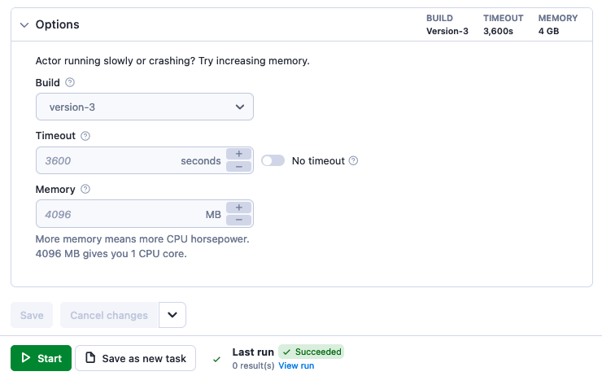
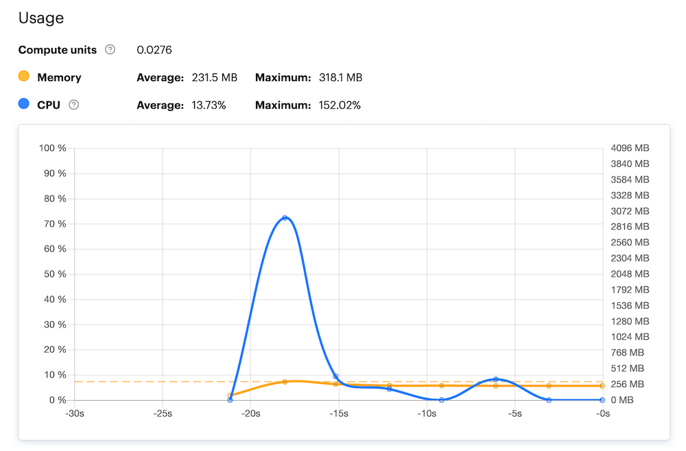
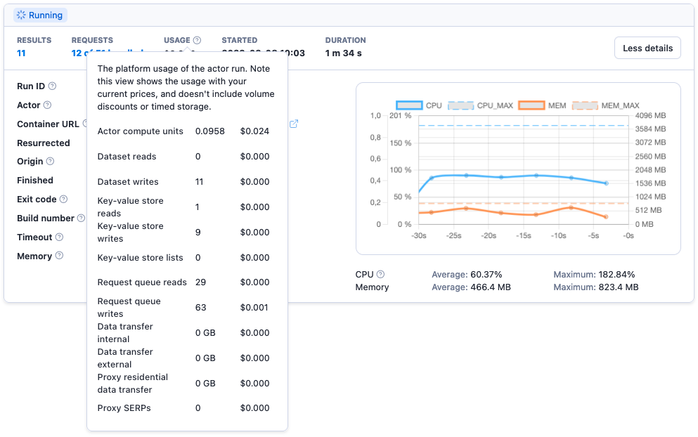

# Usage and resources

**Learn about your Actors' memory and processing power requirements, their relationship with Docker resources, minimum requirements for different use cases and its impact on the cost.**

---

## Resources

[Actors](../index.md) run in
[Docker containers](https://www.docker.com/resources/what-container),
which have a [limited amount of resources](https://phoenixnap.com/kb/docker-memory-and-cpu-limit) (memory, CPU, disk size, ...). When starting, the Actor needs to be allocated a certain share of those resources, such as how much CPU "horsepower" it will be able to use.

By assigning an Actor's **memory** capacity, you also assign it a proportional amount of **CPU power**. In addition to CPU power, the memory allocation also influences disk size, which amounts to 2x the allocated memory.

> [See the **Limits**](../../limits.md) page for detailed information on Actor memory, CPU limits, disk size and other limits.

### Memory

When invoking the Actor, the caller has to specify the amount of memory allocated for the Actor run. The amount of memory can be set to a power of 2 with a minimum of 128 MB, i.e., 256 MB, 512 MB, 1024 MB, 2048 MB, ..., 32768 MB.

Additionally, each user has a certain total limit of memory for running Actors. The sum of memory allocated for all running Actors and builds needs to fit into this limit, otherwise the user cannot start a new Actor. For more details, see [limits](../../limits.md).

### CPU

The share of CPU is computed automatically from the memory as follows: for each 4096 MB of memory, the Actor gets 1 full CPU core. For other amounts of memory the number of CPU cores is computed fractionally. For example, 512 MB = 1/8th of a core, 1 GB = 1/4 of core, 8 GB gives you 2 cores, and so on.

#### CPU usage spikes

[//]: # (Is it still relevant though? Does it still get CPU boost?)
Sometimes, you see the Actor’s CPU use go over 100%. This is not unusual. To help an Actor start up faster, it is allocated a free CPU boost. For example, if an Actor is assigned 1GB (25% of a core), it will temporarily be allowed to use 100% of the core, so it gets started quicker.

### Disk

The Actor has hard disk space limited by twice the amount of memory. For example, an Actor with 1024 MB of memory will have 2048 MB of disk available.

## Requirements

Actors built on top of the [Apify SDK](/sdk/js) and [Crawlee](https://crawlee.dev/) use autoscaling. This means that they will always run as efficiently as they can with the memory they have allocated. So, if you allocate 2 times more memory, the run should be 2 times faster and consume the same amount of compute units (1 * 1 = 0.5 * 2).

A good middle ground to start is 4096 MB. If you need the results faster, increase the memory (bear in mind the [next point](#maximum-memory), though). You can also try decreasing it to lower the pressure on the target site.

Autoscaling only applies to solutions that run multiple tasks (URLs) for at least 30 seconds. If you need to scrape just one URL or use Actors like [Google Sheets](https://apify.com/lukaskrivka/google-sheets) that do just a single isolated job, we recommend you lower the memory.

> Most Actors in [Apify Store](https://apify.com/store) have some information in their README about how many CUs they consume per certain amount of data scraped.

[//]: # (TODO: It's pretty outdated, we now have platform credits in pricing)
[//]: # (If you read that you can scrape 1000 pages of data for 1 CU and you want to scrape approximately 2 million of them monthly, that means you need 2000 CUs monthly and should [subscribe to the Business plan]&#40;https://console.apify.com/billing-new#/subscription&#41;.)

If the Actor doesn't have this information, or you want to use your own solution, just run your solution like you want to use it long term. Let's say that you want to scrape the data **every hour for the whole month**. You set up a reasonable memory allocation like 4096 MB, and the whole run takes 15 minutes. That should consume 1 CU (4 \* 0.25 = 1). Now, you just need to multiply that by the number of hours in the day and by the number of days in the month, and you get an estimated usage of 720 (1 \* 24 \* 30) CUs monthly.

> [See our article on **estimating consumption**](https://help.apify.com/en/articles/3470975-how-to-estimate-compute-unit-usage-for-your-project) for more details.

### Memory requirements

Each use case has its own minimum memory requirements. The larger and more complex your project, the more memory/CPU power it will require. Some examples which have minimum requirements are:

- Actors using [Puppeteer](https://pptr.dev/) or [Playwright](https://playwright.dev/) and so the real web browser: at least 1GB of memory.
- Large and complex sites like [Google Maps](https://apify.com/drobnikj/crawler-google-places): at least 4GB for optimal speed and [concurrency](https://crawlee.dev/api/core/class/AutoscaledPool#minConcurrency).
- Working with a large amount of data in memory.

### Maximum memory

Apify Actors are most commonly written in [Node.js](https://nodejs.org/en/), which uses a [single process thread](https://betterprogramming.pub/is-node-js-really-single-threaded-7ea59bcc8d64). Unless you use external binaries such as the Chrome browser, Puppeteer, Playwright, or other multi-threaded libraries you will not gain more CPU power from assigning your Actor more than 4 GB of memory because Node.js cannot use more than 1 core.

In other words, giving a simple [Cheerio-based crawler](https://apify.com/apify/cheerio-scraper) 16GB of memory (4 CPU cores) will not make it faster because these crawlers simply cannot use more than 1 CPU core.

> It is possible to [use multiple threads in Node.js-based Actor](https://dev.to/reevranj/multiple-threads-in-nodejs-how-and-what-s-new-b23) with some configuration. This can be useful if you need to offload a part of your workload.

## Usage

When you run an Actor it generates platform usage that's charged towards the user account. Platform usage is composed of 4 main parts:

- **Compute units**: CPU and memory resources consumed by the Actor.
- **Data transfer**: Amount of data you transfered between web, Apify Platform, and other external systems.
- **Proxy costs**: Residential or SERP proxy usage.
- **Storage operations**: Read, write, and other operations towards key-value store, dataset, and request queue.

> For detailed information, FAQ, and, pricing see the [platform pricing page](https://apify.com/pricing/actors).

### What is a compute unit (CU)?

> **TL;DR: An [Actor](..) running with 1 GB of memory for one hour consumes 1 compute unit.**

A compute unit (CU) is the unit of measurement for the resources consumed by Actor runs and builds. We charge you for using Actors based on CU consumption.

For example, if you run an Actor with 1GB of allocated memory for 1 hour, it will consume 1 CU. Depending on your [subscription plan](https://apify.com/pricing/actors#how-does-the-platform-pricing-work), this CU will cost you a certain amount of money.

You can see each Actor run's exact CU usage in the run's details.

You can [find a summary of your overall platform and CU usage](https://console.apify.com/billing) in the **Billing** section of Apify Console.

> **How are CUs calculated?** To calculate CUs, you need to multiply two factors:
>
> - **Memory** (GB) - Size of the allocated server for your Actor or task run.
> - **Duration** (hours) - How long the server is used (Actor or task run). For example, if your run took 6 minutes (360 seconds), you can use 0.1 (hours) as the second number to calculate CUs. Minimum granularity is a second.
>
> **1 GB memory x 1 hour = 1 CU.**

### What determines consumption

The factors, in order of importance, are:

- **Using a browser or plain HTTP**: launching a browser ([Puppeteer](https://pptr.dev/)/[Playwright](https://playwright.dev/)) is resource-intensive and slow. Working with plain HTML ([Cheerio](https://cheerio.js.org/)) can be up to **20 times** faster.

- **Run size and frequency**: large runs can utilize full resource scaling and are not subjected to repeated Actor start-ups (as opposed to many short runs). Always opt for larger batches, if possible.

- **Page type**: heavy pages like Amazon or Facebook will take more time to load regardless whether you use a browser or Cheerio. Large pages can take up to **3 times** more resources to load and parse than average pages.

**Our [article on estimating consumption](https://help.apify.com/en/articles/3470975-how-to-estimate-compute-unit-usage-for-your-project) contains more details on what determines consumption.**
