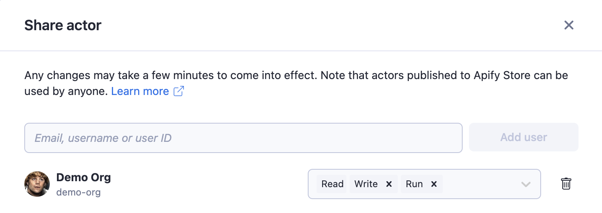

**Manage permissions for your private resources such as Actors, Actor runs, and storages. Allow other users to read, run, modify, or build new versions.**

---

You can easily and securely share your own resources - Actors, tasks, key-value stores, datasets, and request queues with other users using a [granular](https://www.google.com/search?client=firefox-b-d&q=define+granular+permissions) permissions system. This enables you to, for example, allow your colleague to run an [Actor](../actors/index.md) or view a [dataset](../storage/dataset.md) but not modify them.

> To be able to grant access rights to another user, you must have a **username** set in [account settings](https://console.apify.com/account?tab=settings).

You can also grant permission to update an Actor and build a new version.
[Storages](../storage/index.md) (key-value stores, request queues, and datasets) are sharable the same way with, for example, just **read** permission or a combination of both **read** and **write** permissions.

To share an Actor, task, key-value store, request queue, or dataset, click on the **Actions** button in the top-right corner and select **Share**. You can add a collaborator using their **user ID**, **email**, or **username**. Once you have added the collaborator, you can configure their permissions.

