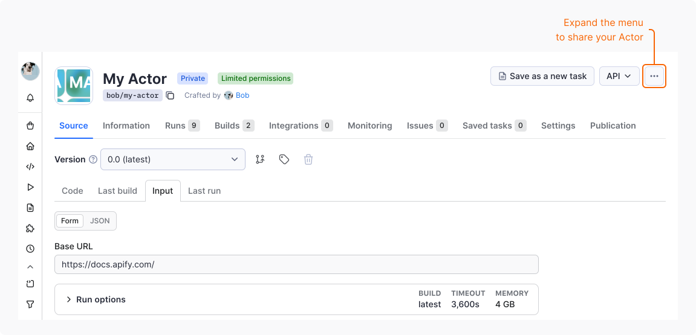

You can securely share your resources with others by using a granular permissions system. Such resources include Actors, tasks, key-value stores, datasets, and request queues.

For example, you can let your colleague run an [Actor](../actors/index.mdx) or view a [dataset](../storage/dataset.md) but not modify it. You can also grant permission to update an Actor and build a new version. [Storages](../storage/index.md) are sharable in the same way as a **read** permission or a combination of both **read** and **write** permissions.

## Grant access to resources

To share an Actor or a task:

1. In Apify Console, go to the Actor or task page.
1. From the menu, select **Share**.
1. Under **Invite**, add the user ID, email, or username of a person you want to share the resource with and select **Add user**.
1. From the dropdown, select the permissions to grant.

To share a key-value store, request queue, or a dataset:

1. In Apify Console, in the left-side menu, go to **Storage**.
1. Use tabs to switch between datasets, key-value stores, and request queues.
1. From the table, select the resource you want to share.
1. Under **Invite**, add the user ID, email, or username of a person you want to share the resource with and select **Add user**.
1. From the dropdown, select the permissions to grant.
