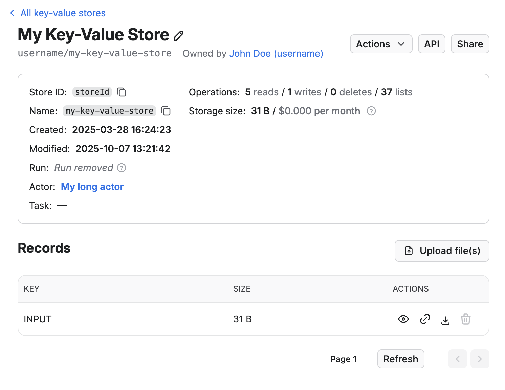

Some resources, like storages, Actor runs or Actor builds, can be shared simply by sending their unique resource ID or Console link and the recipient can then view the data in Console or fetch it via API without needing an API token. This is very useful for ad-hoc collaboration, integrating third party tools that connect to data in your Apify account or quick prototypes.

Thanks to the hard-to-guess, unique IDs, it’s also secure enough for most use cases. However, it doesn't offer features like access revocation and in some cases, you may want to have more direct control over data access and require users to have explicit permissions to your resources.

**General resource access** is an account setting that defines the default access policy at the account level. You can find General resource access in Apify Console under **Settings → Security & Privacy**. The two following options are supported:

- **Anyone with ID can read (default)**: Selected resources can be accessed using just their unique resource ID. This means if you share the resource ID with someone, they would be able to view it without providing an API token or viewing the resource by visiting the Console URL.
- **Restricted**: With this setting, only signed-in users with an explicit access to the resources can access them. To access restricted resources via API, a valid token needs to be provided.

This setting affects the following resources:

- Actor runs
- Actor builds
- Storages:
  - Datasets
  - Key-value stores
  - Request queues

Access to resources that require explicit access — such as Actors, tasks or schedules are not affected by this setting.


## How Restricted Access works

If your **General resource access** is set to **Anyone with ID can read**, you can just send this link to anybody, and they will be able to download the data even if they don’t have an Apify account. However, once you change the setting to **Restricted**, this API call will require a valid token with access in order to work. In other words, you’ll have to explicitly share the dataset and you can only do that with people who have an Apify account.

:::tip Access Setting Changes May Be Delayed
When you change the access for a resource it may take a minute for the change to take effect.
:::

### What is the best setting for me

Sharing by link is quick, convenient, and secure enough for most use cases -- thanks to the use of hard-to-guess unique IDs.

That said, link-based sharing doesn’t support access revocation, audit trails, or fine-grained permission controls. If you need tighter control over who can access your data or require elevated security because of the domain you're working in we recommend enabling **Restricted** access.

The default setting strikes a good balance for casual or internal use, but **Restricted** access is a better fit for teams with stricter security policies, integrations using scoped API tokens, or audit requirements.

You can switch to **Restricted** access at any time. If it causes issues in your workflow, you can revert to the default setting just as easily.

:::note Support in public Actors

Because this is a new setting, some existing public Actors and integrations might not support it yet. Their authors need to update them to provide a valid token on all API calls.

:::


### Exceptions

Even if your access is set to **Restricted** there are a few built-in exceptions that make collaboration and platform features work seamlessly. These are explained in the sections below.


#### Builds of public Actors

Builds of public Actors are always accessible to anyone who can view the Actor — regardless of the Actor owner’s account **General resource access** setting.

This ensures that public Actors in the Apify Store continue to work as expected. For example, if you open a public Actor in Console, you’ll also be able to view its build details, download logs, or inspect the source package — without needing extra permissions or a token.

This exception exists to maintain usability and avoid breaking workflows that rely on public Actors. It only applies to builds of Actors that are marked as **public**. For private Actors, build access still follows the general resource access setting of the owner’s account.

#### Automatically share owner runs of shared Actors & Tasks with collaborators

When you share an Actor with a collaborator, you can choose to share read-only access to your (the owner’s) runs of that Actor. This makes it easier for them to help with debugging, monitoring, or reviewing outputs.

- This access includes logs, input, and default storages (dataset, key-value store, request queue)
- Access is one-way: you won’t see the collaborator’s runs unless they share them
- Collaborators can’t see each other’s runs
- This works even if your account uses **restricted general resource access** — permissions are applied automatically.

#### Automatically sharing runs with public Actor creators

If you’re using a public Actor from the Apify Store, you can choose to automatically share your runs of that Actor with its creator. This helps developers monitor usage and troubleshoot issues more effectively.

- This setting is opt-in and can be enabled under **Account Settings → Privacy**
- When enabled, your runs of public Actors are automatically visible to the Actor’s creator
- Shared runs include logs, input, and output storages (dataset, key-value store, request queue)

This sharing works even if your account has  **General resource access** set to **Restricted** — the platform applies specific permission checks to ensure the Actor creator can access only the relevant runs.

You can disable this behavior at any time by turning off the setting in your account.

#### Automatically sharing runs via Actor Issues

When you report an issue on an Actor and include a **run URL**, that run is automatically shared with the Actor developer — **even if your account uses restricted general resource access**.

This automatic sharing ensures the developer can view all the context they need to troubleshoot the issue effectively. That includes:

- Full access to the run itself (logs, input, status)
- Automatic access to the run’s default storages:
  - Dataset
  - Key-value store
  - Request queue

The access is granted through explicit, behind-the-scenes permissions (not anonymous or public access), and is limited to just that run and its related storages. No other resources in your account are affected.

This means you don’t need to manually adjust permissions or share multiple links when reporting an Actor issue — **just including the run URL in your issue is enough**


## Per-resource access control

The account level access control can be changed on individual resources. This can be done by setting the general access level to other than Restricted  in the share dialog for a given resource. This way the resource level setting takes precedence over the account setting.


:::tip Using Apify API
You can also set the general access on a resource programmatically using the Apify API or Apify client. Read more in the API reference and client documentation.

```js
const datasetClient = apifyClient.dataset(datasetId);
await datasetClient.update({
    generalAccess: STORAGE_GENERAL_ACCESS.ANYONE_WITH_ID_CAN_READ
});
```

:::

### Sharing restricted resources with pre-signed URLs {#pre-signed-urls}

Even when a resource is restricted, you might still want to share it with someone outside your team — for example, to send a PDF report to a client, or include a screenshot in an automated email or Slack message. In these cases, _storage resources_ (like key-value stores, datasets, and request queues) support generating _pre-signed URLs_. These are secure, time-limited links that let others access individual files without needing an Apify account or authentication.

#### How pre-signed URLs work

A pre-signed URL is a regular HTTPS link that includes a cryptographic signature verifying that access has been explicitly granted by someone with valid permissions.
When a pre-signed URL is used, Apify validates the signature and grants access without requiring an API token.

The signature can be temporary (set to expire after a specified duration) or permanent, depending on the expiration date set when it's generated.

#### What links can be pre-signed

Only selected _dataset_ and _key-value store_ endpoints support pre-signed URLs.  
This allows fine-grained control over what data can be shared without authentication.

| Resource | Link | Validity | Notes |
|-----------|-----------------------|------|-------|
| _Datasets_ | [Dataset items](/api/v2/dataset-items-get) (`/v2/datasets/:datasetId/items`) | Temporary or Permanent | The link provides access to all dataset items. |
| _Key-value stores_ | [List of keys](/api/v2/key-value-store-keys-get) (`/v2/key-value-stores/:storeId/keys`) | Temporary or Permanent | Returns the list of keys in a store. |
| _Key-value stores_ | [Single record](/api/v2/key-value-store-record-get) (`/v2/key-value-stores/:storeId/records/:recordKey`) | _Permanent only_ | The public URL for a specific record is always permanent - it stays valid as long as the record exists. |

:::info Automatically generated signed URLs

When you retrieve dataset or key-value store details using:

- `GET https://api.apify.com/v2/datasets/:datasetId`  
- `GET https://api.apify.com/v2/key-value-stores/:storeId`

the API response includes automatically generated fields:  

- `itemsPublicUrl` – a pre-signed URL providing access to dataset items  
- `keysPublicUrl` – a pre-signed URL providing access to key-value store keys  

These automatically generated URLs are _valid for 14 days_.

The response also contains:

- `consoleUrl` - provides a stable link to the resource's page in the Apify Console. Unlike a direct API link, Console link will prompt unauthenticated users to sign in, ensuring they have required permissions to view the resource.

:::

You can create pre-signed URLs either through the Apify Console or programmatically via the Apify API client.

#### How to generate pre-signed URLs in Apify Console

To generate a pre-signed link, you can use the **Export** button in Console.

:::note

The link will include a signature _only if the general resource access is set to Restricted_. For unrestricted datasets, the link will work without a signature.

:::

##### Dataset items

1. Click the **Export** button.  
2. In the modal that appears, click **Copy shareable link**.  


##### Key-value store records

1. Open a key-value store.  
2. Navigate to the record you want to share.  
3. In the **Actions** column, click the link icon to copy signed link.  



#### How to generate pre-signed URLs using Apify Client

You can generate pre-signed URLs programmatically for datasets and key-value stores:

##### Dataset items

```js
import { ApifyClient } from "apify-client";
const client = new ApifyClient({ token: process.env.APIFY_TOKEN });
const datasetClient = client.dataset('my-dataset-id');

// Creates pre-signed URL for items (expires in 7 days)
const itemsUrl = await datasetClient.createItemsPublicUrl({ expiresInSecs: 7 * 24 * 3600 });

// Creates permanent pre-signed URL for items
const permanentItemsUrl = await datasetClient.createItemsPublicUrl();
```

##### Key-value store list of keys

```js
const storeClient = client.keyValueStore('my-store-id');

// Create pre-signed URL for list of keys (expires in 1 day)
const keysPublicUrl = await storeClient.createKeysPublicUrl({ expiresInSecs: 24 * 3600 });

// Create permanent pre-signed URL for list of keys
const permanentKeysPublicUrl = await storeClient.createKeysPublicUrl();
```

##### Key-value store record

```js
// Get permanent URL for a single record
const recordUrl = await storeClient.getRecordPublicUrl('report.pdf');
```

:::tip Permanent signed URL

If the `expiresInSecs` option is not specified, the generated link will be _permanent_.

:::

#### Signing URLs manually

If you need finer control — for example, generating links without using Apify client — you can sign URLs manually using our reference implementation.

[Check the reference implementation in Apify clients](https://github.com/apify/apify-client-js/blob/5efd68a3bc78c0173a62775f79425fad78f0e6d1/src/resource_clients/dataset.ts#L179)

Manual signing uses standard _HMAC (SHA-256)_ with `urlSigningSecretKey` of the resource and can be easily integrated.

### Sharing storages by name

A convenient feature of storages is that you can name them. If you choose to do so there is an extra access level setting that applies to storages only, which is  **Anyone with name or ID can read**. In that case anyone that knows the storage name is able to read it via API or view it using the storages Console URL.

:::tip Exposing public named datasets

This is very useful if you wish to expose a storage publicly with an easy to remember URL.

:::

## Implications for public Actor developers

If you own a public Actor in the Apify Store, you need to make sure that your Actor will work even for users who have restricted access to their resources. Over time, you might see a growing number of users with _General resource access_ set to _Restricted_.

In practice, this means that all API calls originating from the Actor need to have a valid API token. If you are using Apify SDK, this should be the default behavior. See the detailed guide below for more information.


:::caution Actor runs inherit user permissions

Keep in mind that when users run your public Actor, the Actor makes API calls under the user account, not your developer account. This means that it follows the _General resource access_ configuration of the user account. The configuration of your developer account has no effect on the Actor users.

:::

### Migration guide to support restricted general resource access

This section provides a practical guide and best practices to help you update your public Actors so they fully support _Restricted general resource access_.

---

#### Always authenticate API requests

All API requests from your Actor should be authenticated.
When using the [Apify SDK](https://docs.apify.com/sdk/js/) or [Apify Client](https://docs.apify.com/api/client/js/), this is done automatically.

If your Actor makes direct API calls, include the API token manually:

```js
  const response = await fetch(`https://api.apify.com/v2/key-value-stores/${storeId}`, {
    headers: { Authorization: `Bearer ${process.env.APIFY_TOKEN}` },
  });
```

#### Generate pre-signed URLs for external sharing

If your Actor outputs or shares links to storages (such as datasets or key-value store records), make sure to generate pre-signed URLs instead of hardcoding API URLs.

For example:

```js
import { ApifyClient } from "apify-client";

// ❌ Avoid hardcoding raw API URLs
const recordUrl = `https://api.apify.com/v2/key-value-stores/${storeId}/records/${recordKey}`;

// ✅ Use Apify Client methods instead
const storeClient = client.keyValueStore(storeId);
const recordUrl = await storeClient.getRecordPublicUrl(recordKey);

// Save pre-signed URL — accessible without authentication
await Actor.pushData({ recordUrl });
```

To learn more about generating pre-signed URLs, refer to the section [Sharing restricted resources with pre-signed URLs](/platform/collaboration/general-resource-access#pre-signed-urls).


:::note Using Console URLs

Datasets and key-value stores also include a `consoleUrl` property.
Console URLs provide stable links to the resource’s page in Apify Console.
Unauthenticated users will be prompted to sign in, ensuring they have required permissions.

:::

#### Test your Actor under restricted access

Before publishing or updating your Actor, it’s important to verify that it works correctly for users with _restricted general resource access_.

You can easily test this by switching your own account’s setting to _Restricted_, or by creating an organization under your account and enabling restricted access there. This approach ensures your tests accurately reflect how your public Actor will behave for end users.

:::tip Make sure links work as expected

Once you’ve enabled restricted access, run your Actor and confirm that all links generated in logs, datasets, key-value stores, and status messages remain accessible as expected. Make sure any shared URLs — especially those stored in results or notifications — work without requiring an API token.

:::

