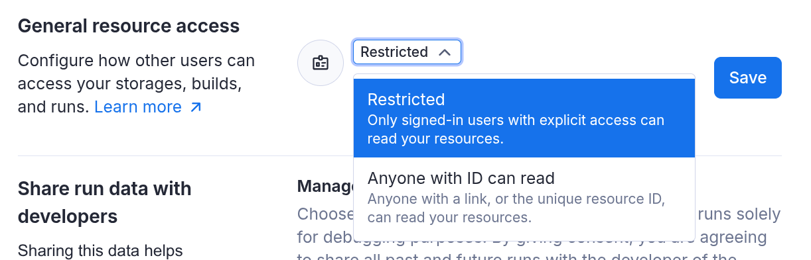
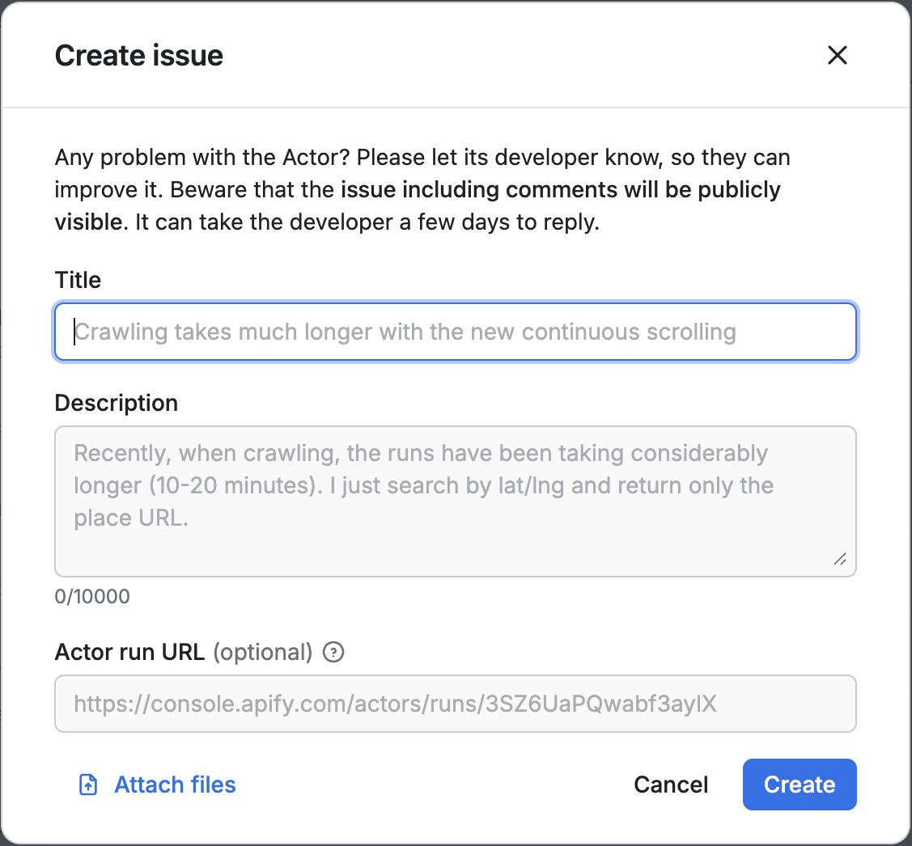
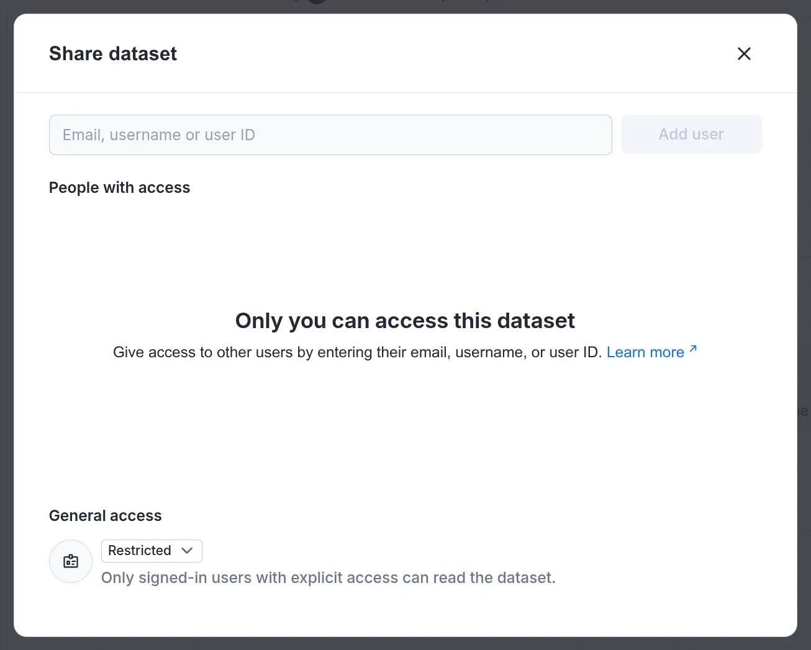
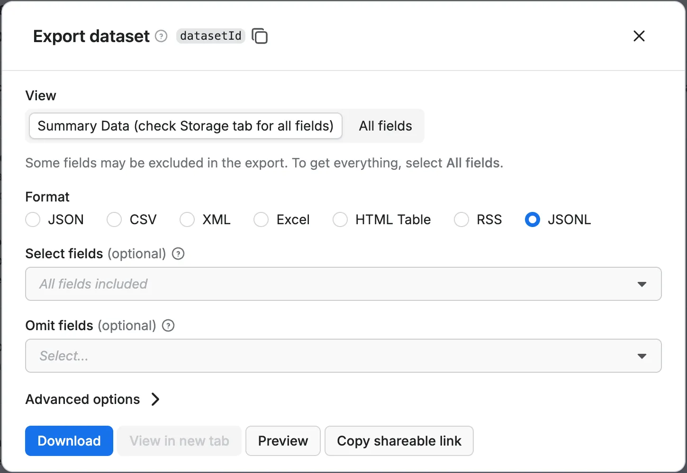

# General Resources Access

Some resources, like storages, Actor runs or Actor builds, support `unrestricted access`. You can share them simply by sending their unique resource ID or Console link and the recipient can then view the data in Console or fetch it via API without needing an API token. This is very useful for ad-hoc collaboration, integrating third party tools that connect to data in your Apify account or quick prototypes.

Thanks to the hard-to-guess, unique IDs, it’s also secure enough for most use cases. However, it doesn't offer features like access revocation or a formal audit trail and in some cases, you may want to have more direct control over data access and require users to have explicit permissions to your resources.

**General resource access** is an account setting that defines the default access policy at the account level. You can find general resource access in Apify Console under **Settings → Security & Privacy**. The two following options are supported:

- **Anyone with ID can read (default)**: Selected resources can be accessed using just with their unique resource ID. This means if you share the resource ID with someone, they would be able to view it without providing an API token or viewing the resource by visiting the Console URL.
- **Restricted**: With this setting, only signed-in users with an explicit access to the resources can access them. To access restricted resources via API, a valid token needs to be provided.

This setting affects the following resources:

- Actor runs
- Actor builds
- Storages:
  - Datasets
  - Key-value stores
  - Request queues

Access to resources that require explicit access — such as Actors, tasks or schedules are not affected by this setting.



## How restricted access works
If your **general resource access** is set to **anyone with ID can read**, you can just send this link to anybody, and they will be able to download the data even if they don’t have an Apify account. However, once you change the setting to **restricted**, this API call will require a valid token with access in order to work. In other words, you’ll have to explicitly share the dataset and you can only do that with people who have an Apify account.

When using the API, resources that are set to `Restricted` can be viewed only with a valid token with correct permissions is sent in the request. Alternatively, when a resource is set to **anyone with ID can read**, the resource could be viewed.

### Named storages

A convenient feature of storages is that you can name them. If you choose to do so there is an extra access level setting that applies to storages i only, which is  **Anyone with name or ID can read**. In that case anyone that knows the storage name is able to read it via API or view it using the storages Console URL.

:::tip

This is very useful if you wish to expose a storage publicly with an easy to remember URL.

:::

### Exception: Builds of public Actors

Builds of **public Actors** are always accessible to anyone who can view the Actor — regardless of the Actor owner’s account **general resource access** setting.

This ensures that public Actors in the Apify Store continue to work as expected. For example, if you open a public Actor in the Console, you’ll also be able to view its build details, download logs, or inspect the source package — without needing extra permissions or a token.

This exception exists to maintain usability and avoid breaking workflows that rely on public Actors. It only applies to builds of Actors that are marked as **public**. For private Actors, build access still follows the general resource access setting of the owner’s account.

### Exception: Automatically share owner runs of shared Actors & Tasks with collaborators

When you share an Actor with a collaborator, they automatically gain read-only access to your (the owner’s) runs of that Actor. This makes it easier for them to help with debugging, monitoring, or reviewing outputs.

- This access includes logs, input, and default storages (dataset, key-value store, request queue)
- Access is one-way: you won’t see the collaborator’s runs unless they share them
- Collaborators can’t see each other’s runs
- This works even if your account uses **restricted general resource access** — permissions are applied automatically.

### Exception: Automatically sharing runs with public Actor creators
If you’re using a public Actor from the Apify Store, you can choose to automatically share your runs of that Actor with its creator. This helps developers monitor usage and troubleshoot issues more effectively.

- This setting is opt-in and can be enabled under **Account Settings → Privacy**
- When enabled, your runs of public Actors are automatically visible to the Actor’s creator
- Shared runs include logs, input, and output storages (dataset, key-value store, request queue)

This sharing works even if your account has **restricted general resource access** — the platform applies specific permission checks to ensure the Actor creator can access only the relevant runs.

You can disable this behavior at any time by turning off the setting in your account.

### Exception: Automatically sharing runs via Actor Issues
When you report an issue on an Actor and include a **run URL**, that run is automatically shared with the Actor developer — **even if your account uses restricted general resource access**.

This automatic sharing ensures the developer can view all the context they need to troubleshoot the issue effectively. That includes:

- Full access to the run itself (logs, input, status)
- Automatic access to the run’s default storages:
    - Dataset
    - Key-value store
    - Request queue

The access is granted through explicit, behind-the-scenes permissions (not anonymous or public access), and is limited to just that run and its related storages. No other resources in your account are affected.

This means you don’t need to manually adjust permissions or share multiple links when reporting an Actor issue — **just including the run URL in your issue is enough**



## Per-resource access control

The account level access control can be changed on individual resources. You can do by setting the general access level to other than Restricted  in the share dialog for a given resource. This way the resource level setting takes precedence over the account setting.



:::tip
You can also set the general access on a resource programmatically using the Apify API or Apify client. Read more in the API reference and client documentation.

```js
const datasetClient = apifyClient.dataset(datasetId);
await datasetClient.update({
	generalAccess: STORAGE_GENERAL_ACCESS.ANYONE_WITH_ID_CAN_READ
});
```

:::

:::tip
When you change the access for a resource it may take a minute for the change to take effect.
:::

### Sharing restricted resources with pre-signed URLs {#pre-signed-urls}

Even when a resource is restricted, you might still want to share it with someone outside your team — for example, to send a PDF report to a client, or include a screenshot in an automated email or Slack message. In these cases, **storage resources** (like key-value stores, datasets, and request queues) support generating **pre-signed URLs**. These are secure, time-limited links that let others access individual files without needing an Apify account or authentication.

Pre-signed URLs:

- Work even when general resource access is restricted
- Expire automatically after 14 days (by default)
- Are scoped to a single record (prevents access to other records)
- Are ideal for sharing screenshots, reports, or any other one-off files

To generate a pre-signed link, you can use the **Export** button in the Console, or call the appropriate SDK method.



:::info

Resource objects returned by the API and clients (like `apify-client-js`) include a `consoleUrl` property. This provides a stable link to the resource's page in the Apify Console. Unlike a direct API link, the Console link will prompt unauthenticated users to sign in, ensuring they have required permissions to view the resource.

This is ideal for use-cases like email notifications or other automated workflows.

:::

### What is the best setting for me?

Sharing by link is quick, convenient, and secure enough for most use cases -- thanks to the use of hard-to-guess unique IDs.

That said, link-based sharing doesn’t support access revocation, audit trails, or fine-grained permission controls. If you need tighter control over who can access your data or require elevated security because of the domain you're working in we recommend enabling **restricted** access.

The default setting strikes a good balance for casual or internal use, but **restricted** access is a better fit for teams with stricter security policies, integrations using scoped API tokens, or audit requirements.

You can switch to **restricted** access at any time. If it causes issues in your workflow, you can revert to the default setting just as easily.

:::note
Because this is a new setting, some existing public Actors and integrations might not support it yet. Their authors need to update them to provide a valid token on all API calls.
:::

### Implications for public Actor developers

If you own a public Actor in the Apify Store, you need to make sure that your Actor will work even for users who have restricted access to their resources. Over time, you might see a growing number of users with **General Resource Access** set to `restricted`.

:::tip

To test your public Actor, run it using an account with **general resource access** set to restricted. You can use your developer account, or create a temporary testing Apify account.

:::

In practice, this means that all API calls originating from the Actor need to have a valid API token. If you are using Apify SDK, this should be the default behavior.


:::️warning

Keep in mind that when users run your public Actor, the Actor makes API calls under the user account, not your developer account. This means that it follows the **general resource access** configuration of the user account. The configuration of your developer account has no effect on the Actor users.

:::
