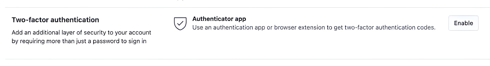
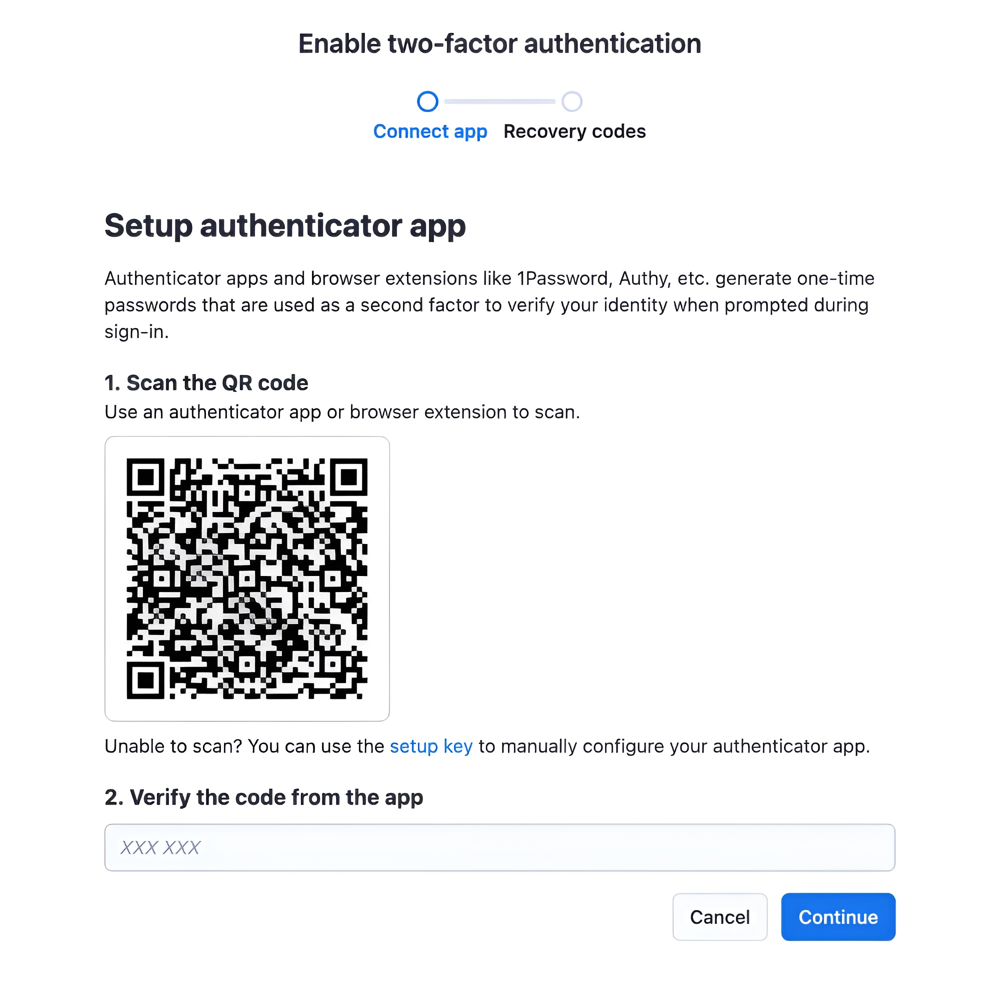
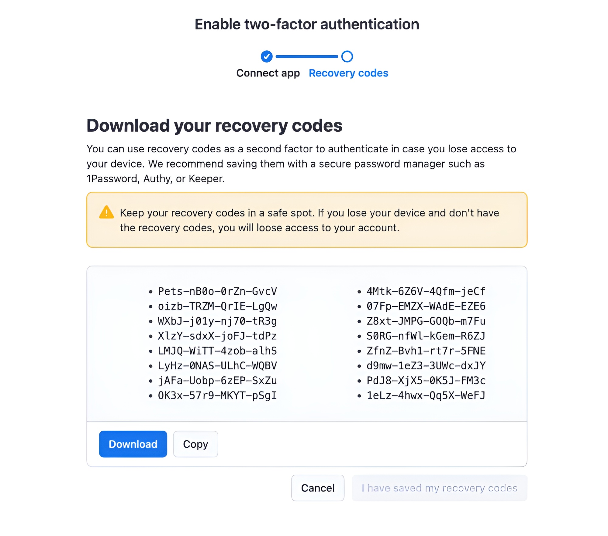
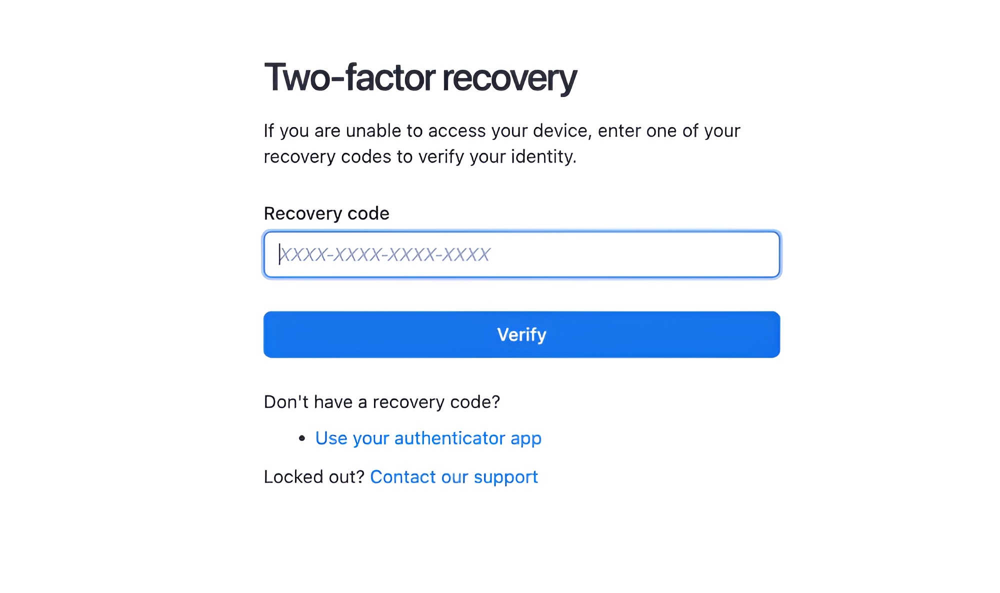

**Learn about Apify Console's account creation and authentication process.**

---

## Sign up

To create a new account in Apify Console, please go to the [sign up page](https://console.apify.com/sign-up).
At the moment we support 3 different methods of creating an account:

### Email and password

This is the most common way of creating an account. You just need to provide your email address and a password. The password needs to be at least 8 characters, should not be your email address, and should either contain special characters or be long enough to be secure. The password field has a strength indicator below it that will tell you if your password is strong enough.

After you click on the **Sign up** button, we will send you a verification email. The email contains a link which you need to click on or copy to your browser to proceed to automated email verification. After we verify your email you will proceed to the Apify Console.

:::info CAPTCHA
We are using Google reCaptcha to prevent spam accounts. Usually you will not see it, but if Google evaluates your browser as suspicious, they will ask you to solve a reCaptcha before we create your account and send you the verification email.
:::

If you did not receive the email, you can go to the [sign in page](https://console.apify.com/sign-in). There you will either proceed to our verification page right away, or you can sign in and you will be redirect after. On the verification page you can click on the **Resend verification email** button to send the email again.

### Google or GitHub

If you do not want to create a new password for Apify Console, you can also use your Google or GitHub account to sign up. To do that, click on the **Sign up with Google** or **Sign up with GitHub** buttons. You will proceed to the corresponding authentication page where you will need to sign in and authorize Apify to access your account. Then when you come back to the Apify Console we will create your account.

If you used Google to sign up, there is no verification step after this and you can start to use the Apify Console right away.
On the other hand if you used GitHub to create your account and your github account does not have verified email, we will ask you to verify your email address before you can start using Apify Console. The process works the same as the process for email and password authentication.

If you already have an account in Apify Console connected to Google or GitHub, clicking on these buttons on the sign up page will not create a new account and instead it will directly sign you in.

## Sign in

To sign in to your account please go to the [sign in page](https://console.apify.com/sign-in).
There you can use any of the authentication methods you have set up for your account. If you have multiple authentication methods, you can choose which one you want to use by using on the corresponding button or form.

If you sign in through email and password and have two-factor authentication enabled on your account, you will proceed to the two-factor authentication page after you enter your password. There you will need to enter the code from your authenticator app to sign in.
If you do not have two-factor authentication enabled, you will be directly redirected to the Apify Console.

### Forgotten password

In case you forgot your password, you can click on the **Forgot your password?** link which will redirect you to the [forgot password page](https://console.apify.com/forgot-password). There you will need to enter your email address and click on the **Reset password** button. We will then send an email to the address connected to your account with a link to the password reset page which will allow you to change your password.

## Adding different authentication methods

After you create your account, you might still want to use the other authentication methods. To do that, go to your [account settings](https://console.apify.com/account/settings) and scroll down to the **Login** section. There you will see all available authentication methods and their configuration.

## Resetting your password

This section also allows you to reset your password if you ever forget it. To do that, click on the **Send email to reset password** button.
We will then send an email to the address connected to your account with a link to the password reset page.
After you click on the link (or copy it to your browser), you will proceed to a page where you can set up a new password.

## Two-factor authentication

If you use email and password to sign in to Apify Console, you can enable two-factor authentication for your account. This will add an extra layer of security to your account and will prevent anyone who gains access to your password from signing in to your account.

### Setting up two-factor authentication

To set up two-factor authentication, go to your [account settings](https://console.apify.com/account/settings) and scroll down to the **Two-factor authentication** section. Currently there is only one option, which is the **Authenticator app**. If you have two-factor authentication already enabled, will be a label **enabled** next it.

If it's not enabled click on the **Enable** button and you will see with this view:

In this view you can use your favorite authenticator app to scan the QR code. We recommend using Google Authenticator ([Google play store](https://play.google.com/store/apps/details?id=com.google.android.apps.authenticator2&hl=en_US)/[Apple app store](https://apps.apple.com/us/app/google-authenticator/id388497605)) or [Authy](https://authy.com/) but any other authenticator app should work as well.

You can also setup your app/browser extension manually without the QR code. To do that, click on the **Setup key** link below the QR code this view with key will pop up:

Here you can copy the two-factor `secret` key, which you can use in your authenticator app to setup the account. You can also use this key to setup your authenticator app on multiple devices.

After you scan the QR code, or setup your app manually, the app will generate a code which you need to enter into the **Verify the code from the app** field. After you enter the code, click on the **Continue** button to get to the next step of the setup process.

In this step you will see 16 recovery codes. These codes can are required when you want to sign in to your account if you lose access to your authenticator app. We recommend saving these codes in a safe place, ideally printing them out and not storing them on your device.

You will not be able to enable the two-factor authentication until you on the **Download** / **Copy** buttons, or copy the codes manually. After you do that, the **I have saved my recovery codes** button will be enabled and you can click on it to enable the two-factor authentication. Which will be confirmed in the next view.

### Verification after sign in

After you enable two-factor authentication, the next time you attempt to sign in, you'll need to enter a code before you can get into the Apify Console. To do that, open your authenticator app and enter the code for your Apify account into the **code** field. After you enter the code, click on the **Verify** button and if the provided code is correct, you will proceed to Apify Console.

### Using recovery codes

In case you loose access to your authenticator app, you can use the recovery codes to sign in to your account. To do that, click on the **recovery code or begin 2FA account recovery** link below the **Verify** button. This will redirect you to a similar view as the current one, but instead of code from the authenticator app, you will need to enter one of your 16 recovery codes which you have received during the setup process.

If the provided recovery code is correct, you will proceed to Apify Console same as if you provided the code from the authenticator app. We recommend then going to the [account settings](https://console.apify.com/account/settings) and disabling the two-factor authentication, and then enabling it again with the new authenticator app.

:::info Removal of recovery codes
When you successfully use a recovery code, we remove the code from the original list and it's no longer possible to use it again. If you use all of your recovery codes, you will not be able to sign in to your account with them anymore and you will need to either use your authenticator app or contact our support to help you regain access to your account.
:::

### Disabling two-factor authentication

In case you no longer want to use the two-factor authentication or if you lose access to your authenticator app, you can disable the two-factor authentication in your [account settings](https://console.apify.com/account/settings). To do that, scroll down to the **Two-factor authentication** section and click on the **Disable** button. We will ask you to enter either your verification code from the authenticator app or if you do not have access to it anymore, you can use one of your recovery codes. After you enter the code, click on the **Remove app** button and which will verify the provided code and if it's valid, it will disable the two-factor authentication and remove the configuration from your account.

After you disable the two-factor authentication you will be able to sign in to your account without providing the verification code.

### What to do when you get locked out

If you lost access to both your authenticator app and either you do not have any recovery codes left or you lost them as well, you will not be able to sign in to your account. In this case you will need to contact our support. To do that you can either send us an email to [support@apify.com](mailto:support@apify.com?subject='Locked%20out%20of%20account%20with%202FA%20enabled') or you can go to the [sign in page](https://console.apify.com/sign-in) and sign in with your email and password. Then on the two-factor authentication page click on the **recovery code or begin 2FA account recovery** link and on the two-factor recovery page click on the **Contact our support** link. This link will open up our online chat and our support team can help you from there.

In order for our support team to help you and recover your account, you will need to provide them with the following information:

TODO: We will probably use ask users to provide some personal information not connected to their account which they consider secure.
