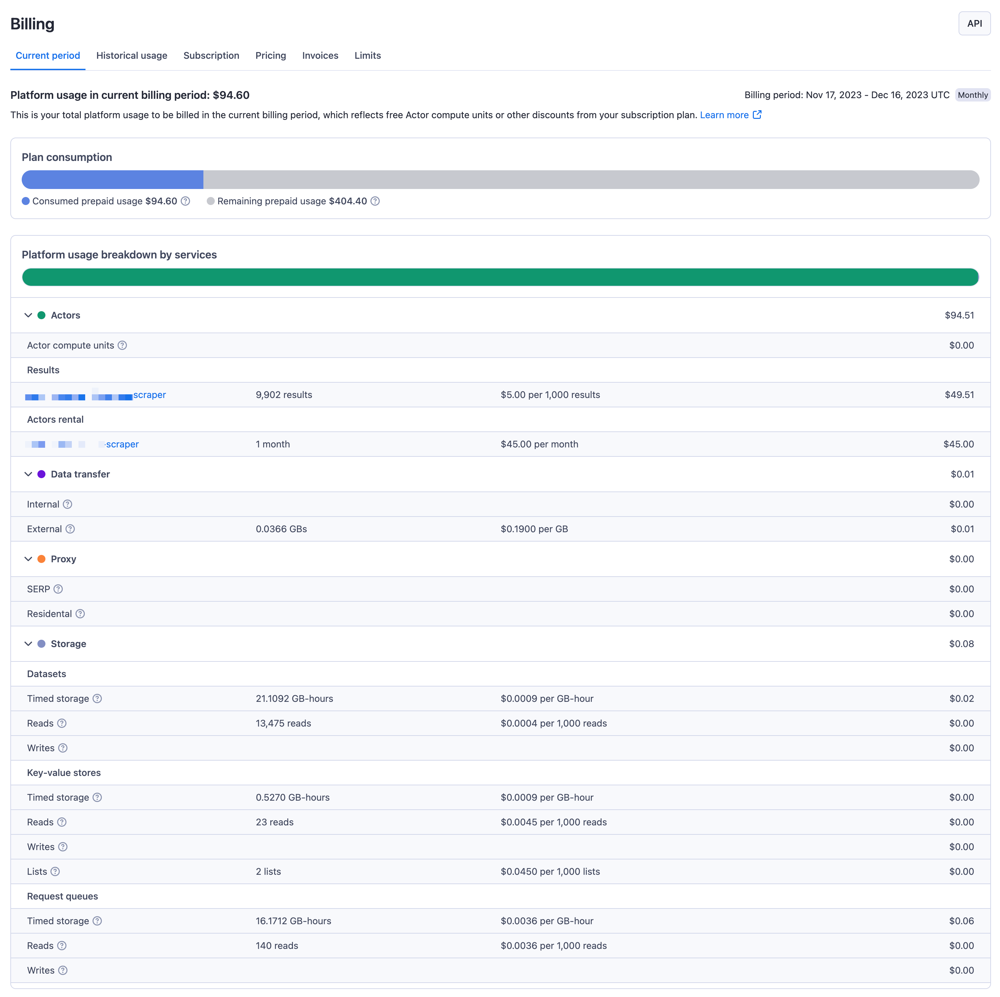
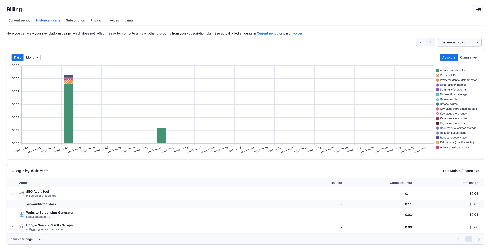
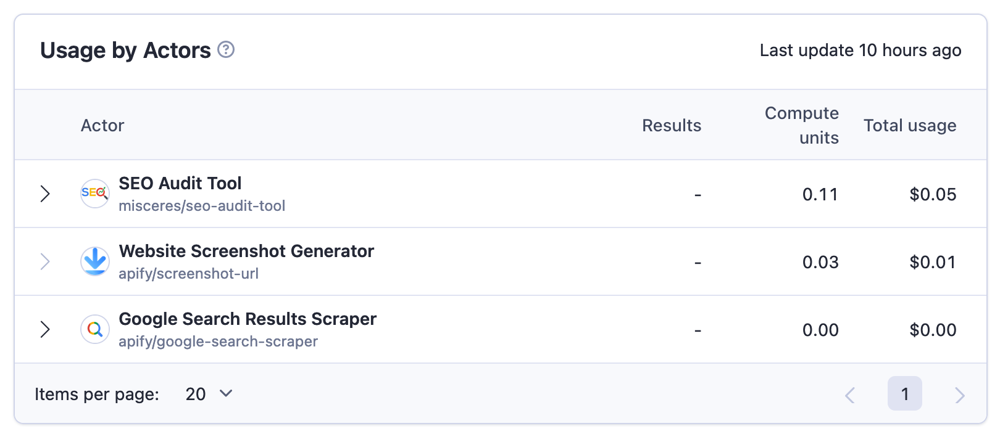
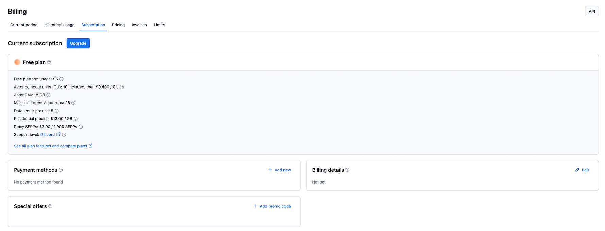
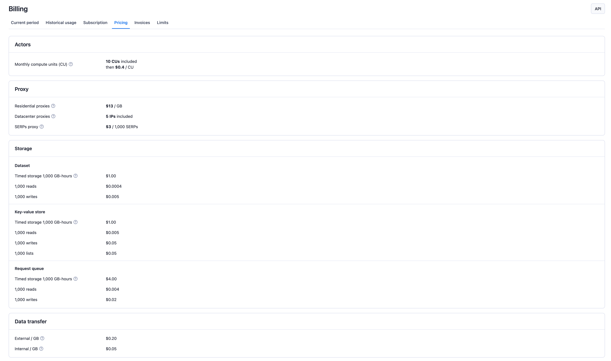
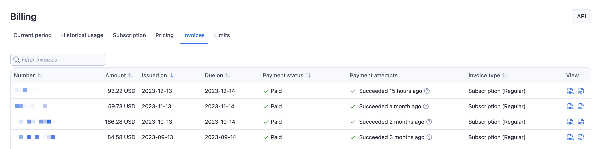
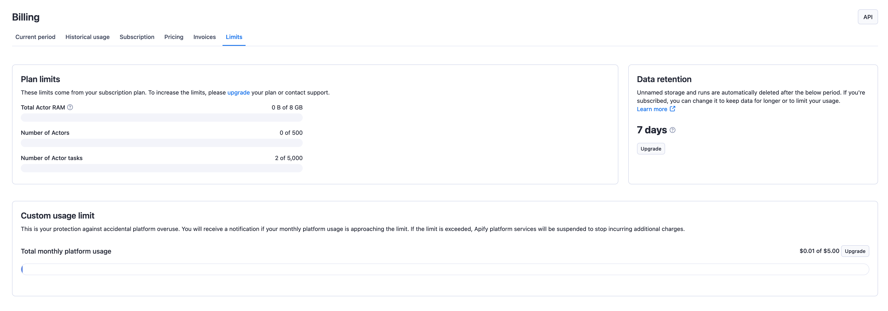

**The Billings page is the central place for all information regarding your invoices, billing information regarding usage in the current billing cycle, historical usage, subscriptions & limits.**

---

## Current period

The **Current period** tab is a comprehensive resource for understanding your platform usage during the ongoing billing cycle. It provides an overview of your total usage and indicates the start and end dates of the current billing period.

In addition to this, the tab features a **Plan Consumption** Graph. It shows how much of your free or paid plan has been utilized up to this point. The graph offers a broad perspective of your overall usage.

Apart from the platform usage breakdown graph, this tab provides more detailed information on the usage of different platform services. You can explore the sections under the graph. You can access detailed statistics related to **Actors**, **Data transfer**, **Proxy**, and **Storage**.

## Historical usage

The **Historical usage** tab provides a detailed view of your monthly platform usage, excluding any free Actor compute units or discounts from your subscription plan. You can navigate through the months by selecting from a dropdown list or using arrows to move one month backward or forward.

The tab features an adjustable bar chart. This chart can be customized to display statistics either on a monthly or daily basis. Additionally, you can view these statistics as absolute or cumulative numbers, providing flexibility in how you analyze your usage data.

:::note Monthly usage data
Since billing cycles can shift, the data in the **Historical usage** tab is shown for calendar months.
:::

Below the bar chart, there is a table titled **Usage by Actors**. This table presents a detailed breakdown of the Compute units used per Actor and the associated costs. It clearly explains how each Actor contributes to your overall platform usage and expenses.

## Subscription

The **Subscriptions** tab offers a central location to manage various aspects of your subscription plan. Here, you can access details about your current plan and explore options to upgrade to a different one.

This tab also allows you to manage your payment methods. Additionally, you can adjust your billing details to ensure they remain up-to-date.
Another feature of this tab is the visibility of any special offers currently applied to your account.

## Pricing

The **Pricing** tab offers a way to quickly check all unit pricing for various platform services related to Apify usage for your account.

## Invoices

The **Invoices** tab is where you can find your current and previous invoices for Apify platform usage. This is your source of truth for any questions regarding previous charges and subscriptions.

## Limits

The **Limits** tab showcases the limits of Apify platform usage based on your current subscription plan.

