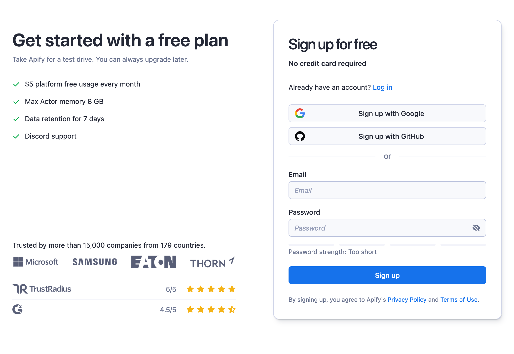
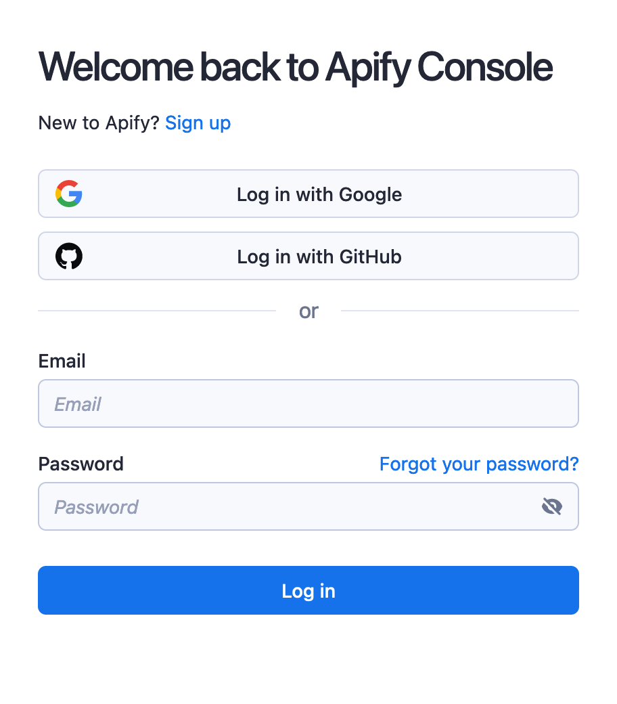

**Learn about Apify Console's easy account creation and user-friendly homepage for efficient web scraping management.**

---

## Sign Up

To use Apify Console, you need to create Apify account. [Sign up here](https://console.apify.com/sign-up).

## Log In

After signing up you need to log in using your Apify account.

## Homepage Overview

The Apify Console homepage provides an overview of your account setup. The header displays your account name and current plan level. The homepage features several sections:

- **Get Started with Apify**: This section guides you to Apify Store. Here, you can explore existing Actors or create your own. A 'Show me how' button directs you to a guided tour of the Console.

- **Recently Viewed**: This section displays Actors you have recently accessed. If you haven't used any Actors yet, you will see suggestions instead.

- **Suggested Actors for You**: Based on your and other users' recent activities, this section recommends Actors that might interest you.

- **Actor Runs**: This section is divided into two tabs:
  - **Recent**: View your latest Actor runs.
  - **Scheduled**: Check your upcoming scheduled runs and tasks.

Use the side menu to navigate other parts of the Apify Console easily.

:::tip Keyboard shortcuts
You can also navigate Apify Console via keyboard shortcuts.

Keyboard Shortcuts

|Shortcut| Tab |
|:---|:----|
|Home| GH  |
|Store| GO  |
|Actors| GA  |
|Saved tasks| GT  |
|Runs| GR  |
|Schedules| GU  |
|Storage| GE  |
|Proxy| GP  |
|Settings| GS  |
|Billing| GB  |

:::

| Tab name | Description |
|:---|:---|
| [Store](/sources/platform/console/store.md)| Search for Actors that suit your web-scraping needs. |
| [Actors](/sources/platform/actors/index.mdx)| View your recent runs, Actors developed by you, rented Actors, analytics & issues, as well as:   &bull; Saved tasks - where you can view your saved tasks or change any settings within them.  &bull; Runs - where you can check on your previous runs. |
| [Schedules](/sources/platform/schedules.md)| Schedule Actor runs & tasks to run at specified time. |
| [Storage](/sources/platform/storage/index.md)| View stored results of your runs in various data formats. |
| [Proxy](/sources/platform/proxy/index.md)| View your proxy usage & credentials |
| [Settings](/sources/platform/console/settings.md)| Settings of your account. |
| [Billing](/sources/platform/console/billing.md)| Billing information, statistics and invoices. |
