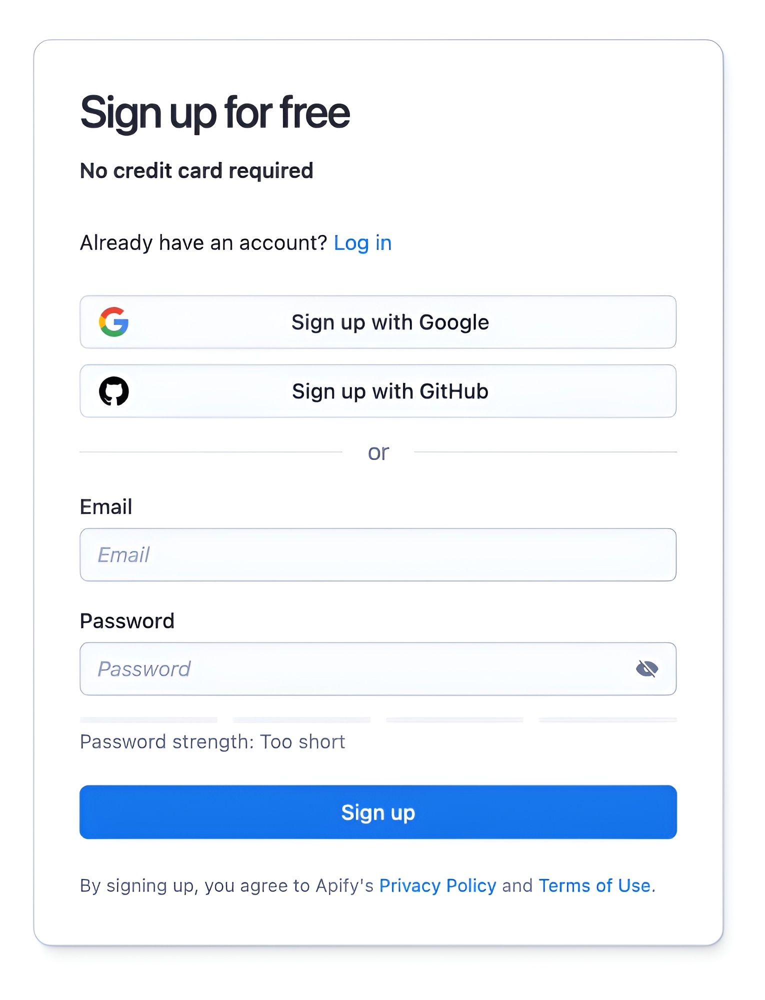
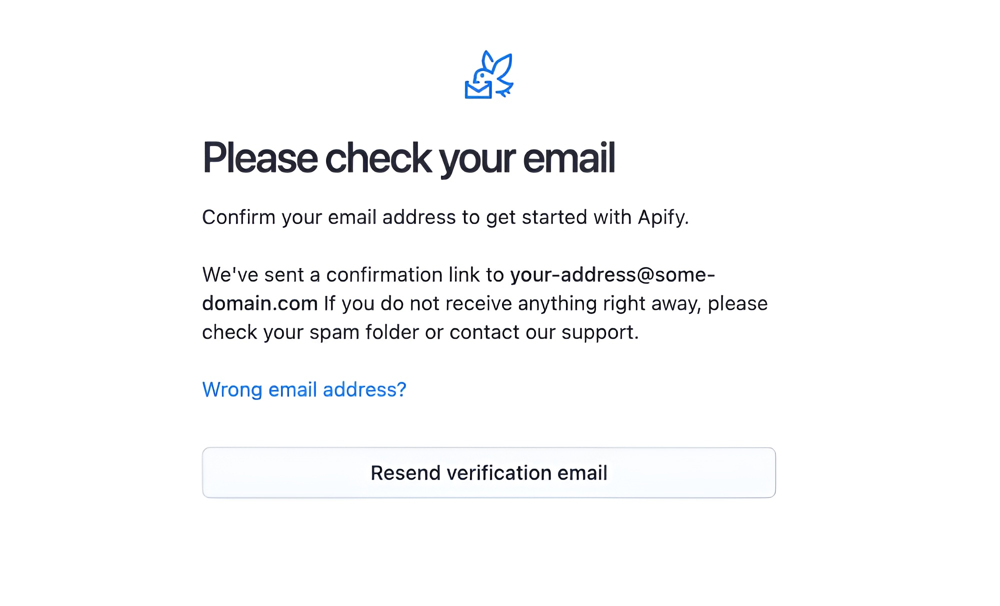
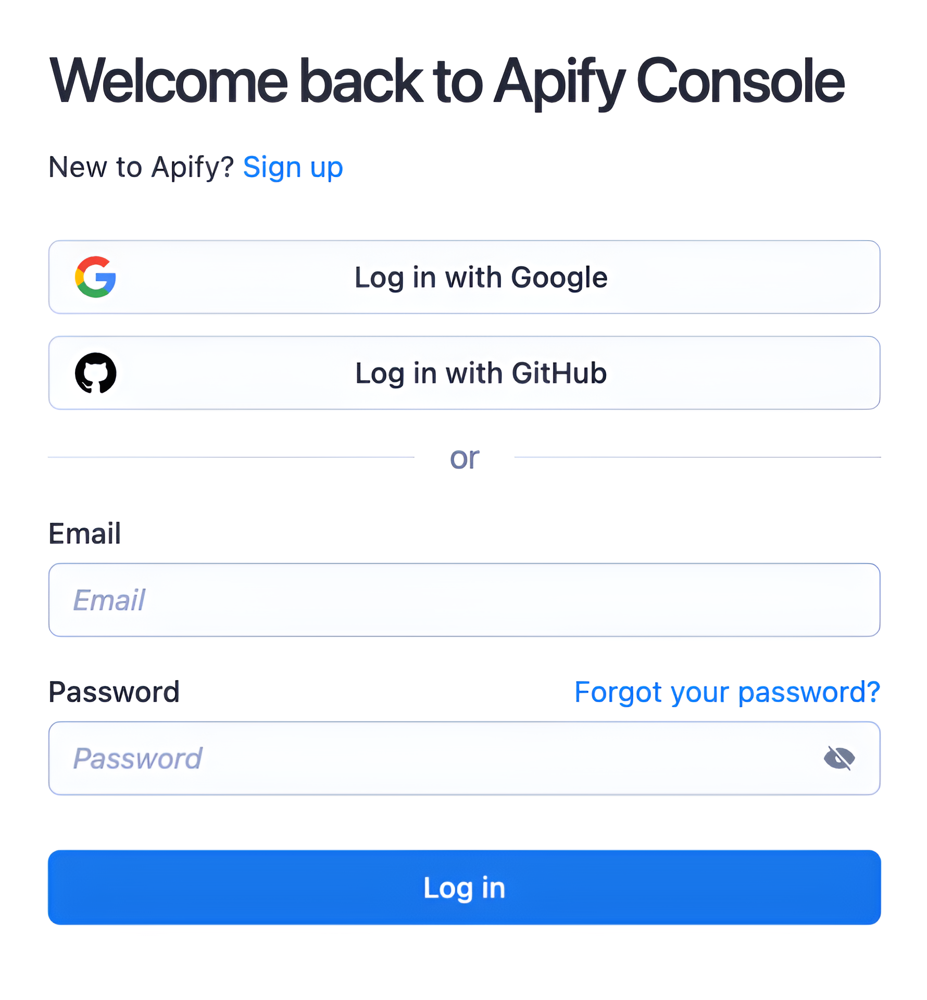
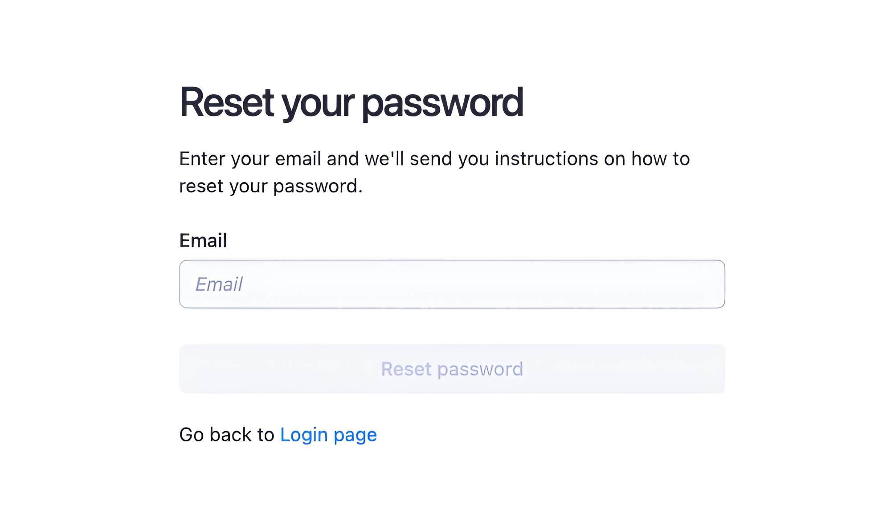
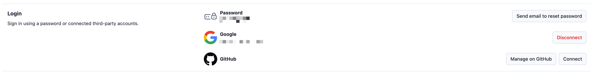
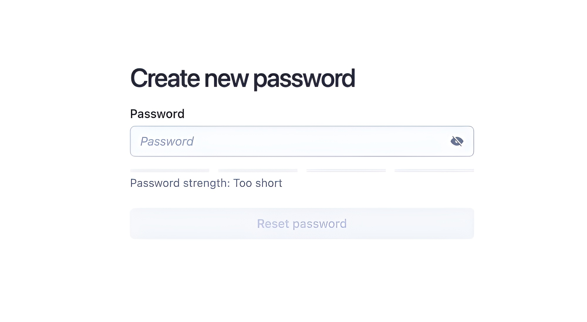
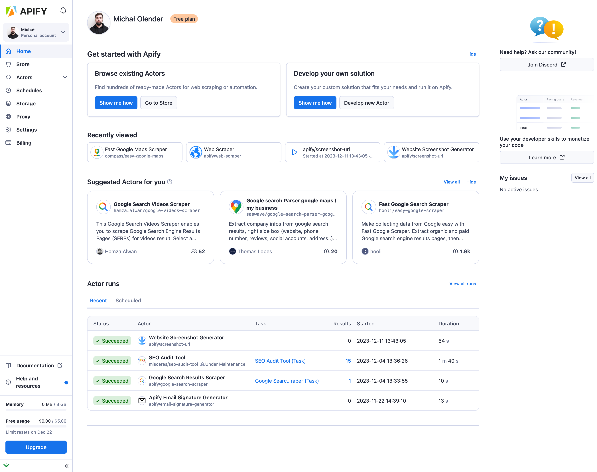

**Learn about Apify Console's easy account creation and user-friendly homepage for efficient web scraping management.**

---

## Sign-up

To use Apify Console, you first need to create an account. To create it please go to the [sign-up page](https://console.apify.com/sign-up).
At the moment we support 3 different methods of creating an account:

### Email and password

This is the most common way of creating an account. You just need to provide your email address and a password. The password needs to be at least 8 characters, should not be your email address, and should either contain special characters or be long enough to be secure. The password field has a strength indicator below it that will tell you if your password is strong enough.

After you click the **Sign up** button, we will send you a verification email. The email contains a link that you need to click on or copy to your browser to proceed to automated email verification. After we verify your email, you will proceed to Apify Console.

:::info CAPTCHA
We are using Google reCaptcha to prevent spam accounts. Usually, you will not see it, but if Google evaluates your browser as suspicious, they will ask you to solve a reCaptcha before we create your account and send you the verification email.
:::

If you did not receive the email, you can visit the [sign-in page](https://console.apify.com/sign-in). There, you will either proceed to our verification page right away, or you can sign in and will be redirected afterward. On the verification page, you can click on the **Resend verification email** button to send the email again.

### Google or GitHub

If you do not want to create a new password for Apify Console, you can also use your Google or GitHub account to sign up. To do that, click the **Sign up with Google** or **Sign up with GitHub** buttons. You will proceed to the corresponding authentication page, where you must sign in and authorize Apify to access your account. Then, when you come back to Apify Console, we will create your account.

If you used Google to sign up, there is no verification step after this, and you can start using Apify Console right away.
On the other hand, if you used GitHub to create your account and your GitHub account does not have a verified email, we will ask you to verify your email address before you can start using Apify Console. The process works the same as the process for email and password authentication.

If you already have an account in Apify Console connected to Google or GitHub, clicking on these buttons on the sign up page will not create a new account and instead it will directly sign you in.

## Sign-in

To sign in to your account please go to the [sign in page](https://console.apify.com/sign-in).
There you can use any of the authentication methods you have set up for your account. If you have multiple authentication methods, you can choose which one you want to use by using on the corresponding button or form.

If you sign in through email and password and have two-factor authentication enabled on your account, you will proceed to the two-factor authentication page after you enter your password. There you will need to enter the code from your authenticator app to sign in.
If you do not have two-factor authentication enabled, you will be directly redirected to the Apify Console.

### Forgotten password

In case you forgot your password, you can click on the **Forgot your password?** link which will redirect you to the [forgot password page](https://console.apify.com/forgot-password). There you will need to enter your email address and click on the **Reset password** button. We will then send an email to the address connected to your account with a link to the password reset page which will allow you to change your password.

## Adding different authentication methods

After you create your account, you might still want to use the other authentication methods. To do that, go to your [account settings](https://console.apify.com/account/settings) and scroll down to the **Login** section. There you will see all available authentication methods and their configuration.

## Resetting your password

This section also allows you to reset your password if you ever forget it. To do that, click on the **Send email to reset password** button.
We will then send an email to the address connected to your account with a link to the password reset page.
After you click on the link (or copy it to your browser), you will proceed to a page where you can set up a new password.

## Homepage overview

The Apify Console homepage provides an overview of your account setup. The header displays your account name and current plan level. The homepage features several sections:

- **Get Started with Apify**: This section guides you to Apify Store. Here, you can explore existing Actors or create your own. A 'Show me how' button directs you to a guided tour of the Console.

- **Recently Viewed**: This section displays Actors you have recently accessed. If you haven't used any Actors yet, you will see suggestions instead.

- **Suggested Actors for You**: Based on your and other users' recent activities, this section recommends Actors that might interest you.

- **Actor Runs**: This section is divided into two tabs:
  - **Recent**: View your latest Actor runs.
  - **Scheduled**: Check your upcoming scheduled runs and tasks.

Use the side menu to navigate other parts of Apify Console easily.

:::tip Keyboard shortcuts
You can also navigate Apify Console via keyboard shortcuts.

Keyboard Shortcuts

|Shortcut| Tab |
|:---|:----|
|Home| GH  |
|Store| GO  |
|Actors| GA  |
|Saved tasks| GT  |
|Runs| GR  |
|Schedules| GU  |
|Storage| GE  |
|Proxy| GP  |
|Settings| GS  |
|Billing| GB  |

:::

| Tab name | Description |
|:---|:---|
| [Store](/sources/platform/console/store.md)| Search for Actors that suit your web-scraping needs. |
| [Actors](/sources/platform/actors/index.mdx)| View your recent runs, Actors developed by you, rented Actors, analytics & issues, as well as:   &bull; Saved tasks - where you can view your saved tasks or change any settings within them.  &bull; Runs - where you can check on your previous runs. |
| [Schedules](/sources/platform/schedules.md)| Schedule Actor runs & tasks to run at specified time. |
| [Storage](/sources/platform/storage/index.md)| View stored results of your runs in various data formats. |
| [Proxy](/sources/platform/proxy/index.md)| View your proxy usage & credentials |
| [Settings](/sources/platform/console/settings.md)| Settings of your account. |
| [Billing](/sources/platform/console/billing.md)| Billing information, statistics and invoices. |
