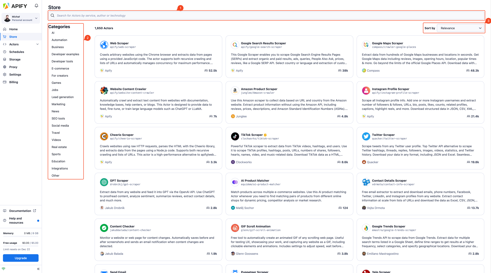

**Explore Apify's Store, browse and select Actors, search by criteria, sort by relevance, and adjust settings for immediate or future runs.**

---

The Store is a place where you can explore a variety of Actors, both created and maintained by Apify or our community members. To enhance your browsing experience, you can employ several strategies.
Utilize the search box at the top of the page to find Actors by service names, such as TikTok, Google, Facebook, or by their authors.
Alternatively, explore Actors grouped under predefined categories accessible via the side menu.
The results from the store can also be organized by different criteria, including:

* relevance
* popularity
* newest
* recent updates

Upon selecting an Actor from the store, you'll be directed to its specific page. Here, you can configure the settings for your future Actor run, save these configurations for later use, or run the Actor immediately.
