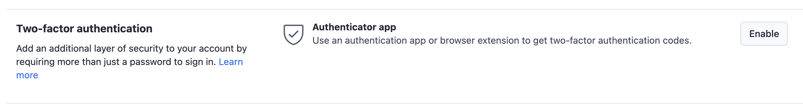
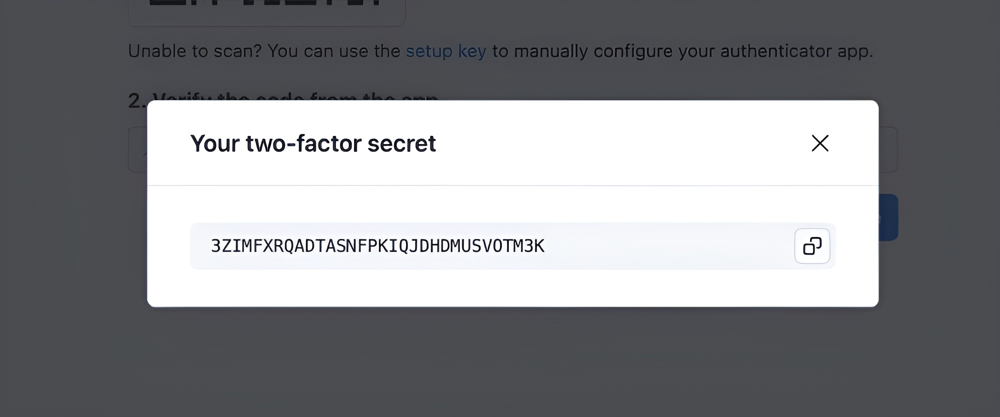
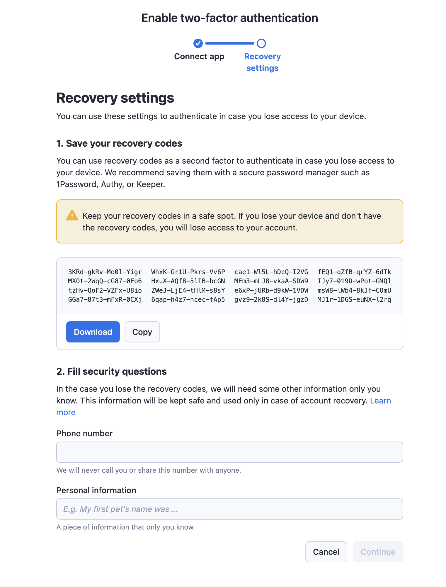
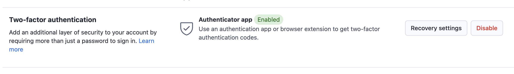
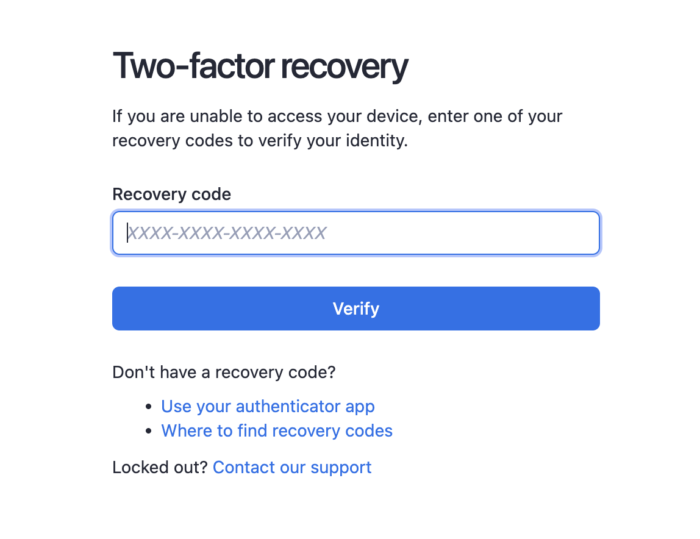
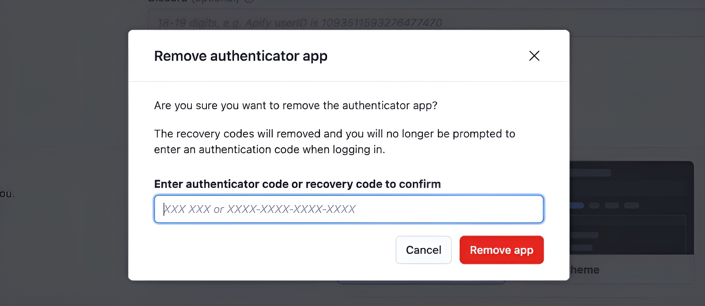
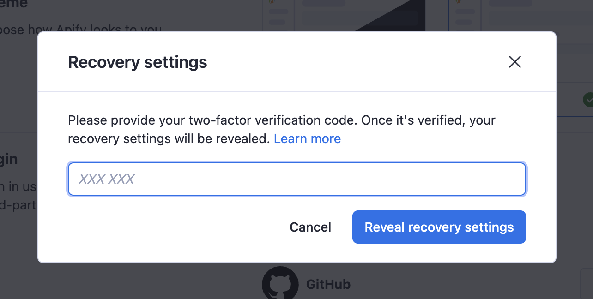
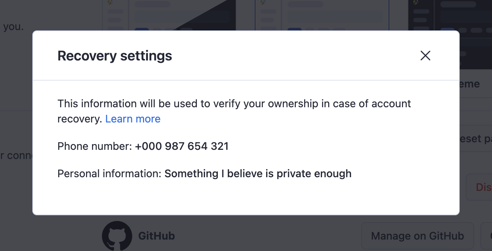

**Learn about Apify Console's account two-factor authentication process and how to set it up.**

---

If you use your email and password to sign in to Apify Console, you can enable two-factor authentication for your account. This will add an extra layer of security to your account and prevent anyone who gains access to your password from signing in to your account.

Some organizations might require two-factor authentication (2FA) to access their resources. Members of such an organization, must enable 2FA on their account in order to continue accessing shared resources and maintain compliance with their security policies.

## Setting up two-factor authentication

To set up two-factor authentication, go to your [account settings](https://console.apify.com/account/settings) and scroll down to the **Two-factor authentication** section. Currently, there is only one option, which is the **Authenticator app**. If you have two-factor authentication already enabled, there will be a label **enabled** next to it.

If it's not enabled, click on the **Enable** button. You should see the two-factor setup view.

### Authenticator app setup

In this view, you can use your favorite authenticator app to scan the QR code. We recommend using Google Authenticator ([Google Play Store](https://play.google.com/store/apps/details?id=com.google.android.apps.authenticator2&hl=en_US)/[Apple App Store](https://apps.apple.com/us/app/google-authenticator/id388497605)) or [Authy](https://authy.com/)([Google Play Store](https://play.google.com/store/apps/details?id=com.authy.authy)/[Apple App Store](https://apps.apple.com/us/app/twilio-authy/id494168017) but any other authenticator app should work as well.

You can also set up your app/browser extension manually without the QR code. To do that, click on the **Setup key** link below the QR code. This view with the key will pop up:

A new pop-up window will appear where you can copy the two-factor `secret` key, which you can use in your authenticator app to set up the account. You can also use this key to set up your authenticator app on multiple devices.

After you scan the QR code or set up your app manually, the app will generate a code that you need to enter into the **Verify the code from the app** field. After you enter the code, click on the **Continue** button to get to the next step of the setup process.

### Recovery settings

In this step, you will see 16 recovery codes. If you ever lose access to your authenticated app, you will be able to use these codes to access the Apify Console. We recommend saving these codes in a safe place; ideally, you should store them in a secure password manager or print them out and keep them separate from your device.

Under the recovery codes, you will find two fields for your recovery information. These two fields are what the support team will ask you to provide in case you lose access to your authenticator app and also to your recovery codes. We will never use the phone number for anything other than to verify your identity and help you regain access to your account, only as a last resort. Ideally, the personal information you provide will be enough to verify your identity. Always provide both the kind of personal information you provide and the actual information.

:::info Personal information
What kind of personal information you provide is completely up to you. It does not even have to be personal, as long as it's secure and easy to remember. For example, it can be the name of your pet, the name of your favorite book, some secret code, or anything else. Keep in mind who has access to that information. While you can use the name of your pet, if you share information about your pet on public social media, it's not a good choice because anyone on the internet can access it. The same goes for any other information you provide.
:::

You will not be able to enable the two-factor authentication until you click on the **Download** / **Copy** buttons or copy the codes manually. After you do that, the **Continue** button will light up, and you can click on it to enable the two-factor authentication. The authentication process will then enable the two-factor authentication for your account and show a confirmation.

### Confirmation

When you close the setup process, you should see that your two-factor authentication is enabled in the account settings.

## Verification after sign-in

After you enable two-factor authentication, the next time you attempt to sign in, you'll need to enter a code before you can get into the Apify Console. To do that, open your authenticator app and enter the code for your Apify account into the **Code** field. After you enter the code, click on the **Verify** button, and if the provided code is correct, you will proceed to Apify Console.

## Using recovery codes

In case you lose access to your authenticator app, you can use the recovery codes to sign in to your account. To do that, click on the **recovery code or begin 2FA account recovery** link below the **Verify** button. This will redirect you to a view similar to the current one, but instead of code from the authenticator app, you will need to enter one of the 16 recovery codes you received during the setup process.

If the provided recovery code is correct, you will proceed to Apify Console, the same as if you provided the code from the authenticator app. After gaining access to Apify Console, we recommend going to the [account settings](https://console.apify.com/account/settings), disabling the two-factor authentication there, and then enabling it again with the new authenticator app.

:::info Removal of recovery codes
When you successfully use a recovery code, we remove the code from the original list as it's no longer possible to use it again. If you use all of your recovery codes, you will not be able to sign in to your account with them anymore, and you will need to either use your authenticator app or contact our support to help you regain access to your account.
:::

## Disabling two-factor authentication

If you no longer want to use the two-factor authentication or lose access to your authenticator app, you can disable the two-factor authentication in your [account settings](https://console.apify.com/account/settings). To do that, scroll down to the **Two-factor authentication** section and click on the **Disable** button. We will ask you to enter either your verification code from the authenticator app or, if you do not have access to it anymore, you can use one of your recovery codes. After entering the code, click on the **Remove app** button to verify the provided code. If it's valid, it will disable the two-factor authentication and remove the configuration from your account.

After you disable the two-factor authentication you will be able to sign in to your account without providing the verification code.

## What to do when you get locked out

If you lose access to your authenticator app and do not have any recovery codes left, or you lost them as well, you will not be able to sign in to your account. In this case, you will need to contact our support. To do that, you can either send us an email to [support@apify.com](mailto:support@apify.com?subject='Locked%20out%20of%20account%20with%202FA%20enabled') or you can go to the [sign-in page](https://console.apify.com/sign-in) and sign in with your email and password. Then, on the two-factor authentication page, click on the **recovery code or begin 2FA account recovery** link. On the two-factor recovery page, click on the **Contact our support** link. This link will open up our online chat, and our support team can help you from there.

For our support team to help you recover your account, you will need to provide them with the personal information you have configured during the two-factor authentication setup. If you provide the correct information, the support team will help you regain access to your account.

:::caution
The support team will not give you any clues about the information you provided; they will only verify if it is correct.
:::

You can always check what information you provided by going to your [account settings](https://console.apify.com/account/settings), scrolling down to the **Two-factor authentication** section, and clicking on the **Recovery settings** button, then you should see a view like this:

After you enter a verification code from your authenticator app, you will see the recovery settings you provided during the two-factor authentication setup.

