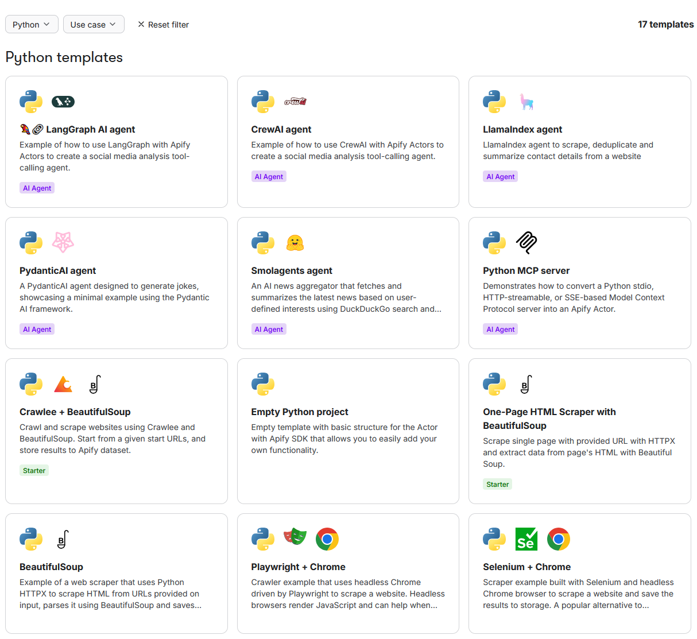

import Card from "@site/src/components/Card";
import CardGrid from "@site/src/components/CardGrid";

**Create your first Actor using the Apify Web IDE or locally in your IDE.**

---

:::info Before you build

Before you start building your own Actor, try out a couple of existing Actors from [Apify Store](https://apify.com/store). See the [Running Actors](/platform/actors/running) section for more information on running existing Actors.

:::

## Technology stack

Any code that can run inside of a Docker container can be turned into Apify [Actor](/platform/actors). This gives you freedom in choosing your technical stack, including programming language and technologies.

But to fully benefit from running on top of the Apify platform, we recommend you choose either JavaScript/Node.js or Python, where Apify provides first-level support regarding its SDK, API clients, and learning materials.

For these languages, you can also [choose from many code templates](https://apify.com/templates) that help you to kickstart your project quickly.

## Development paths

You can choose from three main ways to build your Actor, depending on your preferences and requirements:

<CardGrid>
    <Card
        title="Start Locally in Your IDE"
        desc="Build and test on your own machine using your preferred IDE, then deploy to Apify when ready."
        to="/platform/get-started/build-an-actor/locally"
    />
    <Card
        title="Start in Apify Web IDE"
        desc="Start coding immediately in your browser using Apify Console."
        to="/platform/get-started/build-an-actor/web-ide"
    />
    <Card
        title="Build with AI"
        desc="Use AI coding assistants to generate and refine your Actor's code."
        to="/platform/get-started/build-an-actor/build-with-ai"
    />
</CardGrid>
