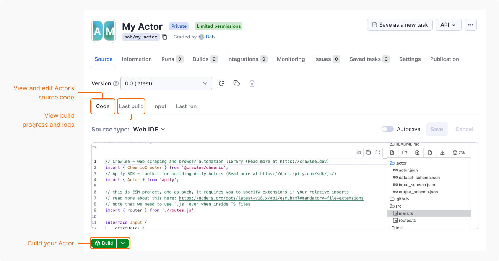

import Tabs from '@theme/Tabs';
import TabItem from '@theme/TabItem';


This guide walks you through the full lifecycle of an Actor using the web IDE in Apify Console: create an Actor from a code template, build it, configure its input, and run it in the cloud.

## Before you start

To complete this tutorial, you need an Apify account. If you don't have it yet, [sign up for free](https://console.apify.com/sign-up).

## Step 1: Create your Actor

To create an Actor from a code template:

1. Log in to [Apify Console](https://console.apify.com).
1. In the left-side panel, go to **Development** > **My Actors**.
1. Select **Develop new**.
1. In the first step, choose a type of Actor you want to create: web scraper, AI agent, API and data pipeline, or browser automation. Let's select **web scraper**.
1. In the second step, choose the programming language: TypeScript, JavaScript, or Python. Let's select **JavaScript**.
1. Based on your choice, Apify suggests Actor templates. For this tutorial, let's use the recommended **Crawlee + Cheerio**.

:::tip Explore Actor templates

To find a template that best suits your needs, browse the [full list of templates](https://apify.com/templates).

:::

Once you choose the template, your Actor is automatically named and you're redirected to its page.

## Step 2: Explore the Actor

The provided boilerplate code utilizes the [Apify SDK](https://docs.apify.com/sdk/js/) combined with [Crawlee](https://crawlee.dev/), Apify's popular open-source Node.js web scraping library.

By default, the code crawls the [apify.com](https://apify.com) website, but you can change it to any website.

:::info Crawlee

[Crawlee](https://crawlee.dev/) is an open-source Node.js library designed for web scraping and browser automation. It helps you build reliable crawlers quickly and efficiently.

:::

## Step 3: Build the Actor

The next step it to build the Actor:

1. Go to **Source** tab > **Code**.
1. Click **Build**.

Once the build starts, you're redirected to the **Last build** tab. Here you can check the build progress and view Docker build logs.



## Step 4: Run the Actor

Finally, it's time to run the Actor:
<!-- vale off -->
1. Go to **Source** tab > **Input**.
1. Set the **Start URL** to the URL you want to crawl or use the default value.
1. _(Optional)_ To customize the run, expand the **Run options** section. You can adjust the following options:
   - **Build** – select the build version to run.
   - **Timeout** – set the timeout for the run in seconds.
   - **Memory limit** – allocate the memory for the run. For details, see [Usage and resources](/actors/running/usage-and-resources).
   - **Maximum cost per run**.
1. Click **Start**.
<!-- vale on -->
Once the run starts, you can monitor its progress and view the logs in real-time. To view the results of the Actor's execution, go to the **Output** tab.

To stop the run, click **Abort**.

## Step 5: Pull the Actor

To continue development locally, pull the Actor's source code to your machine.

:::note Prerequisites

Install <code>[apify-cli](https://docs.apify.com/cli/)</code> :

<Tabs>
  <TabItem value="macOS/Linux" label="macOS/Linux">

  ```bash
  brew install apify-cli
  ```

  </TabItem>
  <TabItem value="other platforms" label="Other platforms">

  ```bash
  npm -g install apify-cli
  ```

  </TabItem>
</Tabs>

:::

To pull your Actor:

1. Log in to the Apify platform

    ```bash
    apify login
    ```

2. Pull your Actor:

    ```bash
    apify pull your-actor-name
    ```

    Or with a specific version:

    ```bash
    apify pull your-actor-name --version [version_number]
    ```

    As `your-actor-name`, you can use either:

    - The unique name of the Actor (e.g., `apify/hello-world`)
    - The ID of the Actor (e.g., `E2jjCZBezvAZnX8Rb`)

You can find both by clicking on the Actor title at the top of the page, which will open a new window containing the Actor's unique name and ID.

## Step 6: It's time to iterate!

After pulling the Actor's source code to your local machine, you can modify and customize it to match your specific requirements. Leverage your preferred code editor or development environment to make the necessary changes and enhancements.

Once you've made the desired changes, you can push the updated code back to the Apify platform for deployment & execution, leveraging the platform's scalability and reliability.

## Next steps

- Visit the [Apify Academy](/academy) to access a comprehensive collection of tutorials, documentation, and learning resources.
- To understand Actors in detail, read the [Actor Whitepaper](https://whitepaper.actor/).
- Check [Continuous integration](/actors/development/deployment/continuous-integration) documentation to automate your Actor development process.
- After you finish building your first Actor, you can [share it with other users and even monetize it](/actors/publishing).
