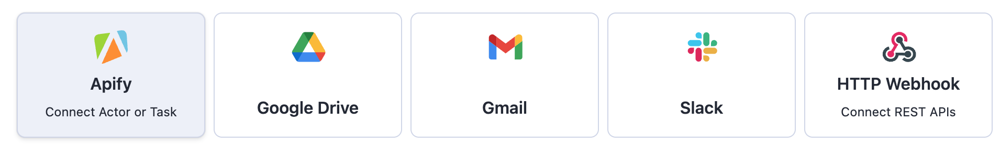
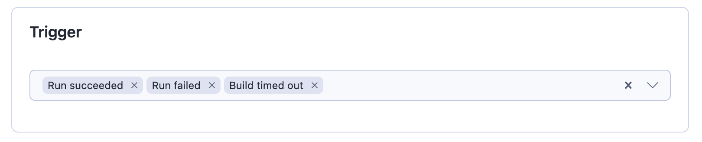
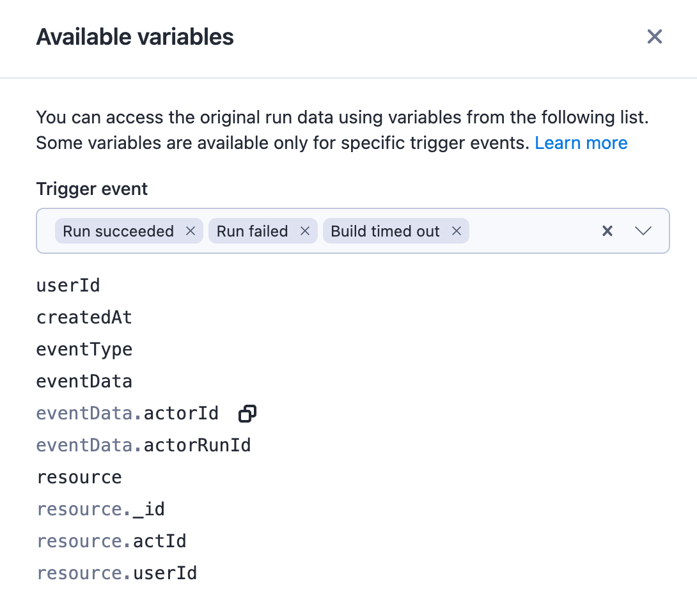
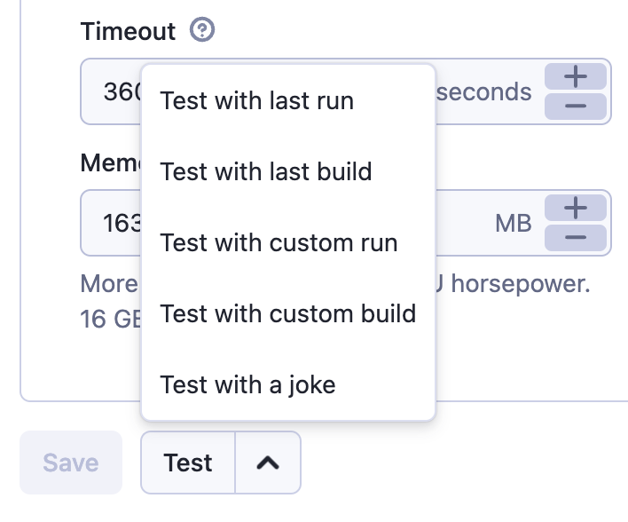

# What are Actor integrations?

**Learn how to integrate with other Actors and tasks.**

---

Actor integrations provide a way to connect your Actors with other Actors or tasks easily. They provide a new level of flexibility, as adding a new integration simply means creating [integration-ready Actors](/platform/integrations/actors/integration-ready-actors). Thus, new integrations can be created by the community itself.

## How to integrate an Actor with other Actors?

To integrate one Actor with another:

1. Navigate to the **Integrations** tab in the Actor's detail page.
2. Select `Apify (Connect Actor or Task)`.

3. Find the Actor or task you want to integrate with and click `Connect`.

This leads you to a setup screen, where you can provide:

- **Triggers**: Events that will trigger the integrated Actor. These are the same as webhook [event types](/platform/integrations/webhooks/events) (*run succeeded*, *build failed*, etc.)

- **Input for the integrated Actor**: Typically, the input has two parts. The information that is independent of the run triggering it and information that is specific for that run. The "independent" information (e.g. connection string to database or table name) can be added to the input as is. The information specific to the run (e.g. dataset ID) is either obtained from the implicit `payload` field (this is the case for most Actors that are integration-ready), or they can be provided using variables.
- **Available variables** are the same ones as in webhooks. The one that you probably are going to need the most is `{{resource}}`, which is the Run object in the same shape you get from the [API](/api/v2#/reference/actor-runs/run-object-and-its-storages/get-run) (for build event types, it will be the Build object). The variables can make use of dot notation, so you will most likely just need `{{resource.defaultDatasetId}}` or `{{resource.defaultKeyValueStoreId}}`.

## Testing your integration

When adding a new integration, you can test it using a past run or build as a trigger. This will trigger a run of your target Actor or task as if your desired trigger event just occurred. The only difference between a test run and regular run is that the trigger's event type will be set to 'TEST'. The test run will still consume compute units.

To test your integration, first set your desired input and options and save. You can then select one of the options from the menu. If the source of your integration is a task, you can test it using a past run. For Actors, you can use a past run or build. Alternatively, if the source of your integration has neither, you can test your integration with a random joke in the webhook's payload.

When testing with a custom run or build, you will need to enter its ID. You can find it on the run's or build's detail page. Ensure that the run or build belongs to the **source** Actor, since that is where the trigger will be coming from.

## Implementation details

Under the hood, the Actor integrations use regular [HTTP POST webhooks](https://www.redhat.com/en/topics/automation/what-is-a-webhook) and target the Apify API, for which this feature provides a friendlier UI. The UI allows you to fill the payload template using the Actor input UI rather than plain text and constructs the URL to start your Actor with the given options.

The UI ensures that the variables are enclosed in strings, meaning that even the payload template is a valid JSON, not just the resulting interpolation. It also automatically adds the `payload` field that contains the default webhook payload. Thanks to this, when using Actors that are meant to be used as integrations, users don't have to fill in the variables: the Actor takes the data from this field by itself.
