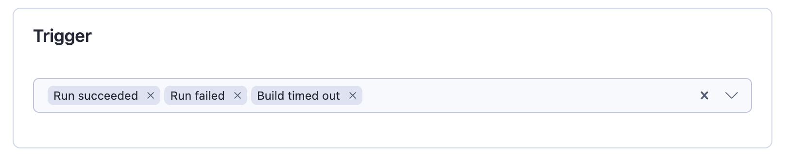
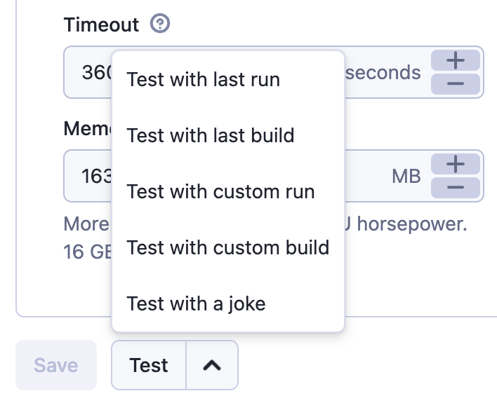

:::note Integration Actors

You can check out a catalog of Integration Actors within [Apify Store](https://apify.com/store/categories/integrations).

:::

Actor integrations connect your Actors with other Actors or tasks, letting you build multi-step workflows on the Apify platform. Because any [integration-ready Actor](/platform/integrations/actors/integration-ready-actors) can act as the target of an integration, the community can keep extending the catalog with new integrations.

<!-- TODO: confirm the YouTube video (zExnYbvFoBM) still reflects the current flow; replace or remove if outdated. -->
<iframe width="560" height="315" src="https://www.youtube-nocookie.com/embed/zExnYbvFoBM" title="YouTube video player" frameborder="0" allow="accelerometer; autoplay; clipboard-write; encrypted-media; gyroscope; picture-in-picture; web-share" allowfullscreen></iframe>

## Add an integration

To connect an Actor with another Actor or task:

1. Open the Actor's detail page and select the **Integrations** tab.
    - If the Actor already has integrations set up, the **Integrations** tab lists them instead. Click **Add integration** to open the catalog.
1. In the **Add integration** catalog, find the target Actor in one of two places:
    - **Suggested for this Actor** - Actors relevant to the source Actor's output. <!-- TODO: confirm how an Actor ends up in this list (Store category, manual curation, similarity, or a combination). -->
    - **Search integrations** field at the top - search across the full catalog.
1. Click the Actor card to open its setup screen. <!-- TODO: confirm the post-selection screen still uses the trigger + payload + variables layout described below. Recapture screenshots if the UI differs. -->

<!-- TODO: add a screenshot of the new Add integration dialog. -->

On the setup screen, configure:

- **Triggers** - Events that trigger the integrated Actor. These match webhook [event types](/platform/integrations/webhooks/events) (`run succeeded`, `build failed`, and so on).

    

- **Input for the integrated Actor** - The input usually has two parts: static fields whose value doesn't change between runs (for example, a database connection string or table name) and dynamic fields specific to the triggering run (for example, a dataset ID). Static fields go in as-is. Dynamic fields are pulled from the implicit `payload` field (the default for most integration-ready Actors) or set with variables.
- **Available variables** - The same variables as in webhooks. The most common is `{{resource}}`, which holds the Run object in the shape returned by the [API](/api/v2/actor-run-get), or the Build object for build event types. Variables support dot notation, so `{{resource.defaultDatasetId}}` or `{{resource.defaultKeyValueStoreId}}` is usually all you need.

## Test your integration

When you add a new integration, you can test it using a past run or build as a trigger. The integrated Actor or task runs as if the trigger event just happened. The only difference from a regular run is that the event type is set to `TEST`. Test runs consume compute units. <!-- TODO: confirm "compute units" is still the right billing-unit name in this context. -->

To test, set the input and options, save, then pick an option from the test menu:

- A past run, if the source is an Actor or a task.
- A past build, if the source is an Actor.
- A random joke in the webhook payload, if the source has no runs or builds yet.

For a custom run or build, enter its ID - you can find it on the run's or build's detail page. The run or build must belong to the source Actor, since that is where the trigger originates.

## Implementation details

Actor integrations are regular [HTTP POST webhooks](https://www.redhat.com/en/topics/automation/what-is-a-webhook) targeting the Apify API. The Integrations UI is a friendlier wrapper that lets you fill the payload template through the Actor input UI instead of plain text, and constructs the URL that starts the target Actor with the chosen options.

The UI keeps variables enclosed in strings, which means the payload template is valid JSON rather than only the interpolated result. It also adds a `payload` field with the default webhook payload, so integration-ready Actors can read run data from `payload` without users having to set variables themselves.

## Next steps

- [Creating integration Actors](/platform/integrations/actors/integration-ready-actors) - design your own Actor to be used as an integration target.
- [Integrating Actors via API](/platform/integrations/actors/integrating-actors-via-api) - set up the same integrations programmatically with the Apify API.
- [Connecting scrapers with Apify integrations](https://blog.apify.com/connecting-scrapers-apify-integration/) - a complete walkthrough on the Apify blog. <!-- TODO: confirm the linked blog post is still current and matches the new catalog flow; if not, replace or remove. -->
