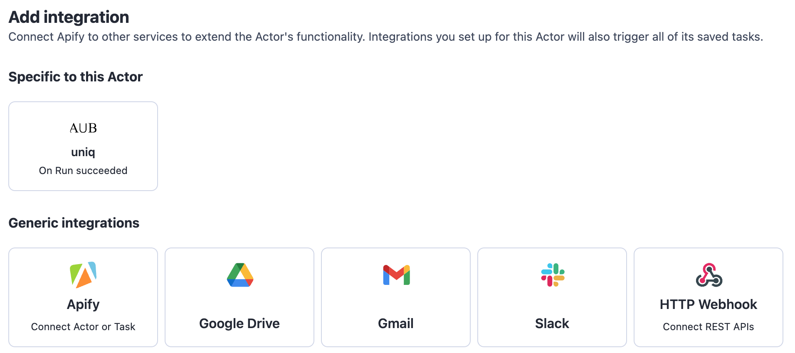

This page is for Actor developers. It covers the patterns to follow when building an Actor that other users will connect as an integration target - input shape, handling the implicit `payload` field, and processing dataset references rather than dataset contents.

:::note Integration Actors

For inspiration, browse [Integration Actors in Apify Store](https://apify.com/store/categories/integrations) - published Actors designed to be used as integration targets.

:::

Any Actor can be used as an integration target, but Actors designed for the role give users a smoother experience. The rest of this page assumes you are developing such an Actor.

## General guidelines

If your Actor is supposed to be used as an integration, it will most likely have an input that can be described as two groups of fields. The first group is the "static" part of the input - the fields that have the same value whenever the integration is triggered. The second, "dynamic", group are fields that are specific to the triggering event - information from the run or build that triggered the integration.

The Actor should hide its complexity from users and take all the "dynamic" fields from the implicit `payload` field - it is attached automatically. This way, users don't have to take care of passing in variables on their own and only need to take care of the static part of the input.

Only the dataset ID is passed to the Actor as input, not the dataset contents. The Actor needs to fetch the contents of the dataset itself. Ideally, it should not load the full dataset at once, as it might be too large to fit in memory, but rather process it in batches.

## Example

To illustrate the above, here is a simplified example of an Actor that uploads a dataset to a database table or collection.

Start with an input that looks something like this:

- `datasetId: string` - ID of the dataset to upload
- `connectionString: string` - Credentials for the database connection
- `tableName: string` - Name of the table or collection

With this input schema, users have to provide an input that looks like this:

```json
{
    "datasetId": "{{resource.defaultDatasetId}}",
    "connectionString": "****",
    "tableName": "results"
}
```

In the Actor code, use this to get the values:

```js
const { datasetId, connectionString, tableName } = await Actor.getInput();
```

To make the integration process smoother, define an input that's prefilled when your Actor is used as an integration. Set this on the Actor's **Settings** tab, in the **Integrations** form. For this example, use:

```json
{
    "datasetId": "{{resource.defaultDatasetId}}"
}
```

This means that users will see that the `defaultDatasetId` of the triggering run is going to be used right away.

Explicitly stating what is the expected input when Actor is being used as an integration is a preferred way.

However, if the Actor is only supposed to be used as an integration, use a different input schema:

- `connectionString: string` - Credentials for the database connection
- `tableName: string` - Name of the table or collection

In this case, users only need to provide the "static" part of the input:

```json
{
    "connectionString": "****",
    "tableName": "results"
}
```

In the Actor's code, the `datasetId` (the dynamic part) would be obtained from the `payload` field:

```js
const { payload, connectionString, tableName } = await Actor.getInput();
const datasetId = payload.resource.defaultDatasetId;
```

You can also combine both approaches, which is useful for development or advanced usage. Keep the `datasetId` in the input, hidden under an "Advanced options" section, and use it like this:

```js
const { payload, datasetId } = await Actor.getInput();
const datasetIdToProcess = datasetId || payload?.resource?.defaultDatasetId;
```

The example above focuses on accessing a run's default dataset, but the approach is similar for any other field.

## Make your Actor available to other users

To allow other users to use your Actor as an integration, [publish it in Apify Store](/platform/actors/publishing). Users can then find it in the **Add integration** dialog on the **Integrations** tab of any Actor. While publishing is enough, there are two ways to make your Actor more visible to users.

For Actors generic enough to be used with most other Actors, you can have them listed under **Generic integrations** in the **Add integration** dialog. This includes (but is not limited to) Actors that upload datasets to databases, send notifications through various messaging systems, or create issues in ticketing systems. To have your Actor listed under generic integrations, [contact support](mailto:support@apify.com?subject=Actor%20generic%20integration). <!-- TODO: confirm the contact-support workflow is still current; the new catalog UI may use a different listing mechanism. -->

Some Actors can only be integrated with a few - or even just one - other Actor. For example, an Actor that scrapes profiles from a social network is relevant for Actors that produce usernames from that network, but not for Actors that produce product lists. In this case, you can have the Actor listed under **Suggested for this Actor** on the source Actor's **Integrations** tab. To have your Actor listed as specific to another Actor, [contact support](mailto:support@apify.com?subject=Actor%20specific%20integration). <!-- TODO: confirm the contact-support workflow and the exact UI section name ("Suggested for this Actor" vs "Specific to this Actor"). -->

<!-- TODO: recapture or replace `specific_vs_generic_integrations.png` to match the new Add integration dialog. -->

