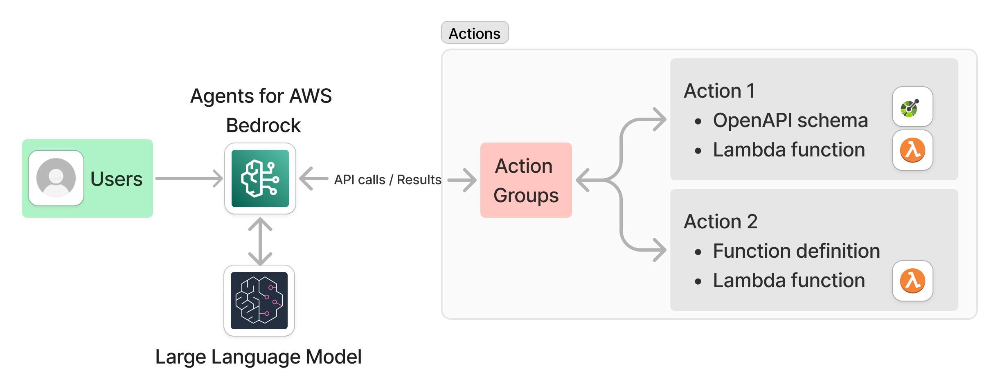
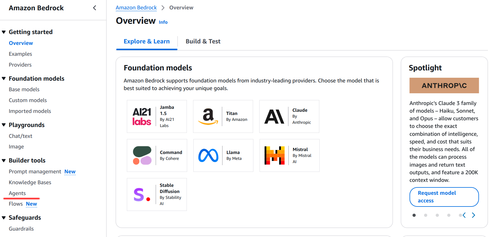
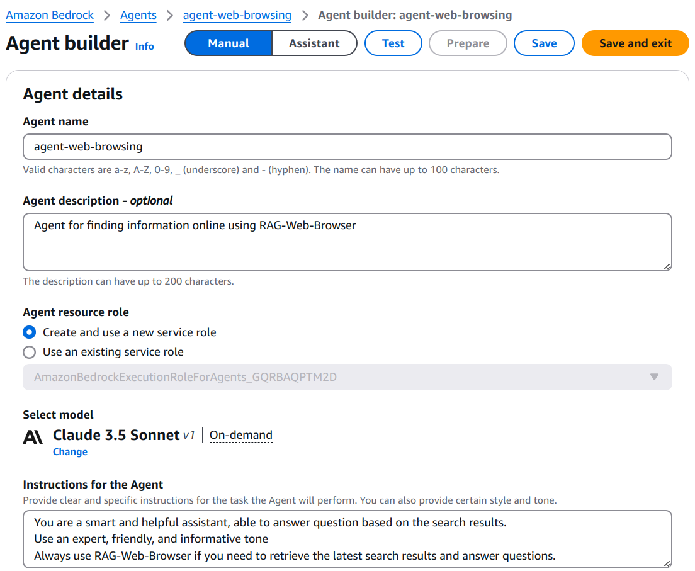
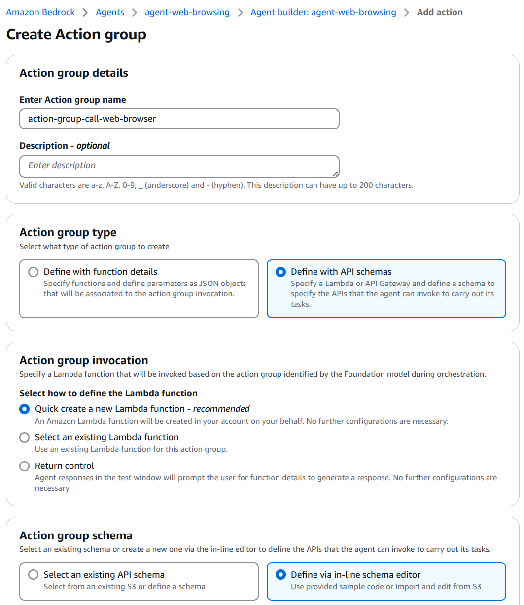
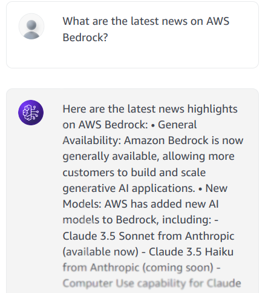

**Learn how to integrate Apify with Amazon Bedrock Agents to provide web data for AI agents.**

---

[Amazon Bedrock](https://aws.amazon.com/bedrock/) is a fully managed service that provides access to large language models (LLMs), allowing users to create and manage retrieval-augmented generative (RAG) pipelines, and create AI agents to plan and perform actions.
AWS Bedrock supports a wide range of models from providers such as A21 Labs, Anthropic, Cohere, Meta, and Mistral AI.
These models are designed to handle complex, multistep tasks across systems, knowledge bases, and APIs, making them versatile for various use cases.

In this tutorial, we’ll demonstrate how to create and use AWS Bedrock AI agent and integrate it with Apify Actors.
The AI agent will be configured to either answer questions from an internal LLM knowledge or to leverage the [RAG Web Browser](https://apify.com/apify/rag-web-browser) to perform internet searches for relevant information.
This approach enables the agent to provide more comprehensive and accurate responses by combining internal knowledge with real-time data from the web.

## AWS Bedrock AI agents

Amazon Bedrock allows you to create AI agents powered by large language models to analyze user input and determine the required data sources, and execute actions needed to fulfill the user requests.

Before getting started, ensure you have:

- An active AWS Account.
- An Apify account and an [API token](https://docs.apify.com/platform/integrations/api#api-token).
- Granted access to any Large Language Model from Amazon Bedrock. To add access to a LLM, follow this [guide](https://docs.aws.amazon.com/bedrock/latest/userguide/model-access-modify.html). We'll use **Anthropic Claude 3.5 Sonnet** in this example.

The overall process for creating an agent includes the following [steps](https://docs.aws.amazon.com/bedrock/latest/userguide/agents.html):

- Provide a name and description for the agent.
- Specify instructions for the agent.
- Set up actions in action groups by defining function details or using an OpenAPI schema.
- Configure a Lambda function to implement the defined function or OpenAPI schema.
- Select a model for the agent to orchestrate with.
- (Optional) Add knowledge bases for the agent.
- (Optional) Configure advanced prompts for the agent for better control.

The following image illustrates the key components of an AWS Bedrock AI agent:



### Building an Agent

To begin, open the Amazon Bedrock console and select agents from the left navigation panel.
On the next screen, click Create agent to start building your agent.



#### Step 1: Provide agent details

Enter a name and description for your agent.
This will create a new agent and open the Agent Builder page.
On this page, you can:

- Select the LLM model to use.
- Add knowledge bases.
- Set up actions.
- Provide instructions for the agent.

For example, you can use the following instructions:

```plaintext
You are a smart and helpful assistant.
Answer question based on the search results.
Use an expert, friendly, and informative tone
Always use RAG Web Browser if you need to retrieve the
latest search results and answer questions.
```



#### Step 2: Create actions

After saving the agent, preparing it, and testing it in the embedded chat window, you’ll notice that it cannot yet retrieve real-time search data from the internet.
To enable this functionality, you need to create actions that integrate the agent with Apify and provide the necessary search data.

Navigate to the **Actions Groups**, where you can define a set of actions.
Actions can be created by either:

- Providing function details, or
- Using an OpenAPI schema, which will be implemented via a Lambda function.

For this example, use the following settings:

- Action type - Define with API schema
- Action group invocation - Create a new Lambda function
- Action group schema - Define via in-line editor



In the in-line editor, paste the OpenAPI schema of the [RAG Web Browser](https://raw.githubusercontent.com/apify/rag-web-browser/refs/heads/master/docs/standby-openapi-3.0.0.json).
At this point, the Agent is almost ready to integrate with Apify.
Save the action to create a new, empty Lambda function.
The final step is to update the Lambda function to implement the OpenAPI schema and enable real-time web search capabilities.

#### Step 3: Lambda function

1. Open the Lambda function you created and copy-paste the [Python lambda function](https://raw.githubusercontent.com/apify/rag-web-browser/refs/heads/master/docs/aws-lambda-call-rag-web-browser.py).
1. Replace `APIFY_API_TOKEN` in the code with your Apify API token. Alternatively, store the token as an environment variable:
   - Go to the Configuration tab.
   - Select Environment Variables.
   - Add a new variable by specifying a key and value.
1. Configure the Lambda function:
   - Set the memory allocation to 128 MB and timeout duration to 60 seconds.
1. Save the Lambda function and deploy it.

#### Step 4: Test the agent

1. Return to the **AWS Bedrock console** and prepare the agent for testing in the embedded chat window.
1. Test the agent by entering a query, for example: "What is the latest news about AWS Bedrock"
1. Based on your query, the agent will determine the appropriate action to take. You can view the agent's reasoning in the **Trace Step view**. For instance:

```json
{
    "rationale": {
        "text": "To answer this question about the latest news for AWS Bedrock, I'll need to use the RAG Web Browser function to search for and retrieve the most recent information. I'll craft a search query that specifically targets AWS Bedrock news.",
        "traceId": "845d524a-b82c-445b-9e36-66d887b3b25e-0"
    }
}
```

The agent will use the RAG Web Browser to gather relevant information and provide a response to the user query.



### Limitations and debugging

When integrating agent in AWS Bedrock, you may encounter some limitations and issues.

- **Model access**: Ensure that you have access to the model you want to use in the agent. If you don't have access, you can request it from the model provider.
- **Lambda function**: Ensure that the Lambda function is correctly implemented and deployed. Check the function logs for any errors.
- **Environment variables**: Ensure that the `APIFY_API_TOKEN` is correctly set in the Lambda function.
- **Memory and timeout**: Ensure that the Lambda function has enough memory and timeout to call the RAG Web Browser.
- **Agent trace**: Use the agent trace view to debug the agent's reasoning and actions.
- **Response Size**: AWS Bedrock enforces a 25KB limit on response bodies. Limit results and truncate text as needed to stay within this constraint.

## Resources

- [Amazon Bedrock Agents](https://aws.amazon.com/bedrock/agents/)
- [Amazon Bedrock Agents Quickstart](https://github.com/build-on-aws/amazon-bedrock-agents-quickstart)
- [Apify - RAG Web Browser](https://apify.com/apify/rag-web-browser)
