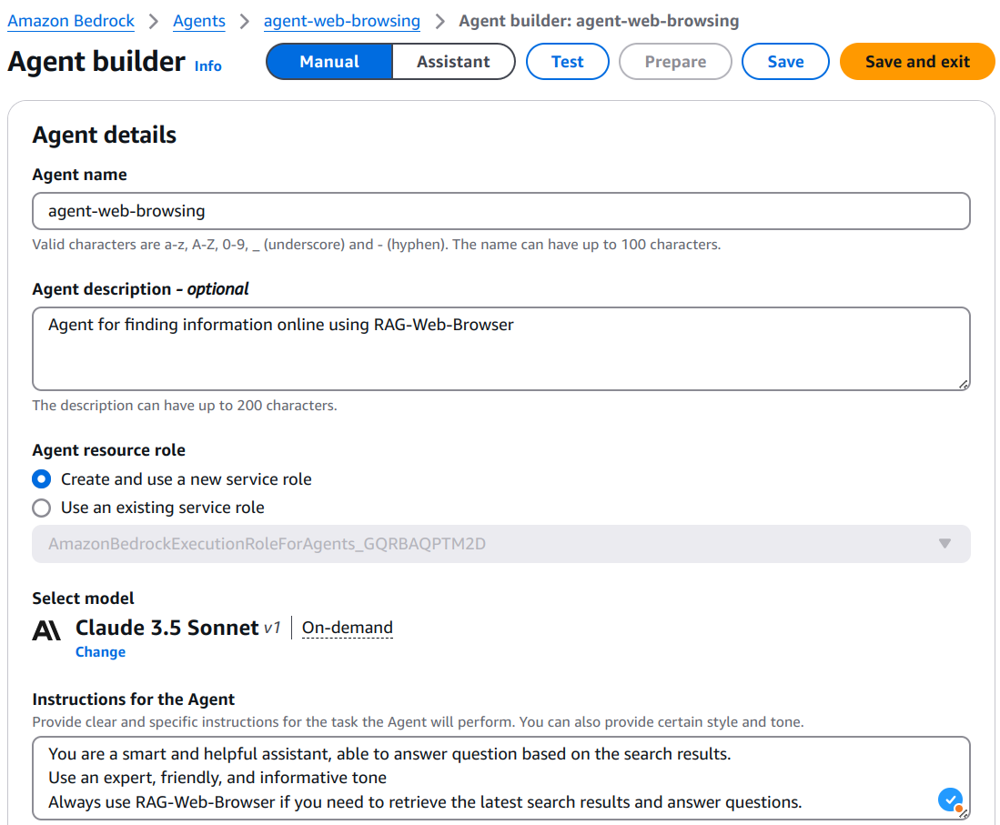
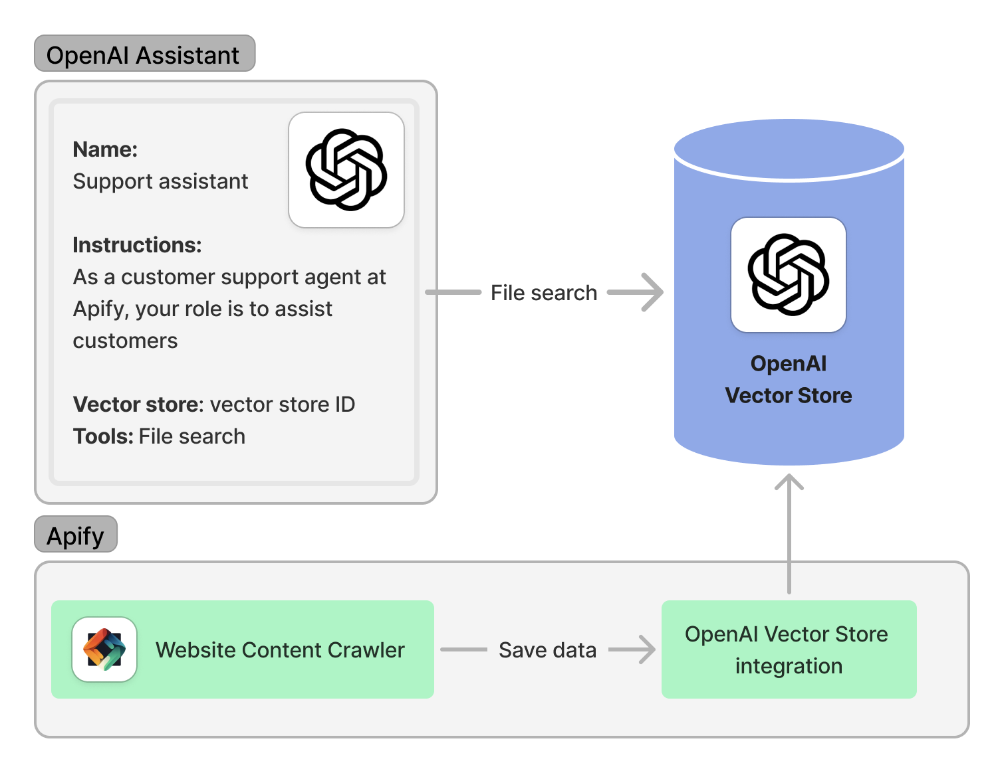

**Learn how to integrate Apify with Amazon Bedrock Agents to provide web data for AI agents.**

---

[Amazon Bedrock](https://aws.amazon.com/bedrock/) is fully managed service that provides access to large language models (LLMs), allows to create and manage retrieval-augmented generative (RAG) pipelines, and create AI agents to plan and perform actions.
AWS Bedrock supports large number of models from different provides like A21 Labs, Anthropic, Cohere, Meta, or Mistral AI that can be used for planning and executing complex, multistep tasks across different systems, knowledge bases, and APIs.

In this tutorial, we’ll demonstrate how to create and use AWS Bedrock AI agent and integrate it with Apify Actors.
We'll create an Agent that can either answer question from an internal LLM knowledge or it can use [RAG-Web-Browser](https://apify.com/apify/rag-web-browser) to search internet and find relevant information.

## AWS Bedrock AI agents

Amazon Bedrock allows you you to create agents that use large language model to analyze user input and determine the data sources, information and actions needed to fulfill the user's requests.
To create an Agent, you need to follow these [steps](https://docs.aws.amazon.com/bedrock/latest/userguide/agents.html):

- Provide an Agent name and description.
- Specify instructions for the Agent.
- Setup actions in action groups. Either define a function details or OpenAPI schema
- Setup Lambda function to implement the defined function or OpenAPI schema.
- Select a model for the agent to orchestrate with.
- (Optional) Add knowledge bases for the agent.
- (Optional) Configure advanced prompts for the agent for better control.

The following image provide an overview of the AWS Bedrock Agent building pieces:


Before we start ensure you have:

- An active AWS Account.
- Apify account and [API token](https://docs.apify.com/platform/integrations/api#api-token).
- Granted access to any Large Language Model from Amazon Bedrock. To add access to a LLM, follow this [guide](https://docs.aws.amazon.com/bedrock/latest/userguide/model-access-modify.html). We'll use Anthropic Claude 3.5 Sonnet in this example.

### Building an Agent

To get started, open the Amazon Bedrock console, select Agents in the left navigation panel, then choose Create Agent.


Next, provide agent name and description, this will create a new agent and will open Agent Builder page.
Here, you can build your agent by selecting LLM model to use, add knowledge bases, and setup actions.
You also need to add instruction for the agent, such as

```plaintext
You are a smart and helpful assistant, able to answer question based on the search results.
Use an expert, friendly, and informative tone
Always use RAG-Web-Browser if you need to retrieve the latest search results and answer questions.
```



Now, you can save the agent, prepare it, and test it in the embedded chat window.
However, the agent is not able to provide real-time search data from the internet yet.
First, we need to create actions to integrate it with Apify and provide the search data.

Head to the Actions Groups, where you can create set of actions.
The actions can be defined by providing function details or OpenAPI schema that will be implemented in a Lambda function.
In this example, we will use the following options:

- Action type - Define with API schema
- Action group invocation - Create a new Lambda function
- Action group schema - Define via in-line editor


In the inlined editor, you need to copy-paste [RAG-Web-Browser OpenAPI schema](https://raw.githubusercontent.com/apify/rag-web-browser/refs/heads/master/docs/standby-openapi-3.0.0.json).
We are almost ready to integrate the agent with Apify, but first we need to create a Lambda function that will implement the OpenAPI schema.


```bash
pip install apify-client openai
```

Import all required packages:

```python

import json
import time

from apify_client import ApifyClient
from openai import OpenAI, Stream
from openai.types.beta.threads.run_submit_tool_outputs_params import ToolOutput
```

Find your [Apify API token](https://console.apify.com/account/integrations) and [OpenAI API key](https://platform.openai.com/account/api-keys) and initialize OpenAI and Apify clients:

```python
client = OpenAI(api_key="YOUR OPENAI API KEY")
apify_client = ApifyClient("YOUR APIFY API TOKEN")
```

First, let us specify assistant's instructions. Here, we ask the assistant to always provide answers based on the latest information from the internet and include relevant sources whenever possible.
In a real-world scenario, you can customize the instructions based on your requirements.

```python
INSTRUCTIONS = """ You are a smart and helpful assistant. Maintain an expert, friendly, and informative tone in your responses.
   Your task is to answer questions based on information from the internet.
   Always call call_rag_web_browser function to retrieve the latest and most relevant online results.
   Never provide answers based solely on your own knowledge.
   For each answer, always include relevant sources whenever possible.
"""
```

Next, we define a function description with two parameters, search query (`query`) and number of results we need to retrieve (`maxResults`).
The RAG-Web-Browser can be called with more parameters, check the [Actor input schema](https://apify.com/apify/rag-web-browser/input-schema) for details.

```python
rag_web_browser_function = {
    "type": "function",
    "function": {
        "name": "call_rag_web_browser",
        "description": "Query Google search, scrape the top N pages from the results, and returns their cleaned content as markdown",
        "parameters": {
            "type": "object",
            "properties": {
                "query": { "type": "string", "description": "Use regular search words or enter Google Search URLs. "},
                "maxResults": {"type": "integer", "description": "The number of top organic search results to return and scrape text from"}
            },
            "required": ["query"]
        }
    }
}
```

We also need to implement the `call_rag_web_browser` function, which will be used to retrieve the search data.

```python
def call_rag_web_browser(query: str, max_results: int) -> list[dict]:
    """
    Query Google search, scrape the top N pages from the results, and returns their cleaned content as markdown.
    First start the Actor and wait for it to finish. Then fetch results from the Actor run's default dataset.
    """
    actor_call = apify_client.actor("apify/rag-web-browser").call(run_input={"query": query, "maxResults": max_results})
    return apify_client.dataset(actor_call["defaultDatasetId"]).list_items().items
```

Now, we can create an assistant with the specified instructions and function description:

```python
my_assistant = client.beta.assistants.create(
    instructions=INSTRUCTIONS,
    name="OpenAI Assistant with Web Browser",
    tools=[rag_web_browser_function],
    model="gpt-4o-mini",
)
```

Once the assistant is created, we can initiate a conversation.
Start by creating a thread and adding messages to it, and then calling the run method.
Since runs are asynchronous, we need to continuously poll the `Run` object until it reaches a terminal status.
To simplify this, we use the `create_and_poll` convenience function, which both initiates the run and polls it until completion.

```python
thread = client.beta.threads.create()
message = client.beta.threads.messages.create(
    thread_id=thread.id, role="user", content="What are the latest LLM news?"
)

run = client.beta.threads.runs.create_and_poll(thread_id=thread.id, assistant_id=my_assistant.id)
```

Finally, we need to check the run status to determine if the assistant requires any action to retrieve the search data.
If it does, we must submit the results using the `submit_tool_outputs` function.
This function will trigger the RAG-Web-Browser to fetch the search data and submit it to the assistant for processing.

Let's implement the `submit_tool_outputs` function:

```python
def submit_tool_outputs(run_):
    """ Submit tool outputs to continue the run """
    tool_output = []
    for tool in run_.required_action.submit_tool_outputs.tool_calls:
        if tool.function.name == "call_rag_web_browser":
            d = json.loads(tool.function.arguments)
            output = call_rag_web_browser(query=d["query"], max_results=d["maxResults"])
            tool_output.append(ToolOutput(tool_call_id=tool.id, output=json.dumps(output)))
            print("RAG-Web-Browser added as a tool output.")

    return client.beta.threads.runs.submit_tool_outputs_and_poll(thread_id=run_.thread_id, run_id=run_.id, tool_outputs=tool_output)
```

Now, we can check the run status and submit the tool outputs if required:

```python
if run.status == "requires_action":
    run = submit_tool_outputs(run)
```

The function `submit_tool_output` also poll the run until it reaches a terminal status.
After the run is completed, we can print the assistant's response:

```python
print("Assistant response:")
for m in client.beta.threads.messages.list(thread_id=run.thread_id):
    print(m.content[0].text.value)
```

For the question "What are the latest LLM news?" the assistant's response might look like this:

```plaintext
Assistant response:
The latest news on LLM is as follows:
- [OpenAI](https://openai.com) has released a new version of GPT-4.
- [Hugging Face](https://huggingface.co) has updated their Transformers library.
- [Apify](https://apify.com) has released a new RAG-Web-Browser.
```

<details>
<summary>Complete example of real-time search data for OpenAI Assistant</summary>

```python
import json

from apify_client import ApifyClient
from openai import OpenAI, Stream
from openai.types.beta.threads.run_submit_tool_outputs_params import ToolOutput


client = OpenAI(api_key="YOUR-OPENAI-API-KEY")
apify_client = ApifyClient("YOUR-APIFY-API-TOKEN")

INSTRUCTIONS = """
You are a smart and helpful assistant. Maintain an expert, friendly, and informative tone in your responses.
Your task is to answer questions based on information from the internet.
Always call call_rag_web_browser function to retrieve the latest and most relevant online results.
Never provide answers based solely on your own knowledge.
For each answer, always include relevant sources whenever possible.
"""

rag_web_browser_function = {
    "type": "function",
    "function": {
        "name": "call_rag_web_browser",
        "description": "Query Google search, scrape the top N pages from the results, and returns their cleaned content as markdown",
        "parameters": {
            "type": "object",
            "properties": {
                "query": {"type": "string", "description": "Use regular search words or enter Google Search URLs. "},
                "maxResults": {"type": "integer", "description": "The number of top organic search results to return and scrape text from"}
            },
            "required": ["query"]
        }
    }
}


def call_rag_web_browser(query: str, max_results: int) -> list[dict]:
    """
    Query Google search, scrape the top N pages from the results, and returns their cleaned content as markdown.
    First start the Actor and wait for it to finish. Then fetch results from the Actor run's default dataset.
    """
    actor_call = apify_client.actor("apify/rag-web-browser").call(run_input={"query": query, "maxResults": max_results})
    return apify_client.dataset(actor_call["defaultDatasetId"]).list_items().items


def submit_tool_outputs(run_):
    """ Submit tool outputs to continue the run """
    tool_output = []
    for tool in run_.required_action.submit_tool_outputs.tool_calls:
        if tool.function.name == "call_rag_web_browser":
            d = json.loads(tool.function.arguments)
            output = call_rag_web_browser(query=d["query"], max_results=d["maxResults"])
            tool_output.append(ToolOutput(tool_call_id=tool.id, output=json.dumps(output)))
            print("RAG-Web-Browser added as a tool output.")

    return client.beta.threads.runs.submit_tool_outputs_and_poll(thread_id=run_.thread_id, run_id=run_.id, tool_outputs=tool_output)

# Runs are asynchronous, which means you'll want to monitor their status by polling the Run object until a terminal status is reached.
thread = client.beta.threads.create()
message = client.beta.threads.messages.create(
    thread_id=thread.id, role="user", content="What are the latest LLM news?"
)

# Run with assistant and poll for the results
run = client.beta.threads.runs.create_and_poll(thread_id=thread.id, assistant_id=my_assistant.id)

if run.status == "requires_action":
    run = submit_tool_outputs(run)

print("Assistant response:")
for m in client.beta.threads.messages.list(thread_id=run.thread_id):
    print(m.content[0].text.value)
```

</details>

## Save data into OpenAI Vector Store and use it in the assistant

To provide real-time or proprietary data, OpenAI Assistants can access the [OpenAI Vector Store](https://platform.openai.com/docs/assistants/tools/file-search/vector-stores) to retrieve information for their answers.
With the [Apify OpenAI Vector Store Integration](https://apify.com/jiri.spilka/openai-vector-store-integration), data saving and updating the OpenAI Vector Store can be fully automated.
The following image illustrates the Apify-OpenAI Vector Store integration:



In this example, we'll demonstrate how to save data into the OpenAI Vector Store and use it in the assistant.
For more information on automating this process, check out the blog post [How we built an AI salesperson with the OpenAI Assistants API](https://blog.apify.com/enterprise-support-openai-assistant/).

Before we start, we need to install all dependencies:

```bash
pip install apify-client openai
```

Find your [Apify API token](https://console.apify.com/account/integrations) and [OpenAI API key](https://platform.openai.com/account/api-keys) and initialize OpenAI and Apify clients:

```python
from apify_client import ApifyClient
from openai import OpenAI

client = OpenAI(api_key="YOUR OPENAI API KEY")
apify_client = ApifyClient("YOUR APIFY API TOKEN")
```

Create an assistant with the instructions and `file-search` tool:

```python
my_assistant = client.beta.assistants.create(
    instructions="As a customer support agent at Apify, your role is to assist customers",
    name="Support assistant",
    tools=[{"type": "file_search"}],
    model="gpt-4o-mini",
)
```

Next, create a vector store and attach it to the assistant:

```python
vector_store = client.beta.vector_stores.create(name="Support assistant vector store")

assistant = client.beta.assistants.update(
    assistant_id=my_assistant.id,
    tool_resources={"file_search": {"vector_store_ids": [vector_store.id]}},
)
```

Now, use [Website Content Crawler](https://apify.com/apify/website-content-crawler) to crawl the web and save the data into Apify's dataset:

```python
run_input = {"startUrls": [{"url": "https://docs.apify.com/platform"}], "maxCrawlPages": 10, "crawlerType": "cheerio"}
actor_call_website_crawler = apify_client.actor("apify/website-content-crawler").call(run_input=run_input)

dataset_id = actor_call_website_crawler["defaultDatasetId"]
```

Finally, save the data into the OpenAI Vector Store using [OpenAI Vector Store Integration](https://apify.com/jiri.spilka/openai-vector-store-integration)

```python
run_input_vs = {
    "datasetId": dataset_id,
    "assistantId": my_assistant.id,
    "datasetFields": ["text", "url"],
    "openaiApiKey": "YOUR-OPENAI-API-KEY",
    "vectorStoreId": vector_store.id,
}

apify_client.actor("jiri.spilka/openai-vector-store-integration").call(run_input=run_input_vs)
```

Now, the assistant can access the data stored in the OpenAI Vector Store and use it in its responses.
Start by creating a thread and adding messages to it.
Then, initiate a run and poll for the results.
Once the run is completed, you can print the assistant's response.

```python
thread = client.beta.threads.create()
message = client.beta.threads.messages.create(
    thread_id=thread.id, role="user", content="How can I scrape a website using Apify?"
)

run = client.beta.threads.runs.create_and_poll(
    thread_id=thread.id,
    assistant_id=assistant.id,
    tool_choice={"type": "file_search"}
)

print("Assistant response:")
for m in client.beta.threads.messages.list(thread_id=run.thread_id):
    print(m.content[0].text.value)
```

For the question "How can I scrape a website using Apify?" the assistant's response might look like this:

```plaintext
Assistant response:
You can scrape a website using Apify by following these steps:
1. Visit the [Apify website](https://apify.com) and create an account.
2. Go to the [Apify Store](https://apify.com/store) and choose a web scraper.
3. Configure the web scraper with the URL of the website you want to scrape.
4. Run the web scraper and download the data.
```

<details>
<summary>Complete example of saving data into OpenAI Vector Store and using it in the assistant</summary>

```python
from apify_client import ApifyClient
from openai import OpenAI

client = OpenAI(api_key="YOUR-OPENAI-API-KEY")
apify_client = ApifyClient("YOUR-APIFY-API-TOKEN")

my_assistant = client.beta.assistants.create(
    instructions="As a customer support agent at Apify, your role is to assist customers",
    name="Support assistant",
    tools=[{"type": "file_search"}],
    model="gpt-4o-mini",
)

# Create a vector store
vector_store = client.beta.vector_stores.create(name="Support assistant vector store")

# Update the assistant to use the new Vector Store
assistant = client.beta.assistants.update(
    assistant_id=my_assistant.id,
    tool_resources={"file_search": {"vector_store_ids": [vector_store.id]}},
)

run_input = {"startUrls": [{"url": "https://docs.apify.com/platform"}], "maxCrawlPages": 10, "crawlerType": "cheerio"}
actor_call_website_crawler = apify_client.actor("apify/website-content-crawler").call(run_input=run_input)

dataset_id = actor_call_website_crawler["defaultDatasetId"]

run_input_vs = {
    "datasetId": dataset_id,
    "assistantId": my_assistant.id,
    "datasetFields": ["text", "url"],
    "openaiApiKey": "YOUR-OPENAI-API-KEY",
    "vectorStoreId": vector_store.id,
}

apify_client.actor("jiri.spilka/openai-vector-store-integration").call(run_input=run_input_vs)

# Create a thread and a message
thread = client.beta.threads.create()
message = client.beta.threads.messages.create(
    thread_id=thread.id, role="user", content="How can I scrape a website using Apify?"
)

# Run with assistant and poll for the results
run = client.beta.threads.runs.create_and_poll(
    thread_id=thread.id,
    assistant_id=assistant.id,
    tool_choice={"type": "file_search"}
)

print("Assistant response:")
for m in client.beta.threads.messages.list(thread_id=run.thread_id):
    print(m.content[0].text.value)
```

</details>

## Resources

- [Open AI Assistants](https://platform.openai.com/docs/assistants/overview)
- [Open AI Function Calling](https://platform.openai.com/docs/assistants/tools/function-calling)
- [Apify - RAG Web Browser](https://apify.com/apify/rag-web-browser)
- [Apify - OpenAI Vector Store Integration](https://apify.com/jiri.spilka/openai-vector-store-integration)
