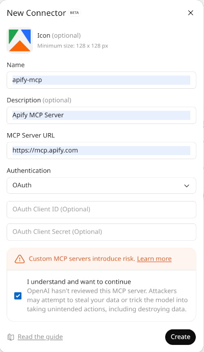

**Learn how to integrate Apify Actors with ChatGPT to provide web context in real-time.**

---

ChatGPT provides easy conversational access to OpenAI's large language models (LLMs). Until recently, ChatGPT was limited to accessing third-party data only through plugins or direct API calls. However, OpenAI has now adopted the [Model Context Protocol (MCP)](https://openai.com/research/model-context-protocol), which enables access to web data using Apify Actors.

In this tutorial, we will show you how to set up ChatGPT using the Model Context Protocol (MCP) server provided by Apify. To do this, we will create a custom connector in ChatGPT and connect it to the Apify MCP server.

## Prerequisites

To use Apify MCP server with ChatGPT, you need to have:

- An Apify account and an [API token](https://docs.apify.com/platform/integrations/api#api-token).
- An OpenAI account with access to ChatGPT.
- ChatGPT account with developer mode enabled.

## ChatGPT with Apify MCP server

:::note Developer mode

You need to enable [developer mode](https://platform.openai.com/docs/guides/developer-mode) in ChatGPT to add custom connectors like the Apify MCP server.
Follow the instructions in the [ChatGPT developer mode](https://platform.openai.com/docs/guides/developer-mode) page to enable developer mode.
When the developer mode is enabled, the box to send messages is wrapped with an orange border.

:::

### Create a connector

In ChatGPT, go to **Settings → Apps & Connectors → Create** (if you don't see the Create button you might not have developer mode enabled, either enable it or reload the page).

Provide the following information for your connector:

1. **Name** – a user-facing title, e.g. "apify-mcp"
2. **Description** – briefly describe what the connector does
3. **MCP Server URL**. Either use default set of tools or connect specific ones:
   - `https://mcp.apify.com` - (this will use Apify MCP with default set of tools, see mcp.apify.com for details)
   - `https://mcp.apify.com?tools=actors,docs,mtrunkat/url-list-download-html` - (this will use Apify MCP with a specific tool, see mcp.apify.com for details)
4. **Authentication** – select OAuth (you don't have to provide neither client ID nor secret ID)

:::caution ChatGPT currently does not allow to connect specific Actors

At the moment, ChatGPT does not allow to select specific tools after the connector is created, leading to the following error: "Something went wrong with setting up the connection".
This error typically occurs for social media scrapers like Instagram, TikTok, etc.
But you can still use these Actors with ChatGPT by including them when initially setting up the connector.

Once you integrate and connect to Apify MCP, you won't be able to change the selected tools, so make sure to include all the tools you want to use.
If you decide to add or remove tools, you will have to create a new connector.

:::

Click **Create**. You will be directed to the authentication page.
You will be redirected to Apify website to authorize ChatGPT to access your Apify account.
Make sure you are logged in to the correct Apify account before authorizing.

When you allow access, you will be redirected back to ChatGPT and you should see a success message and list of tools available from the Apify MCP server.

Once your connector with MCP server is created, you can try it out in a new ChatGPT conversation.

- Open a new chat in ChatGPT.
- Click the **+** button near the message composer, and click **More**.
- Choose the connector, this will add Apify MCP server to the conversation
- Prompt ChatGPT to use Apify tools by saying: "Search the web and summarize recent trends in AI Agents"

You will need to allow each of the Apify tools to be used in the conversation one by one.
You should see that ChatGPT is calling Apify tools (specifically [RAG Web browser](https://apify.com/apify/rag-web-browser)) to get the information needed to answer your question.

### Use any Actor with ChatGPT

You can use any Apify Actor available on the [Apify Store](https://apify.com/store) with ChatGPT.

By default, Apify MCP exposes a set of tools that helps you to search any Actor and use it within ChatGPT.

To use any Actor, you can prompt ChatGPT like this:

- "Find and run an Actor that scrapes Instagram profiles, and get profile of @natgeo"

## Limitations

- MCP connection in ChatGPT is still in beta and may have some limitations or bugs.
- The tool selection and calling is quite slow, especially when using GPT-5 model family.
- ChatGPT custom connectors are only available to users with developer mode enabled.

## References

- [ChatGPT developer mode](https://platform.openai.com/docs/guides/developer-mode)
- [Connectors and MCP servers](https://platform.openai.com/docs/guides/tools-connectors-mcp)
- [Apify MCP server](https://mcp.apify.com)
- [Apify MCP documentation](https://docs.apify.com/platform/integrations/mcp)
