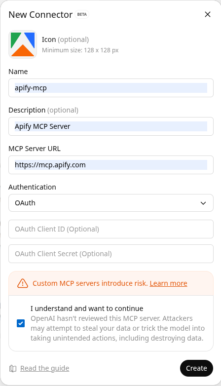
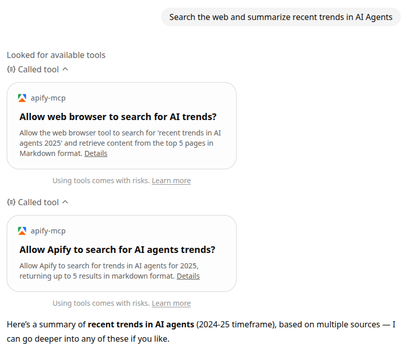

**Learn how to integrate Apify Actors with ChatGPT to provide web context in real-time.**

---

The _ChatGPT_ integration enables you to connect ChatGPT to Apify's extensive library of Actors through the [Model Context Protocol (MCP)](https://modelcontextprotocol.io/docs/getting-started/intro).
This allows ChatGPT to use Apify tools and Actors directly in conversations, providing real-time web data access and automation capabilities.

You can use any [Apify Actor](https://apify.com/store) with ChatGPT.
By default, the Apify MCP server exposes a set of tools that lets you search and use Actors directly.

**Example query:**

> "Find and run an Actor that scrapes Instagram profiles, and get the profile of @natgeo"

In this tutorial, you'll learn how to connect ChatGPT to the **Apify MCP server** using a custom connector.

## Prerequisites

Before connecting ChatGPT to Apify, you'll need:

- _An Apify account_ - If you don't have an Apify account already, you can [sign up](https://console.apify.com/sign-up)
- _Apify API token_ - Get your API token from the **Integrations** section in [Apify Console](https://console.apify.com/account#/integrations). This token authorizes the MCP server to run Actors on your behalf. Make sure to keep it secure.
- _An OpenAI account with access to ChatGPT_ - You need an OpenAI account to use ChatGPT.
- _ChatGPT with Developer Mode enabled_ - You must enable [Developer Mode](https://platform.openai.com/docs/guides/developer-mode) to add custom connectors (when the Developer Mode is active, the message input box is outlined in orange).

## Create an MCP connector

1. In ChatGPT, go to **Settings → Apps & Connectors → Create**. If you don't see the **Create** button, enable developer mode or reload the page.

2. Fill in the following fields:

    - **Name** – a user-facing title, e.g., `apify-mcp`
    - **Description** – a short description of what the connector does
    - **MCP Server URL** – choose one of the following:
        - `https://mcp.apify.com` - use the default set of Apify tools
        - `https://mcp.apify.com?tools=actors,docs,mtrunkat/url-list-download-html` - use specific tools
        - Refer to [mcp.apify.com](https://mcp.apify.com) for details
    - **Authentication** – OAuth, you don’t need to provide a client ID or secret.

:::caution Cannot modify tools after creation
ChatGPT does not allow modifying the selected tools after the connector is created.
If you need to add or remove tools later, you'll need to create a new connector.
:::

:::note Social media scrapers
If you try to use a connector with social media scrapers like Instagram or TikTok, you may see the error:
"Something went wrong with setting up the connection."
You can still use these Actors with ChatGPT by including them when initially setting up the connector.
:::

3. Authorize access

Click **Create** to proceed to the authentication page.
You’ll be redirected to the Apify website to authorize ChatGPT to access your Apify account.
Ensure you're logged into the correct Apify account before approving access.

Once authorized, you’ll return to ChatGPT and see a success message with a list of tools available from the Apify MCP server.

## Try the MCP connector in ChatGPT

Once your connector is ready:

1. Open a **new chat** in ChatGPT.
2. Click the **+** button near the message composer and select **More**.
3. Choose your **Apify MCP connector** to add it to the conversation.
4. Ask ChatGPT to use Apify tools, for example:

   > “Search the web and summarize recent trends in AI agents”

You’ll need to grant permission for each Apify tool when it’s used for the first time.
You should see ChatGPT calling Apify tools — such as the [RAG Web Browser](https://apify.com/apify/rag-web-browser) — to gather information.

## Limitations

- MCP integration in ChatGPT is still in _beta_ and may have some limitations or bugs.
- Tool selection and execution can be _slow_, especially with the latest GPT models.
- _Custom connectors_ are only available in ChatGPT _Developer mode_.

## Related integrations

- [OpenAI Assistants integration](/platform/integrations/openai-assistants) - Use Apify Actors with OpenAI Assistants API via function calling
- [OpenAI Agents SDK integration](/platform/integrations/openai-agents) - Integrate Apify MCP server with OpenAI Agents SDK

## Resources

- [ChatGPT Developer mode](https://platform.openai.com/docs/guides/developer-mode) - Learn how to enable Developer Mode in ChatGPT
- [Connectors and MCP servers](https://platform.openai.com/docs/guides/tools-connectors-mcp) - Official OpenAI documentation on using MCP servers with ChatGPT
- [Apify MCP server](https://mcp.apify.com) - Interactive configuration tool for the Apify MCP server
- [Apify MCP documentation](/platform/integrations/mcp) - Complete guide to using the Apify MCP server
